# **第一章**：Linux入门

**视频地址：[3天搞定Linux，1天搞定Shell，清华学神带你通关（2022版）_哔哩哔哩_bilibili](https://www.bilibili.com/video/BV1WY4y1H7d3?p=89&spm_id_from=pageDriver&vd_source=6f3f75b94bf88857572f45eafffbbb8b)**

## 1. 概述

​		Linux内核最初只是由芬兰人``林纳斯·托瓦兹``(Linus Torvalds）在赫尔辛基大学上学时出于个人爱好而编写的。

​		Linux是一套免费使用和自由传播的类Unix操作系统，是一个基于POSIX和UNIX的多用户、多任务、支持多线程和多CPU的操作系统。Linux能运行主要的UNIX工具软件、应用程序和网络协议。它支持32位和64位硬件。Linux继承了Unix以网络为核心的设计思想，是一个性能稳定的多用户网络操作系统。

​		目前市面上较知名的发行版有:``Ubuntu、RedHat、CentOS、``Debain、Fedora、SuSE、OpenSUSE。

## 2. Linux 和 Windows 区别

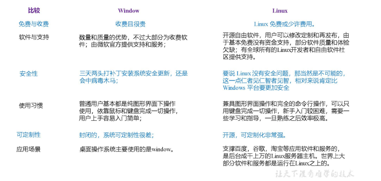

## 3. CentOS下载地址 和 VM 下载地址

* **CentOs下载镜像地址**

网易镜像：http://mirrors.163.com/centos/7/isos/

阿里云镜像：http://mirrors.aliyun.com/centos/7.9.2009/isos/x86_64/CentOS-7-x86_64-DVD-2009.iso

* **VMware下载地址**

# 第二章：VM 与 Linux 的安装

## 1. VMWare 安装

## 2. CentOS安装


# 第三章：Linux文件与目录结构

## 1. Linux文件

> Linux 系统中一切皆文件

## 2. Linux 目录结构

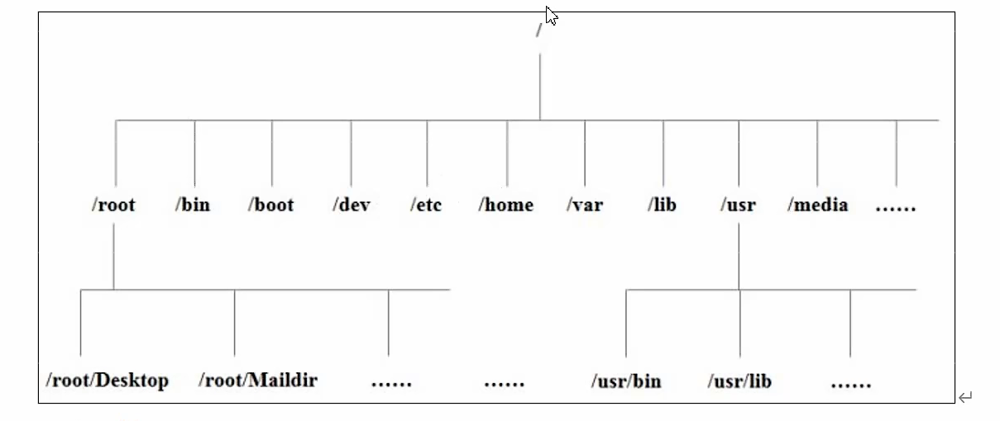

## 3. 各个目录的简介

* **/bin**

> 是 Binary 的缩写，这个目录存放着最经常使用的命令

* **/sbin**

> s就是 Super User 的意思，这里存放的就是管理员使用的管理系统程序

* **/home**

> 存放普通用户的主目录，在 Linux 中每个用户都有一个自己的目录，一般该目录名是以用户的账号命名的

* **/root**

> 该目录为系统管理员，也称作超级权限者的用户主目录

* **/lib**

> 系统开机所需要最基本的动态连接共享库，其作用类似于 Windows里的 dll 文件。几乎所有的应用程序都需要用到这些共享库

* **/lost+found**

> 这个目录一般情况下是空的，当系统非法关机后，这里就存放了一些文件

* **/etc**

> 所有的系统管理所需要的配置文件和子目录

* **/usr**

> 这是一个非常重要的目录，用户的很多应用程序和文件都存放在这个目录下，类似于 windows 下的 program files 目录

* **/boot**

> 这里存放的是启动 Linux 时使用的一些核心文件，包括一些连接文件以及镜像文件，自己的安装别放在这里

* **/proc**

> 这个目录是一个虚拟的目录，它是系统内存的映射，我们可以通过直接访问这个目录来获取系统的信息

* **/srv**

> service的缩写，该目录存放一些服务启动之后需要提取的数据

* **/sys**

> 这是 Linux2.6 内核的一个很大的变化。该目录下安装了 2.6 内核中新出现的一个文件系统 sysfs

* **/tmp**

> 这个目录是用来存放一些临时文件的

* **/dev**

> 类似于 windows 的设备管理器，把所有的硬件用文件的形式存储

* **/media(CentOS6)**

> linux系统会自动识别一些设备，例如U盘、光驱等等，当识别后，linux会把识别的设备挂载到这个目录下。
>
> CentOS7 迁移到了`` /run/media``

* **/mnt**

> 系统提供该目录是为了让用户临时挂载别的文件系统的，我们可以将外部的存储挂载在``/mnt/``上，然后进入该目录就可以查看里面的内容了。

* **/opt**

> 这是给主机额外安装软件所摆放的目录。比如你安装一个 mysql 数据库则就可以放到这个目录下。默认是空的

* **/var**

> 这个目录中存放着在不断扩充着的东西，我们习惯将那些经常被修改的目录放在这个目录下。包括各种日志文件。

# 第四章：VI/VIM 编辑器（重要）

## 1. VIM 是什么

* VI 是 Unix 操作系统和类 Unix 操作系统中最通用的文本
* VIM 编辑器是从 VI 发展出来的一个性能更强大的文本编辑器。可以主动的以字体颜 色辨别语法的正确性，方便程序设计。VIM 与 VI 编辑器完全兼容。

## 2. 测试数据准备

* 拷贝 /root/initial-setup-ks.cfg 到桌面 
* 使用 ``vim initial-setup-ks.cfg `` 命令打开该文件

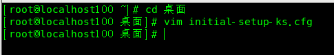


## 3. 一般模式

> ​		以 vi/vim 打开一个档案就直接进入一般模式了（这是默认的模式）。在这个模式中， 你可 以使用『上下左右』按键来移动光标，你可以使用『删除字符』或『删除整行』来处理档 案内容， 也可以使用『复制、粘贴』来处理你的文件数据

**常用语法**:

| 语法                   | 功能描述                       |
| ---------------------- | ------------------------------ |
| yy                     | 复制光标当前一行               |
| y  数字 y 或 者 数字yy | 复制一段（从第几行到第几行）   |
| y$                     | 复制光标后面的内容             |
| y^                     | 复制光标前面的内容             |
| d$                     | 删除光标后面的内容             |
| d^                     | 删除光标前面的内容             |
| p                      | 箭头移动到目的行粘贴           |
| u                      | 撤销上一步                     |
| dd                     | 删除光标当前行                 |
| d 数字 d               | 删除光标（含）后多少行         |
| x                      | 剪切一个字母，相当于 del       |
| X                      | 剪切一个字母，相当于 Backspace |
| yw                     | 复制一个词                     |
| dw                     | 删除一个词                     |
| shift+6（^）           | 移动到行头                     |
| shift+4（$）           | 移动到行尾                     |
| 1+shift+g              | 移动到页头，数字               |
| shift+g                | 移动到页尾                     |
| 数字 + shift+g         | 移动到目标行                   |
| r                      | 替换单个字符                   |
| R                      | 从光标开始依次替换字符         |
| b                      | 跳到上一个词的词头             |
| e                      | 跳到下一个词的词尾             |
| w(shift+w)             | 跳到下一个词的词头             |
| ESC                    | 退出编辑模式                   |
| 数字+shift+g           | 跳到指定的行                   |
| gg 或 shift+h          | 快速移动到文档顶端             |
| G (shift+g)            | 快速移动到文档底端             |
| L(shift+l)             | 快速移动到当前界面的底端       |
| :set nu                | 显示行号                       |
| :set nonu              | 不显示行号                     |

**vi/vim键盘图**

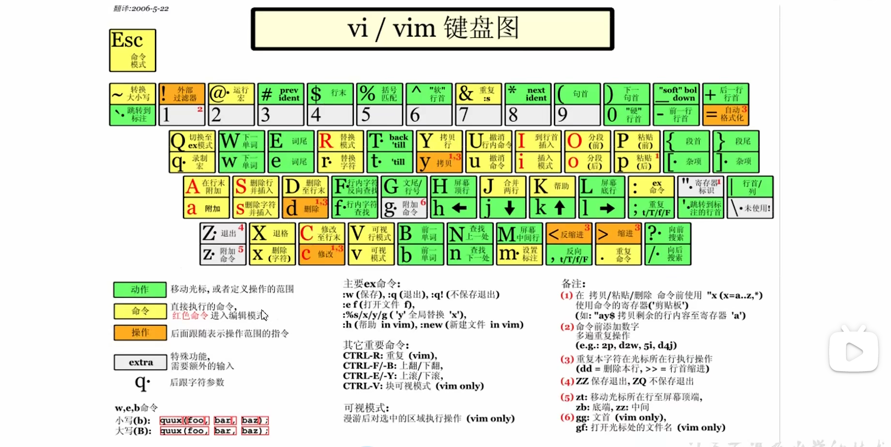

## 4. 编辑模式

​		在一般模式中可以进行删除、复制、粘贴等的动作，但是却无法编辑文件内容的!要等到你按下``【i,I, o,O,a,A】``等任何一个字母之后才会进入编辑模式。

​		注意了!通常在Linux中，按下这些按键时，在画面的左下方会出现 ``【INSERT或REPLACE】`` 的字样，此时才可以进行编辑。而如果要回到一般模式时，则必须要按下``【Esc】``这个按键即可退出编辑模式。

* **进入编辑模式**

| 按键 | 功能               |
| ---- | ------------------ |
| i    | 当前光标前         |
| a    | 当前光标后         |
| o    | 当前光标行的下一行 |
| I    | 光标所在行最前     |
| A    | 光标所在行最后     |
| O    | 当前光标行的上一行 |

* **退出编辑模式**

​		按 【Esc】键退出编辑模式，之后所在的模式为一般模式

## 5. 指令模式

​		在一般模式当中，输入【 : / ?】3个中的任何一个按钮，就可以将光标移动到最底下那 一行。

​		 在这个模式当中， 可以提供你【搜寻资料】的动作，而读取、存盘、大量取代字符、 离开 vi 、显示行号等动作是在此模式中达成的

* **基本语法**

| 命令          | 功能                                            |
| ------------- | ----------------------------------------------- |
| :w            | 保存                                            |
| :q            | 退出                                            |
| :!            | 强制执行                                        |
| :wq!          | 强制保存退出                                    |
| /要查找的词   | 全局查找目标词汇(``n`` 向下查找，``N``向上查找) |
| :noh          | 取消高亮显示                                    |
| :set nu       | 显示行号                                        |
| :set nonu     | 关闭行号                                        |
| :s/old/new    | 替换当前行匹配到的第一个old 为 new              |
| :s/old/new/g  | 替换当前行匹配到的所有 old 为 new               |
| :%s/old/new   | 替换文档中每一行匹配到第一个 old 为 new         |
| :%s/old/new/g | 替换文档中匹配到的所有 old 为 new               |

* **实例实操**

  * 强制保存退出

  ``` mark
  :wq!
  ```

## 6. 模式间转换

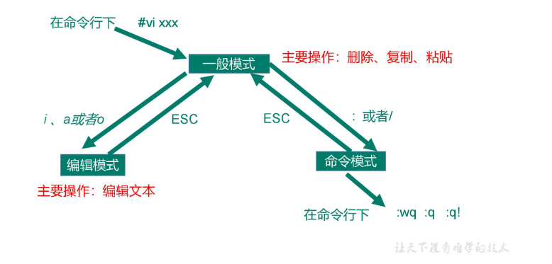

# 第五章：网络配置（重点）

## 1. 查看网络 IP 和网关

* **查看虚拟网络编辑器，如图所示：**

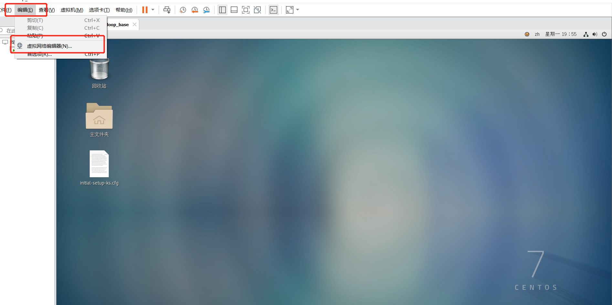

* **修改虚拟网卡 Ip，如图所示：**

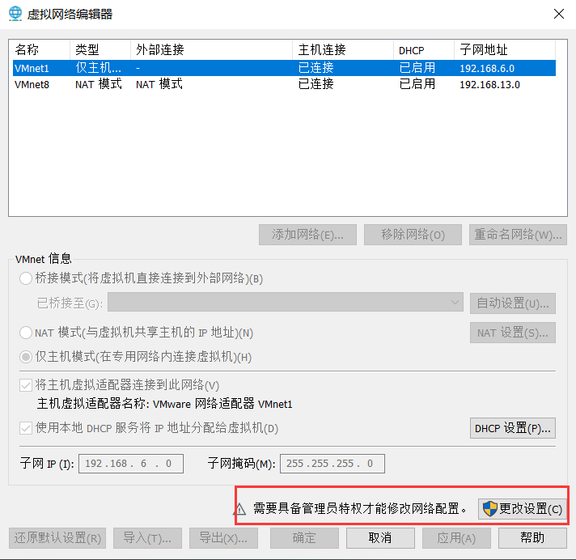


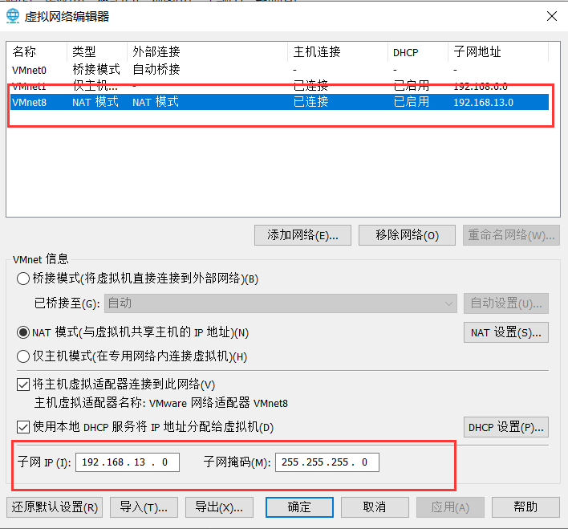


* **VMware 提供了三种网络连接模式：**

  * 桥接模式

  > 虚拟机直接连接外部物理网络的模式，主机起到了网桥的作用。这种模式下，虚拟机可以直接访问外部网络，并且对外部网络是可见的。

  * NAT 模式

  > 虚拟机和主机构建一个专用网络，并通过虚拟网络地址转换(NAT）设备对P进行转换。虚拟机通过共享主机P可以访问外部网络，但外部网络无法访问虚拟机。

  * 仅主机模式

  > 虚拟机只与主机共享一个专用网络，与外部网络无法通信.

* **查看网关，如图所示：**

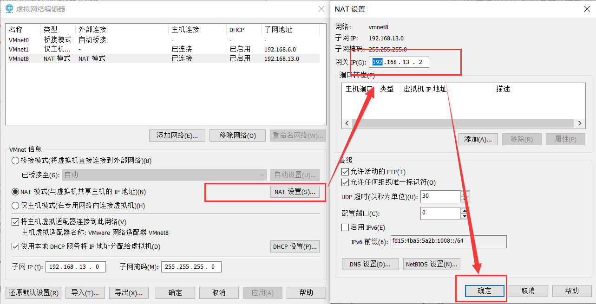


> 说明：如果修改了虚拟子网中的 IP 地址，则对应的 虚拟子网的网关 以及  windows 环境中的 VMnet8（即虚拟网卡）的 IP 也要修改，保证前三位一致。
>
> 以上图为例：要将虚拟子网的 IP 地址修改为 192.168.22.0, 则对应的 网关要修改为 192.168.22.2, 对应的虚拟网卡的 IP 修改为 192.168.22.1


* 查看 windows 环境中的 VMnet8 网络配置，如图所示：


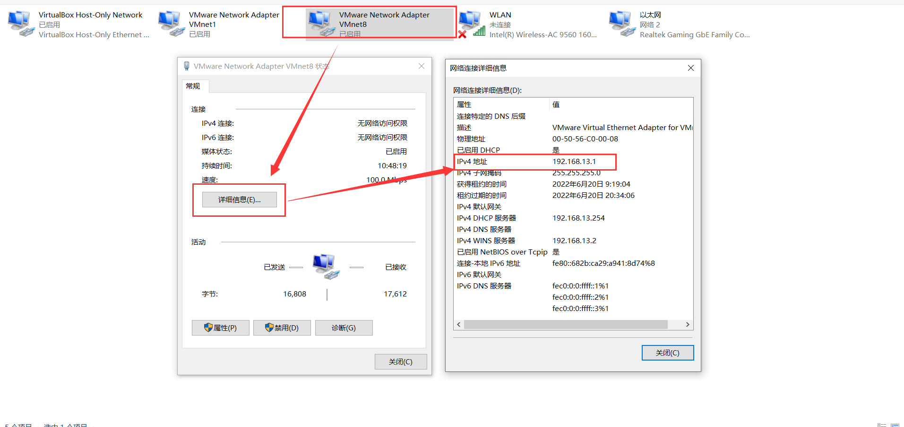


## 2. 配置网络 ip 地址

### 2.1 ifconfig 配置网络接口

> ifconfig :network interfaces configuring 网络接口配置

* **基本语法**

``` vim
ifconfig # 显示所有网络接口的配置
```

> 扩展：windows 下查看 所有的 IP 配置 的命令：
>
> ipconfig

* **实例实操**

> ifconfig   # 查看当前网络 IP

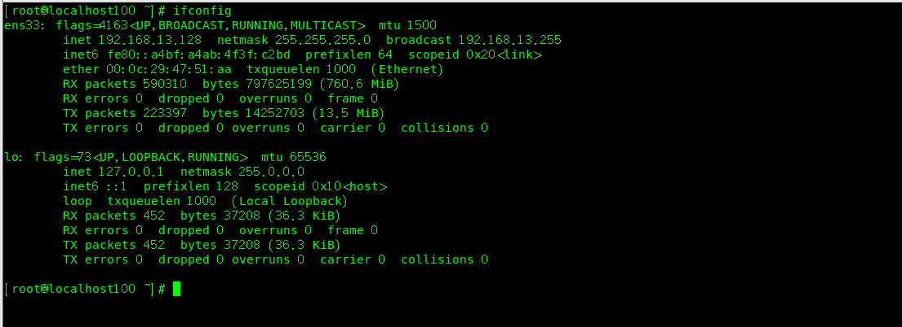

### 2.2 ping测试主机间网络连通性

* **基本语法**

``` linux
ping 目的主机  # 功能描述：测试当前服务器是否可以连接目的主机
```

* **案例实操**

测试当前服务器是否可以连接百度

``` linux
ping www.baidu.com
```

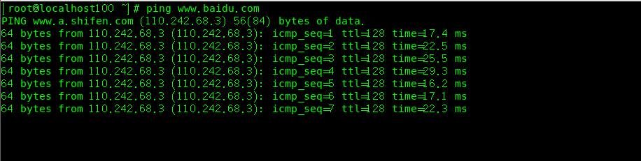

### 2.3 修改 IP 为静态IP

> 默认 IP 是 DHCP 方式，即自动分配

* **查看 IP 配置文件，如图所示：**

``` linux
vim /etc/sysconfig/network-scripts/ifcfg-ens33
```

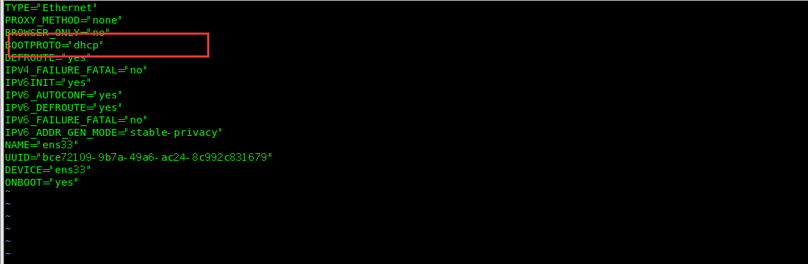

> 可以看到当前默认 IP 方式是DHCP自动获取

**以下标红的项必须修改，有值的按照下面的值修改，没有该项的要增加**

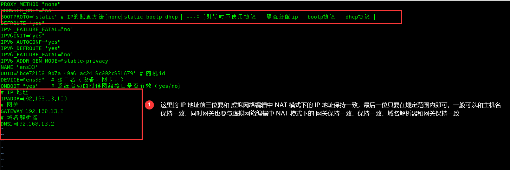

> 总结：
>
> 1. 将 BOOTPROTO 的值修改为 static
> 2. 新增 IP 地址，网关 和 域名解析器
>    1. IP 地址前三位要和虚拟子网（虚拟网络编辑中的 NAT 模式）的 IP地址前三位保持一致，最后一位在合理范围内(1 - 244)可以和主机名编号保持一致（我们这里的主机名设置的是 localhost100，所以最后一位设置为100）,
>    2. 网关要和虚拟子网的网关保持一致
>    3. 域名解析器要和网关保持一致
>    4. 子网掩码可以不用设置，默认就是 255.255.255.0

**修改后如下图所示：**

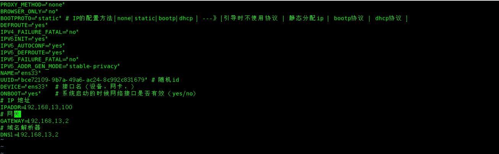


**编辑完成后，按键盘 esc 退出编辑模式，然后输入 :wq 保存并退出**


* **执行 ``service network restart`` 重启网络，如图所示：**


* **执行 ``ifconfig`` 显示所有网络接口的配置**

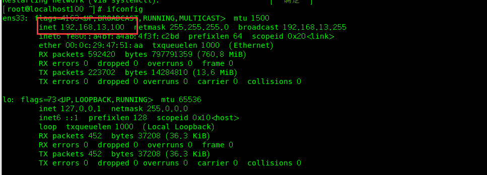

**可以看到 IP 地址已经修改成功了**

* **在 cmd 命令行进行 ping 测试，发现可以进行 Ping**

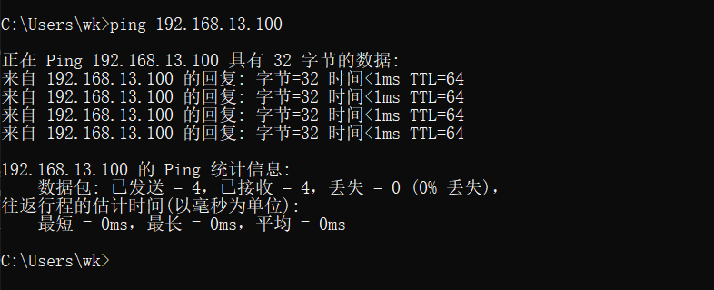


* **在 linux 中 ping 外网，发现也可以进行 ping**

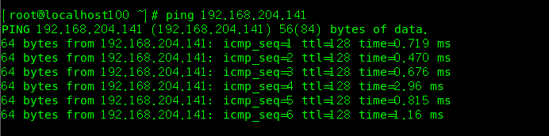

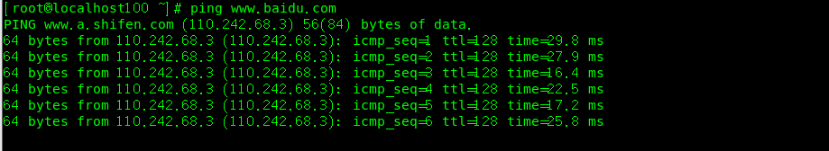


**至此，我们设置 虚拟IP 为 静态IP 就完成了**


### 2.4 修改 IP 地址后 可能会遇到的问题

* **物理机能 ping 通虚拟机，但是虚拟机 ping 不通物理机,一般都是因为物理机的 防火墙问题,把防火墙关闭就行**

* **虚拟机能 Ping 通物理机,但是虚拟机 Ping 不通外网,一般都是因为 DNS 的设置有 问题**

* **虚拟机 Ping www.baidu.com 显示域名未知等信息,一般查看 GATEWAY 和 DNS 设 置是否正确**

* **如果以上全部设置完还是不行，需要关闭 NetworkManager 服务（这个不建议，因为关闭这个之后，就无法进行网络连接，我们可以关闭 NetWork（老版本） 来试试）**
  * ``systemctl stop NetworkManager`` 关闭
  * ``systemctl disable NetworkManager`` 禁用
* **如果检查发现 ``systemctl status network`` 有问题 需要检查 ifcfg-ens3**


## 3. 配置主机名

### 3.1 修改主机名称

* **基本语法**

``` linux
hostname     # 功能描述：查看当前服务器的主机名称
```

* **案例实操**

  * 查看当前服务器主机名称

  ``` linux
  hostname
  ```

  * 如果感觉此主机名不合适，我们可以进行修改。通过编辑 /etc/hostname 文件

    * 方式一：

    ``` linux
    vim /etc/hostname
    ```

    修改完成后重启生效

    * 方式二：

    ``` linux
    hostnamectl set-hostname hadoop100
    ```

    修改完成后立即生效

### 3.2 修改 hosts 映射文件

* **修改 linux 的主机映射文件（hosts文件）**

​			后续在 hadoop 阶段，虚拟机会比较多，配置时通常会采用主机名的方式配置，比较简单方便。不用刻意记 ip 地址。

* **打开 /etc/hosts**

``` linux
vim /etc/hosts
```

* **添加如下内容**

``` linux
192.168.13.100 hadoop100
192.168.13.101 hadoop101
192.168.13.102 hadoop102
192.168.13.103 hadoop103
192.168.13.104 hadoop104
# 这里的 ip 地址 前三位 和 虚拟ip 一致
```

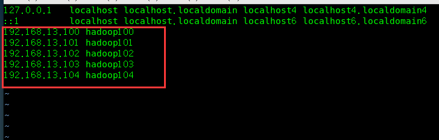


* **修改 window 的主机映射文件（hosts文件）**

> 文件路径：C:\Windows\System32\drivers\etc
>
> hosts为系统重要文件，默认被隐藏了，需要点击 
>
> ``查看 ---》 选项 ---》查看 ---》 取消勾选隐藏受保护的操作系统文件``

* **默认我们是没有权限修改的，我们可以修改 hosts 文件权限，然后打开，并添加一下内容**

``` linux
192.168.13.100 hadoop100
192.168.13.101 hadoop101
192.168.13.102 hadoop102
192.168.13.103 hadoop103
192.168.13.104 hadoop104
```

> 说明：
>
> 如果无法进行修改，则可以复制一份 hosts 文件到桌面，等在桌面修改好以后，在替换掉当前的 hosts 文件

* **在 windows 的 DOS 命令中 与我们的 linux 主机进行 ping 测试**

可以发现 linux 主机名可以自动解析为对应的 ip地址，这样以后远程连接的时候就不用输入 id地址，直接用主机名，更加方便。

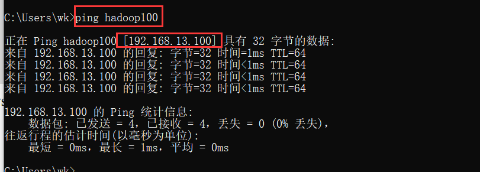

## 4. 远程登录

​		通常在工作过程中，公司中使用的真实服务器或者是云服务器，都不允许除运维人员 之外的员工直接接触，因此就需要通过远程登录的方式来操作。所以，远程登录工具就是 必不可缺的，目前，比较主流的有`` Xshell``, SSH Secure Shell, SecureCRT,FinalShell 等，同学 们可以根据自己的习惯自行选择.

Xshell 和 Xftp下载地址：https://www.xshell.com/zh/

Xshell（远程连接工具）

Xftp（文件上传工具）

# 第六章：系统管理

## 1. Linux 中的进程和服务

​		**计算机中，一个正在执行的程序或命令，被叫做“进程”（process）。** 	

​		**启动之后一直存在、常驻内存的进程，一般被称作“服务”（service）**

## 2. service 服务管理（CentOS 6 版本 -了解）

### 2.1 基本语法

> service  服务名  start | stop | restart | status 

### 2.2 经验技巧

**查看服务的方法：``/etc/init.d/服务名`` ,发现只有``两个服务``保留在 service**

``` linux
ls /etc/init.d/
```


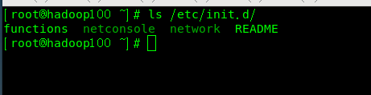


### 2.3 案例实操

* **查看网络服务的状态**

``` \
service network status
```

* **停止网络服务**

``` linux
service network stop
```

* **启动网络服务**

``` linux
service network start
```

* **重启网络服务**

``` linux
service network restart
```

## 3. chkconfig 设置后台服务的自启配置（CentOS6版本）

### 3.1 基本语法

``` shell
chkconfig （功能描述：查看所有服务器自启配置）
chkconfig 服务名 off （功能描述：关掉指定服务的自动启动）
chkconfig 服务名 on （功能描述：开启指定服务的自动启动）
chkconfig 服务名 --list （功能描述：查看服务开机启动状态)
```

### 3.2 案例实操

* **开启/关闭 network(网络)服务 的自动启动**

``` shell
chkconfig network on
```

``` shell
chkconfig network off
```

* **开启/关闭 network 服务指定级别的自动启动**

``` shell
chkconfig --level 指定级别 network on
```

``` shell
chkconfig --level 指定级别 network off
```

## 4. systemctl（CentOS7 版本-重点掌握）

### 4.1 基本语法

> systemctl start | stop | restart | status   服务名

### 4.2 经验技巧

**查看服务的方法：``ls /usr/lib/systemd/system``**

``` shell
ls /usr/lib/systemd/system
```

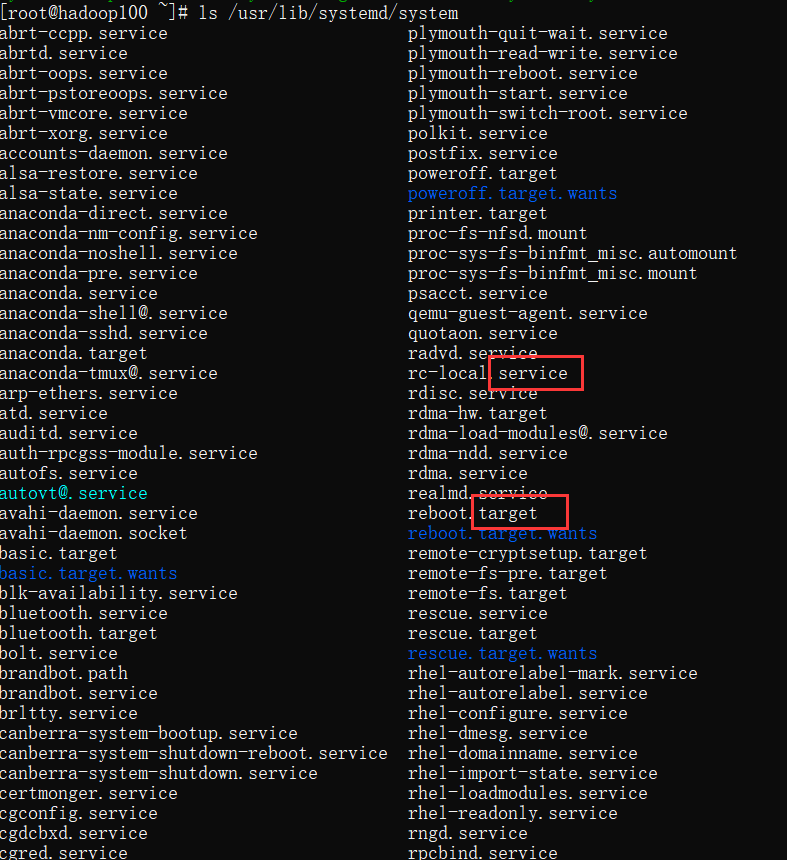

> 说明：
>
> ​	每一个以 .service 结尾的都是一个服务
>
> ​	每一个以 .target 结尾的都是一个服务组成的集合

### 4.3 案例实操

- **查看防火墙服务的状态**

``` linux
systemctl status firewalld
```

* **停止防火墙服务**

``` linux
systemctl stop firewalld
```

- **启动防火墙服务**

``` linux
systemctl start firewalld
```

- **重启防火墙服务**

``` linux
systemctl restart firewalld
```

## 5. systemctyl 设置后台服务的自启动配置

### 5.1 基本语法

``` linux
systemctl list-unit-files (功能描述：查看服务开机启动状态)

systemctl disable service_name (功能描述：关掉指定服务的自动启动)

systemctl enable service_name (功能描述：开启指定服务的自动启动)
```

### 5.2 图形化界面查看自启动服务

在命令行输入以下下命令打开图形化界面：

``` linux
setup
```

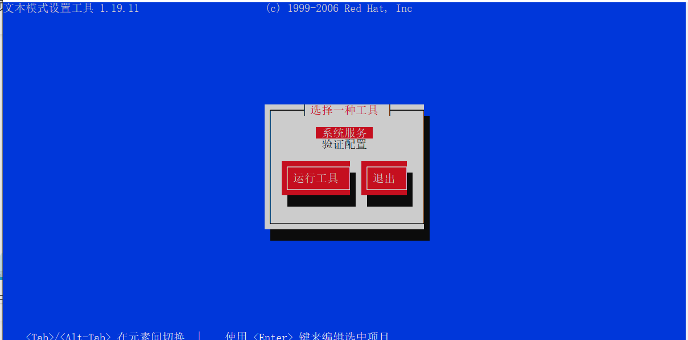

点击回车，选择系统服务：

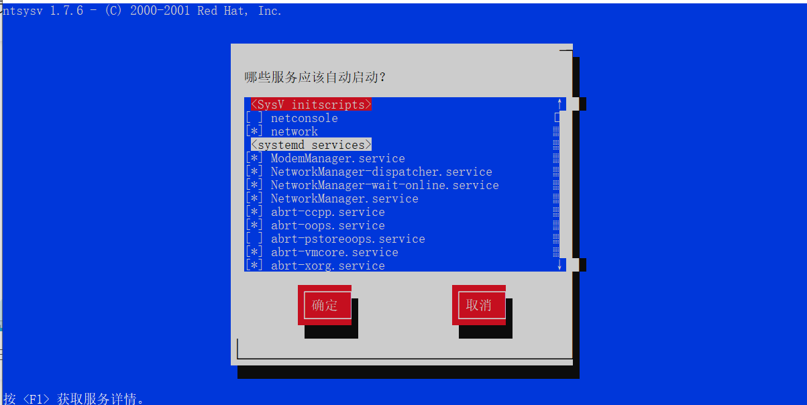

上图列表中方括号里面为 ``*`` 号的表示开机自启动。

如果想要修改，则选中对应行，点击 ``空格`` ，方括号里面的 ``*``消失后，按 ``TAB`` 键 选中确定/取消按钮，退出图形化界面

### 5.3 案例实操

* **开启/关闭 iptables(防火墙)服务的自动启动**

``` linux
systemctl enable firewalld.service
```

``` linux
systemctl disable firewalld.service
```

## 6. 系统运行级别

### 6.1 Linux运行级别[CentOS6],如图所示：

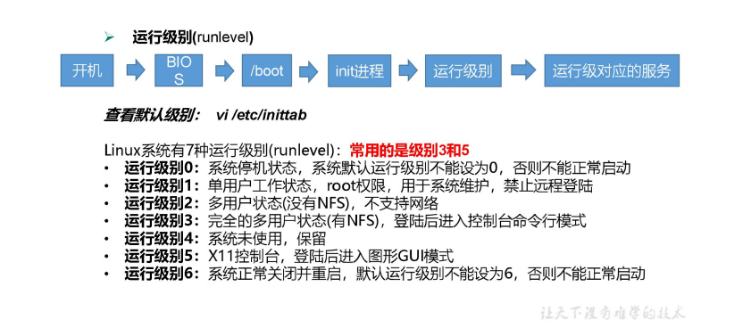

* **在 CentOS6 中查看运行级别**

``` linux
vim /etc/inittab
```

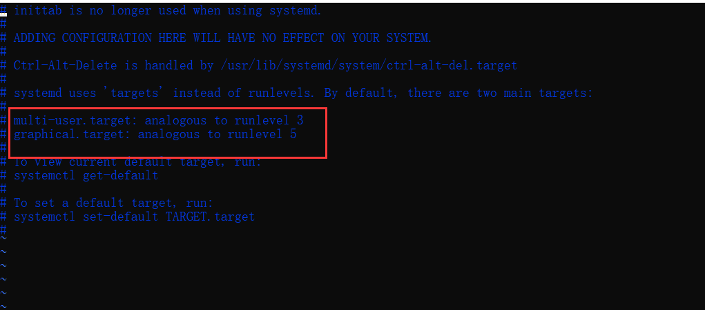

> 由于当前我们使用的是 CentOS7，使用 CentOS6 来查看时，所有的运行级别都别注释掉了，同时我们也可以看到：
>
> CentOS7 的运行级别对应 在 CentOS6 中是多少：
>
> * **``multi-user.target``等价于原运行级别3（多用户有网，无图形界面）**
> * **``graphical.target`` 等价于原运行级别 5 （多用户有网，有图形界面）**

### 6.2 CentOS7 的运行级别简化为：

* **``multi-user.target``等价于原运行级别3（多用户有网，无图形界面）**

* **``graphical.target`` 等价于原运行级别 5 （多用户有网，有图形界面）**

### 6.3 查看当前运行级别

``` linux
systemctl get-default (当前是运行级别5)
```


### 6.4 修改当前运行级别

``` linux
systemctl set-default TARGET.target （这里TARGET取 multi-user 或者 graphical）
```

### 6.5 直接切换到指定运行级别下的方式

* **方式一：使用 ``ctrl + alt + F2`` 快捷键直接进入指定级别下的控制台界面** 

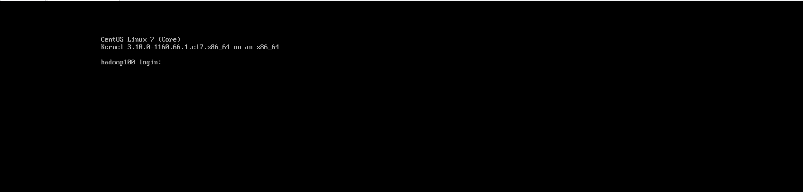

> 在这个界面下，可以处理运行级别三下面的事情

* **使用 ``ctrl + alt + F1`` 退出当前运行级别**


* **方式二：通过命令行进入**

```` linux
init 3
````

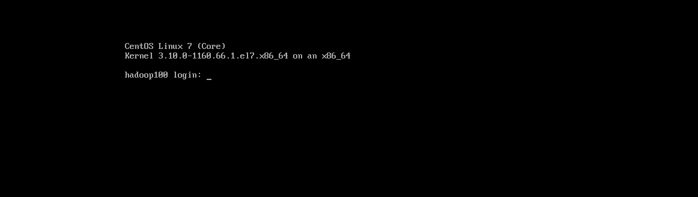

* **可以通过方式一的快捷键退出，也可以登录后，再使用命令切换回 运行级别 5**

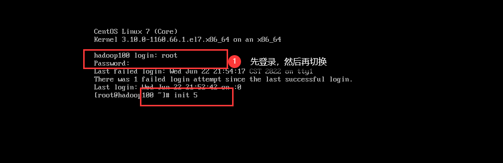

## 7. 关闭防火墙

### 7.1 临时关闭防火墙

* **查看防火墙状态**

``` linux
systemctl status firewalld
```

* **临时关闭防火墙**

``` linux
systemctl stop firewalld
```

### 7.2 开机启动时关闭防火墙

* **设置开机时开启防火墙**

``` linux
systemctl enable firewalld.service
```

* **设置开机时关闭防火墙**

``` linux
systemctl disable firewalld.service
```

## 8. 关机重启命令

在 linux 领域内大多用在服务器上，很少遇到关机的操作。毕竟服务器上跑一个服务是永无止境的，除非特殊情况下，不得已才会关机

### 8.1 基本语法

``` linux
sync          (功能描述：将数据由内存同步到硬盘中)
halt          (功能描述：停机，关闭系统，但不断电)
poweroff      (功能描述：关机，断电)
reboot        (功能描述：就是重启，等同于 shutdown -r now)
```

``` linux
shutdown [选项] 时间
```

| 选项 | 功能                         |
| ---- | ---------------------------- |
| -H   | 相当于 --halt，停机          |
| -r   | -r = reboot 重启             |
| -P   | 相当于 poweroff ，关机，断电 |

| 参数 | 功能                               |
| ---- | ---------------------------------- |
| now  | 立刻关机                           |
| 时间 | 等待多久后关机，（时间单位是分钟） |

### 8.2 经验技巧

​		Linux 系统中为了提高磁盘的读写效率，对磁盘采取了 “预读迟写”操作方式。当用户 保存文件时，Linux 核心并不一定立即将保存数据写入物理磁盘中，而是将数据保存在缓 冲区中，等缓冲区满时再写入磁盘，这种方式可以极大的提高磁盘写入数据的效率。但是， 也带来了安全隐患，如果数据还未写入磁盘时，系统掉电或者其他严重问题出现，则将导 致数据丢失。使用 sync 指令可以立即将缓冲区的数据写入磁盘

### 8.3 案例实操

* **将数据由内存同步到硬盘中**

``` linux
sync
```

* **重启**

``` linux
reboot
```

* **停机（不断电）**

``` linux
halt
```

* **计算机将在 1 分钟后关机，并且会显示在登录用户的当前屏幕中**

``` linux
shutdown -h 1
```

* **立马关机（等同于poweroff）**

``` linux
shutdown -h now
```

* **系统立马重启（等同于 reboot）**

``` linux
shutdown -r now
```

# 第七章：常用基本命令（重要）

​		Shell 可以看作是一个命令解释器，为我们提供了交互式的文本控制台界面。我们可以 通过终端控制台来输入命令，由 shell 进行解释并最终交给内核执行。 本章就将分类介绍 常用的基本 shell 命令。

## 1. 帮助命令

### 1.1 man 获得帮助信息

* **基本语法**

``` linux
man [命令或配置文件] (功能描述：查看外部命令的详细帮助信息)
或 man 命令 --help  (功能描述：查看外部命令的部分帮助信息)
```

> 说明：输入 q 便能退出当前界面

* **显示说明**

| 信息        | 功能                     |
| ----------- | ------------------------ |
| NAME        | 命令的名称和单行描述     |
| SYNOPSIS    | 怎样使用命令             |
| DESCRIPTION | 命令功能的深入讨论       |
| EXAMPLES    | 怎样使用命令的例子       |
| SEE ALSO    | 相关主题（通常是手册页） |

* **案例实操**

``` linux
man ls       (查看 ls 命令 的帮助信息)
```

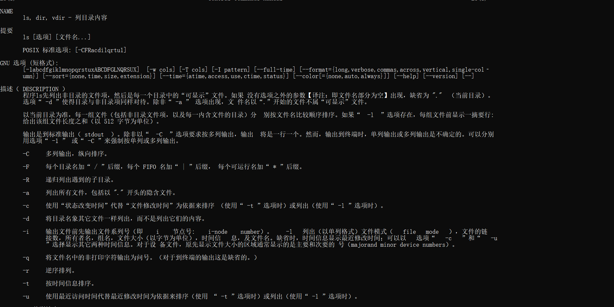

### 1.2 help获得 shell 内置命令的帮助信息

> ​		一部分基础功能的系统命令是直接内嵌在 shell 中的，系统加载启动之后会随着 shell 一起加载，常驻系统内存中。这部分命令被称为“内置（built-in）命令”；相应的其它命令 被称为“外部命令”
>
> ​		``help 只能查看内置命令的帮助信息``

* **基本语法**

``` linux
help 命令    (功能描述：获得 shell 内置命令的帮助信息)
或 man -f 命令
```

* **案例实操**

``` linux
help cd      (查看 cd 命令的帮助信息)
```

### 1.3 type判断命令的类型

> type 可以判断当前命令是内置命令还是外部命令

* **基本语法**

``` linux
type 命令   (功能描述：用来判断命令的类型)
```

* **案例实操**

``` linux
type cd     (cd 是内置命令)
```

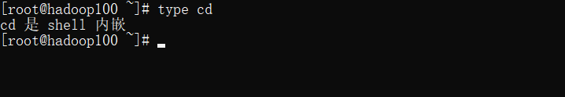

``` linux
type ls    (ls 是外部命令)
```

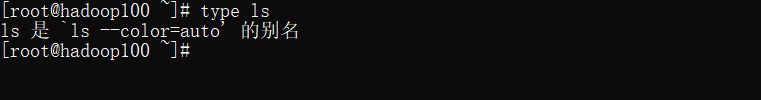

### 1.4 常用快捷键

| 常用快捷键    | 功能                                  |
| ------------- | ------------------------------------- |
| ctrl + c      | 停止进程                              |
| ctrl + l      | 清屏，等同于 clear；彻底清屏是：reset |
| 善于用 tab 键 | 提示（更重要的是可以防止敲错）        |
| 上下键        | 查找执行过的命令                      |

> 补充：history 命令可以查看我们的输入记录

## 2. 文件目录类

### 2.1 pwd 显示当前工作目录的绝对路径

**pwd** ：print working directory 打印工作目录

* **基本语法**

``` linux
pwd           (功能描述：显示当前工作目录的绝对路径)
```

* **案例实操**

``` linux
pwd           (显示当前工作目录的绝对路径)
```

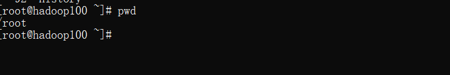


> 补充：
>
> ``` linux
> pwd -P  # 查看当前工作目录的实际物理路径
> ```
>
> 

### 2.2 ls 列出目录的内容

**ls** ：list 列出目录内容

* **基本语法**

``` linux
ls [选项] [目录或是文件]
```

* **选项说明**

| 选项    | 功能                                                         |
| ------- | ------------------------------------------------------------ |
| **-a**  | **全部的文件，连同隐藏档（开头为 . 的文件）一起列出来(常用)** |
| **-l**  | **长数据串列出，包含文件的属性与权限等等数据；（常用）等价于 "ll"** |
| **-lh** | **长数据串列出，包含文件的属性与权限等等数据；其中文件大小会以带单位形式展示** |

* **显示说明**

> 每行列出的信息依次是：文件类型与权限     链接数   文件属主   文件数组   文件大小用byte来表示   建立或最近修改的时间   名字

* **案例实操**

``` linux
ls -al    (查看 al 下的目录数)    
```

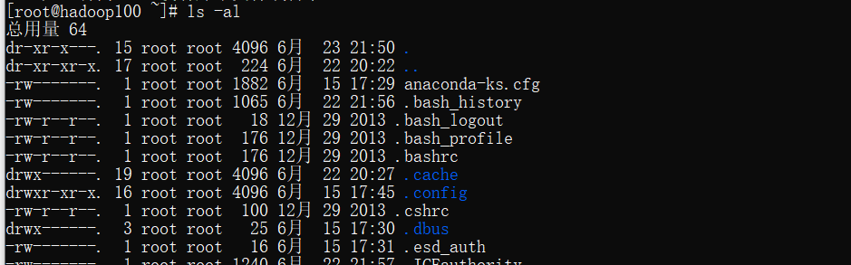

### 2.3 cd 切换目录

**cd**：Change Directory 切换路径

* **基本语法**

``` linux
cd [参数]
```

* **参数说明**

| 参数             | 功能                                     |
| ---------------- | ---------------------------------------- |
| **cd 绝对路径**  | **切换路径**                             |
| **cd 相对路径**  | **切换路径**                             |
| **cd ~ 或者 cd** | **回到自己的家目录**                     |
| **cd -**         | **回到上一次所在目录**                   |
| **cd ..**        | **回到当前目录的上一级目录**             |
| **cd -P**        | **跳转到实际物理路径，而非快捷方式路径** |

* **案例实操**

  * **使用绝对路径切换到 root 目录**

  ``` linux
  cd /root/
  ```

  * **使用相对路径切换到 ‘公共的’ 目录**

  ``` linux
  cd 公共的/
  ```

  * **表示回到自己的家目录，亦即是 /root 这个目录(对于root用户来说)**

  ``` linux
  cd
  ```

  * cd- 回到上一次所在目录

  ``` linux
  cd -
  ```

  * **表示回到当前目录的上一级目录，亦即是 "/root/公共的"  的上一级目录的意思**

  ``` linux
  cd ..
  ```


### 2.4 mkdir 创建一个新的目录

**mkdir：** Make Directory 建立目录

* **基本语法**

``` linux
mkdir [选项] 要创建的目录
```

* **选项说明**

| **选项** | **功能**         |
| -------- | ---------------- |
| **-p**   | **创建多层目录** |

* **案例实操**

  * 创建一个目录

  ``` linux
  mkdir a          (先创建 a 目录，在 a 的基础上再创建 b)
  mkdir a/b
  ```

  * 创建一个多级目录

  ``` linux
  mkdir -p a/b/c   (一次性创建好 a b c 三层目录)
  ```

  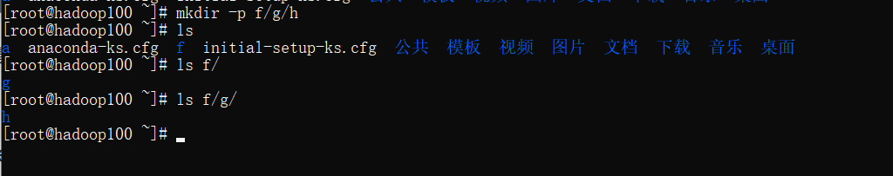

### 2.5 rmdir 删除一个空的目录

**rmdir：** 要删除的空目录

* **基本语法**

``` linux
rmdir   要删除的空目录
```

* **案例实操**

  * 删除一个空的文件夹

  ``` linux
  rmdir a
  ```

  * 删除多层空文件夹

  ``` linux
  rmdir -p f/g/h/
  ```

### 2.6 touch 创建空文件

* **基本语法**

``` linux
touch  文件名称  (直接在当前路径下创建文件，不加后缀名的话默认是文本文件。)
```

``` linux
touch /路径/文件名称   (在指定目录下创建文件)   
```

* **案例实操**

``` linux
touch hello
```

``` linux
touch /home/wk/hello2
```

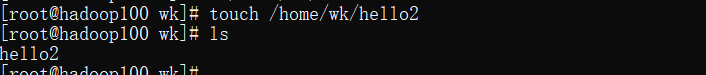

> 补充：
>
> 在 linux  使用 vim 编辑器能创建一个文本文件，和 touch 的区别就是，vim 创建的文件必须要执行保存命令才能创建成功，而 touch 直接就能创建成功

### 2.7 cp 复制文件或目录

* **基本语法**

``` linux
cp [选项] source dest       (功能描述：复制source文件到dest)
```

* **选项说明**

| 选项   | 功能                   |
| ------ | ---------------------- |
| **-r** | **递归复制整个文件夹** |

* **参数说明**

| 参数       | 功能         |
| ---------- | ------------ |
| **source** | **源文件**   |
| **dest**   | **目标文件** |

* **经验技巧**

> 强制覆盖不提示的方法：/cp

* **案例实操**

  * 复制文件

  ``` linux
  cp initial-setup-ks.cfg a/  (复制 initial-setup-ks.cfg 到 当前目录中的 a 目录下 )
  ```

  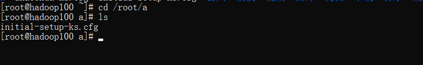

  * 递归复制整个文件夹

  ``` linux
  cp -r a/ /home/wk/
  ```

  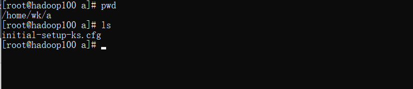

### 2.8 rm 删除文件或目录

* **基本语法**

``` linux
rm [选项] deleteFile      (功能描述：递归删除目录中所有内容)
```

* **选项说明**

| 选项   | 功能                                             |
| ------ | ------------------------------------------------ |
|        | **不添加选项，默认只能删除文件，不能删除文件夹** |
| **-r** | **递归删除目录中所有内容**                       |
| **-f** | **强制执行删除操作，而不提示用户进行确认**       |
| **-v** | **显示指令的详细执行过程**                       |

* **案例实操**

  * 删除目录中的内容（有用户提示）

  ``` linux
  rm initial-setup-ks.cfg  (删除 /home/wk/a 目录下的文件)
  ```

  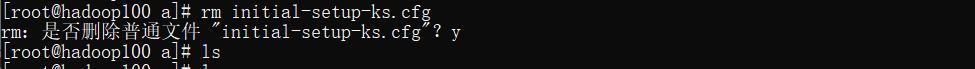

  * 删除目录中的内容（没有用户提示）

  ``` linux
  rm -f hello      (删除 /home/wk/a 目录下的文件)
  ```

  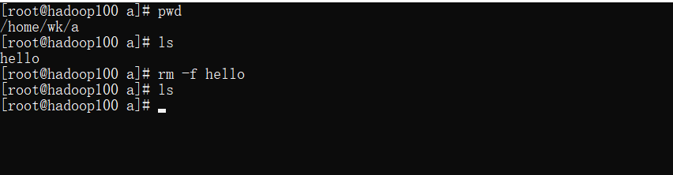

  * 递归删除目录中所有内容（有用户提示）

  ``` linux
  rm -r a/    (删除 /home/wk/a 目录下的所有内容，包括文件夹 a )
  ```

  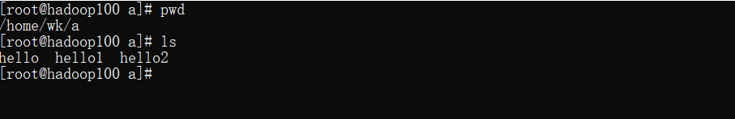

  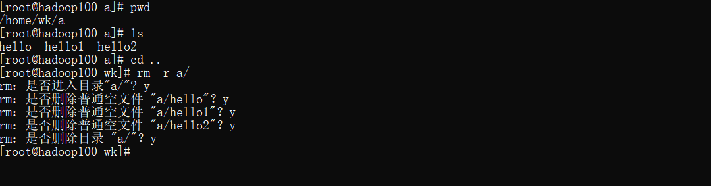

  * 递归删除目录中所有内容（没有用户提示）

  ``` linux
  rm -rf a/    (删除 /home/wk/a 目录下的所有内容，包括文件夹 a )
  ```

  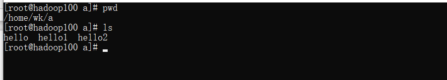

  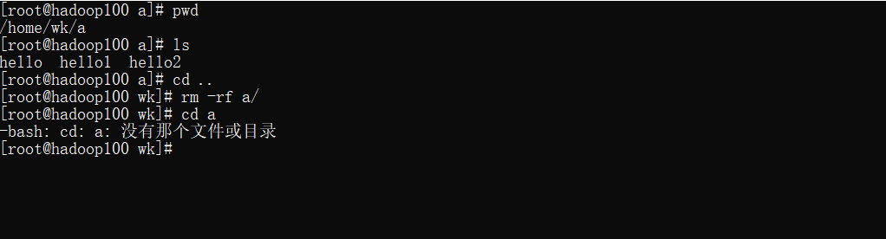

  * 删库跑路（谨慎使用）

  ``` linux
  rm -rf /*   (删除根目录下的所有)
  ```

### 2.9 mv 移动文件与目录或重命名

* **基本语法**

``` linux
(1) mv oldNameFile newNameFile    (功能描述：重命名)
(2) mv 文件名 目标路径 (功能描述：移动文件)
```

* **案例实操**

  * 重命名

  ``` linux
  mv hello world     (将 hello 重命名为 world)
  ```

  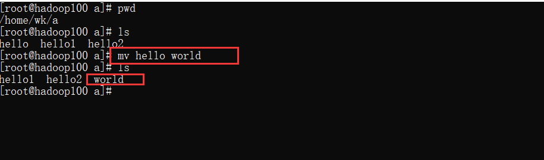

  * 移动文件

  ``` linux
  mv hello-a.cfg /home/wk/1.cfg (将 hello-a.cfg 从 /root/a 目录下移动到 /home/wk 目录下)
  ```

  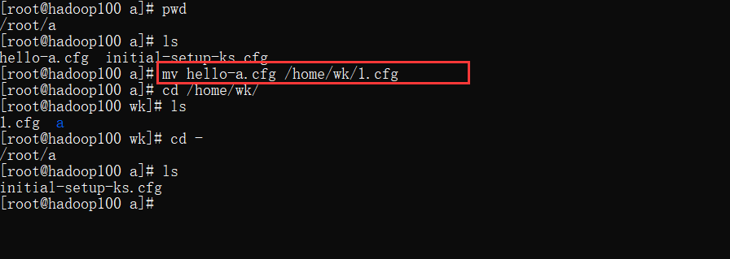

### 2.10 cat 查看文件内容

> 查看文件内容，从第一行开始显示

* **基本语法**

``` linux
cat [选项] 要查看的文件
```

* **选项说明**

| 选项   | 功能描述                       |
| ------ | ------------------------------ |
| **-n** | **显示所有行的行号，包括空行** |

* **经验技巧**

**一般查看比较小的文件，一屏幕能显示全的**

* **案例实操**
  *  **查看文件内容并显示行号**

> cat -n hello.txt

### 2.11 more 文件内容分屏查看器

​		more 指令是一个基于 VI 编辑器的文本过滤器，它以全屏幕的方式按页显示文本文件 的内容。more 指令中内置了若干快捷键，详见操作说明。

* **基本语法**

``` linux
more 要查看的文件
```

* **操作说明**

| 操作              | 功能说明                                  |
| ----------------- | ----------------------------------------- |
| **空白键(space)** | **代表向下翻一页**                        |
| **Enter**         | **代表向下翻一行**                        |
| **b**             | **代表向上翻一页**                        |
| **=**             | **输出当前行的行号**                      |
| **q**             | **代表立刻离开 more，不再显示该文件内容** |
| **Ctrl + F**      | **向下滚动一屏**                          |
| **Ctrl + B**      | **返回上一屏**                            |
| **:f**            | **输出文件名和当前行的行号**              |

* **案例实操**
  * 采用 more 查看文件

> more 1.cfg

### 2.12 less 分屏显示文件内容

​		less 指令用来分屏查看文件内容，它的功能与 more 指令类似，但是比 more 指令更加 强大，支持各种显示终端。less 指令在显示文件内容时，并不是一次将整个文件加载之后 才显示，而是根据显示需要加载内容，对于显示大型文件具有较高的效率。

* **基本语法**

``` linux
less 要查看的文件
```

* **操作说明**

| 操作           | 功能说明                                           |
| -------------- | -------------------------------------------------- |
| **空白键**     | **向下翻动一页**                                   |
| **[pagedown]** | **向下翻动一页**                                   |
| **[pageup]**   | **向上翻动一页**                                   |
| **/字串**      | **向下搜寻[字串]的功能；n：向下查找；N：向上查找** |
| **?字串**      | **向上搜寻[字串]的功能；n：向上查找；N：向下查找** |
| **q**          | **离开less这个程序**                               |
| **g**          | **直接来到第一行**                                 |
| **shift + g**  | **直接来到最后一行**                               |

* **经验技巧**

**用 SercureCR 时 [pagedown] 和 [pageup] 可能会出现无法识别的问题**

* **案例实操**

  * 采用 less 查看文件

  ``` linux
  less 1.cfg
  ```


### 2.13 echo

​		echo输出内容到控制台

* **基本语法**

``` linux
echo [选项][输出内容]
```

* **选项**

| 控制字符 | 作用                    |
| -------- | ----------------------- |
| **\\\**  | **输出\本身**           |
| **\n**   | **换行符**              |
| **\t**   | **制表符，也就是Tab键** |
| **-e**   | **转义输出**            |

* **案例实操**

``` linux
echo "hello\tworld"
```


``` linux
echo -e "hello\tworld"
```

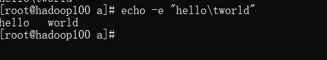

### 2.14 head显示文件头部内容

​		head 用于显示文件的开头部分内容，默认情况下 head 指令显示文件的前 10 行内容。

* **基本语法**

``` linux
head 文件   （功能描述：查看文件头 10 行内容）
head -n 5 文件    （功能描述：查看文件头5行内容，5可以是任意行数）
```

* **选项说明**

| 选项         | 功能                       |
| ------------ | -------------------------- |
| **-n<行数>** | **指定显示头部内容的行数** |

* **案例实操**

  *  查看文件的头2行

  ``` linux
  head -n 2 1.cfg
  ```

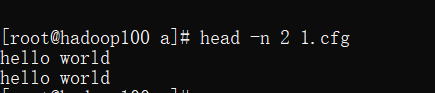

### 2.15 输出文件尾部内容

​		``tail `` 用于输出文件中尾部的内容，默认情况下tail指令显示文件的后 10 行 内容。

* **基本语法**

``` linux
tail 文件           （功能描述：查看文件尾部10行内容）
tail -n 5 文件      （功能描述：查看文件尾部5行内容，5可以是任意行数）
tail -f 文件        （功能描述；实时追踪该文档的所有更新）
```

* **选项说明**

| 选项         | 功能                                         |
| ------------ | -------------------------------------------- |
| **-n<行数>** | **输出文件尾部n行内容**                      |
| **-f**       | **显示文件最新追加的内容，监视文件变化**     |
| **ctrl + c** | **退出监控文件功能**                         |
| **ctrl + s** | **暂停监控文件功能(依然能够记录文件的变化)** |
| **ctrl + q** | **取消暂停监控文件功能**                     |

* **案例实操**

  * 查看文件尾 1 行 内容

  ``` linux
  tail -n 1 1.cfg
  ```

  * 实时追踪该文档的所有更新

  ``` linux
  tail -f 1.cfg
  ```

* **补充**

  ``` linux
  ls -i 文件名   （功能描述：查看文件底层索引）
  ```

  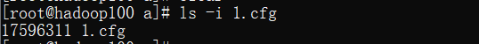

> 注意：文件修改后，其对应的索引也会发生改变

### 2.16  > 输出重定向 和 >> 追加

* **基本语法**

``` linux
ls -l > 文件    （功能描述：列表的内容写入文件 a.txt 中（覆盖写））

ls -al >> 文件  （功能描述：列表的内容追加到文件 aa.txt 的末尾）

cat 文件1 > 文件2   （功能描述：将文件1 的内容覆盖到文件2）

echo "内容" >> 文件 （功能描述：将输入的内容追加到文件里）
```

* **案例实操**

  * 将 ls 查看到的信息写入到文件中

  ``` linux
  ls -l > houge.txt
  ```

  * 将 ls 查看到的信息追加到文件中

  ``` linux
  ls -l >> houge.txt
  ```

  * 采用 echo 将 hello 单词追加到文件中

  ``` linux
  echo hello >> houge.txt
  ```


### 2.17 ln 软链接

​		软链接也称为符号链接，类似于 windows 里的快捷方式，有自己的数据块，主要存放了链接其它文件的路径。

* **基本语法**

``` linux
ln -s [原文件或目录][软链接名]   （功能描述；给原文件创建一个软链接）
```

* **经验技巧**

> **1.删除软链接：**
>
> * rm 软链接名 （有用户提示）
> * rm -rf 软链接名   （没有提示）
>
> 注意：没有提示使用的命令是 ``rm -rf 软连接名``，而不是 ``rm -rf 软链接名/`` , 如果使用 ``rm -rf 软连接名/`` 进行删除，会把软链接对应的真实目录下内容删掉（对应真实目录不会被删除，删除的只是真实目录下的所有内容）
>
> **2.查询：**
>
> 通过 ``ll`` 就可以查看，列表属性第一位是 1，尾部会有位置指向

* **案例实操**

  * 创键软链接

  ``` linux
  ln -s /root/a/1.cfg mycfg  # 在 /home/wk 目录下创键一个指向 /root/a/1.cfg 的软链接 mycfg
  ```

  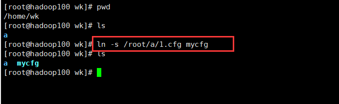

  * 删除软链接

  ``` linux
  rm mycfg # (有提示)
  ```

  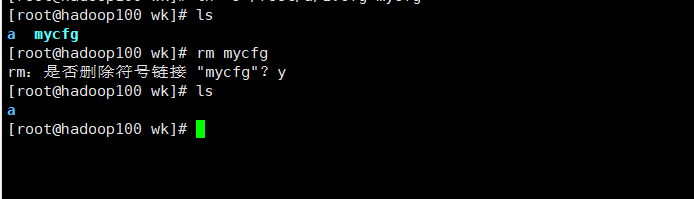

  ``` linux
  rm -rf mycfg #(没有提示)
  ```

  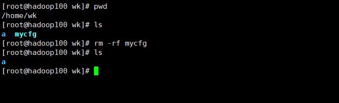

  * 进入软链接实际物理路径

  ``` linux
  cd -P myB  # 软链接是 /home/wk/myB，实际物理路径是/root/b 下, 所以执行这个命令，会直接进入 /root/b
  ```

   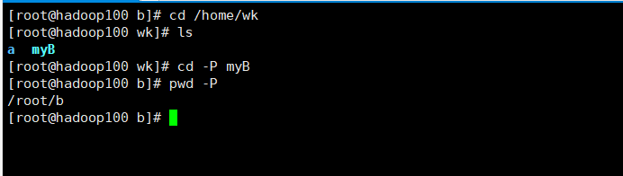

**扩展：**

* **硬链接（了解）**

  * **基本命令**

  ``` linux
  ln [原文件或目录][软链接名]
  ```

  * **硬链接只能针对文件创建硬链接，不能创建目录的硬链接，而且硬链接 与 inode 相关**

* **硬链接 和 软链接 的区别：**

> 硬连接指通过索引节点来进行连接。在 Linux 的文件系统中，保存在磁盘分区中的文件不管是什么类型都给它分配一个编号，称为索引节点号(Inode Index)。在 Linux 中，多个文件名指向同一索引节点是存在的。比如：A 是 B 的硬链接（A 和 B 都是文件名），则 A 的目录项中的 inode 节点号与 B 的目录项中的 inode 节点号相同，即一个 inode 节点对应两个不同的文件名，两个文件名指向同一个文件，A 和 B 对文件系统来说是完全平等的。删除其中任何一个都不会影响另外一个的访问。
>
> 硬连接的作用是允许一个文件拥有多个有效路径名，这样用户就可以建立硬连接到重要文件，以防止“误删”的功能。其原因如上所述，因为对应该目录的索引节点有一个以上的连接。只删除一个连接并不影响索引节点本身和其它的连接，只有当最后一个连接被删除后，文件的数据块及目录的连接才会被释放。也就是说，文件真正删除的条件是与之相关的所有硬连接文件均被删除。

> 另外一种连接称之为符号连接（Symbolic Link），也叫软连接。软链接文件有类似于 Windows 的快捷方式。它实际上是一个特殊的文件。在符号连接中，文件实际上是一个文本文件，其中包含的有另一文件的位置信息。比如：A 是 B 的软链接（A 和 B 都是文件名），A 的目录项中的 inode 节点号与 B 的目录项中的 inode 节点号不相同，A 和 B 指向的是两个不同的 inode，继而指向两块不同的数据块。但是 A 的数据块中存放的只是 B 的路径名（可以根据这个找到 B 的目录项）。A 和 B 之间是“主从”关系，如果 B 被删除了，A 仍然存在（因为两个是不同的文件），但指向的是一个无效的链接。

### 2.18 history 查看已经执行过历史命令

* **基本语法**

``` linux
history      (功能描述：查看已经执行过历史命令)
```

``` linux
history 数字n  （功能描述：显示过去最近输入的 n 条命令）
```

``` linux
history -c     (功能描述：清除输入记录)
```

``` linux
!命令历史编号           (可以重复调用编号对应的输入命令)
```

* **案例实操**

  * 查看已经执行过的历史命令

  ``` linux
  history
  ```

  * 显示过去最近输入的 10 条命令

  ``` linux
  history 10
  ```

  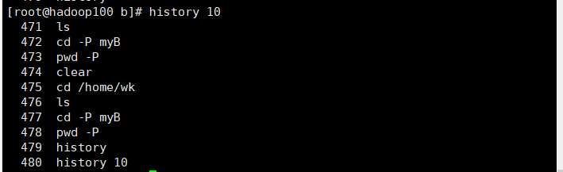

  * 重复调用编号对应的输入命令

  ``` linux
  # 480 对应过去输入记录中的 history 10
  !480   (相当于重复执行了 history 10 这个命令)
  ```

  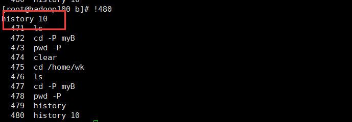

  * 删除历史记录

  ``` linux
  histroy -c
  ```


## 3. 时间日期类

* **基本语法**

``` linux
date [OPTION]... [+FORMAT]
```

* **选项说明**

| 选项               | 功能                                                 |
| ------------------ | ---------------------------------------------------- |
| **-d<时间字符串>** | **显示指定的 "时间字符串" 表示的时间，而非当前时间** |
| **-s<日期时间>**   | **设置系统日期时间**                                 |

* **参数说明**

| 参数                | 功能                               |
| ------------------- | ---------------------------------- |
| **<+日期时间格式>** | **指定显示时间使用的日期时间格式** |

### 3.1 date 显示当前时间

* **基本语法**

``` linux
date date （功能描述：显示当前时间）
date +%Y （功能描述：显示当前年份）
date +%m （功能描述：显示当前月份）
date +%d （功能描述：显示当前是哪一天）
date "+%Y-%m-%d %H:%M:%S" （功能描述：显示年月日时分秒）
```

* **案例实操**

  * 显示当前时间信息

  ``` linux
  date
  ```

  

  * 显示当前时间年月日

  ``` linux
  date +%Y %m %d
  ```

  

  * 显示当前时间年月日时分秒

  ``` linux
  date "+%Y %m %d %H:%M:%S"
  ```

  


### 3.2 date 显示非当天时间

* **基本语法**

``` linux
date -d "1 days ago"  (功能描述：显示当前一天时间)
```

``` linux
date -d "-1 days age" (功能描述：显示明天时间)
```


* **案例实操**

  * 显示前一天

  ``` linux
  date -d "1 days ago"
  ```

  * 显示明天时间

  ``` linux
  date -d "-1 days ago"
  ```

  

### 3.3 date 设置系统时间

* **基本语法**

``` linux
date -s 字符串时间
```

* **案例实操**

  * 设置系统当前时间

  ``` linux
  date -s "2017-06-19 20:52:18"
  ```


### 3.4 cal 查看日历

* **基本语法**

``` linux
cal[选项]       （功能描述：不加选项，显示本月日历）
```

* **选项说明**

| 选项           | 功能                 |
| -------------- | -------------------- |
| **具体某一年** | **显示这一年的日历** |

* **案例实操**

  * 查看当前月的日历

  ``` linux
  cal
  ```

  * 查看 2017 年的日历

  ``` linux
  cal 2017
  ```


## 4. 用户管理命令

### 4.1 useradd 添加新用户

* **基本语法**

``` linux
useradd 用户名     （功能描述：添加新用户）
useradd -g 组名 用户名  （功能描述：添加新用户到某个组）
```

* **案例实操**

  * 添加一个用户

  ``` linux
  useradd atguigu
  ```

* **补充**

  * **修改新用户的默认主文件夹**

  > 普通用户的默认主文件夹是 /home/用户名

  ``` linux 
  useradd -d 新的主文件夹目录 用户名
  ```

  ``` linux
  useradd -d /home/tomtest tom
  ```

  


### 4.2 passwd 设置用户密码

* **基本语法**

``` linux
passwd 用户名   （功能描述：设置用户密码）
```

* **案例实操**

  * 设置用户的密码

  ``` linux
  passwd 123456
  ```


### 4.3 id 查看用户是否存在

* **基本语法**

``` linux
id 用户名
```

* **案例实操**

  * 查看用户是否存在

  ``` linux
  id atguigu
  ```

  

  

### 4.4 cat /etc/passwd 查看创建了哪些用户

* **案例实操**

``` linux
cat /etc/passwd
```


### 4.5 su 切换用户

**su：** switch user 切换用户

* **基本语法**

``` linux
su 用户名称      （功能描述：切换用户，只能获得用户的执行权限，不能获得环境变量）

su - 用户名称     （功能描述：切换到用户并获得该用户的环境变量及执行权限）
```

* **切换回上一个用户**

  * **方式一：**

  ``` linux
  su 上一个用户名称
  ```

  * **方式二：**

  ``` linux
  exit
  ```

  

* **案例实操**

``` linux
su atguigu
```

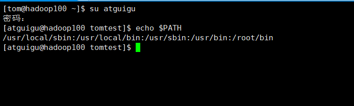

``` linux
su - atguigu
```

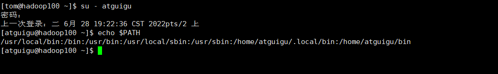

### 4.6 userdel 删除用户

> 注意：删除用户要在 root 用户权限下进行

* **基本语法**

``` linux
userdel 用户名  （功能描述：删除用户但保存用户主目录）

userdel -r 用户名   （功能描述：用户和用户主目录，都删除）
```

* **选项说明**、

| 选项0  | 功能                                         |
| ------ | -------------------------------------------- |
| **-r** | **删除用户的同时，删除与用户相关的所有文件** |

* **案例实操**

  * 删除用户但保存用户主目录

  ``` linux
  userdel tom
  ll /home/
  ```

  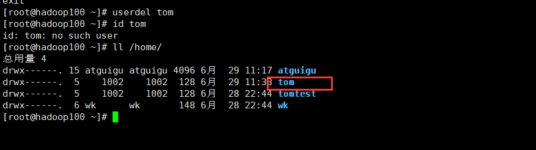

  * 删除用户和用户主目录

  ``` linux
  userdel -r tom
  ls /home/
  ```

  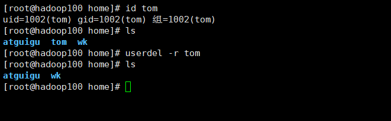

### 4.7 who 查看登录用户信息

* **基本语法**

``` shell
w              (功能描述：查看当前登录的所有用户和登录时间)

who            (功能描述：查看当前登录的所有用户和登录时间)

whoami         (功能描述：显示当前用户名称)

who am i       (功能描述：显示登录用户的用户名以及登录时间)
```

* **案例实操**

  * 查看当前登录的所有用户

  ``` shell
  w
  ```

  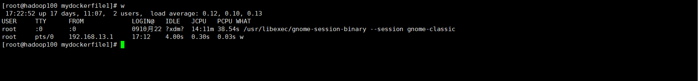

  * 查看当前登录的所有用户

  ``` shell
  who
  ```
  
  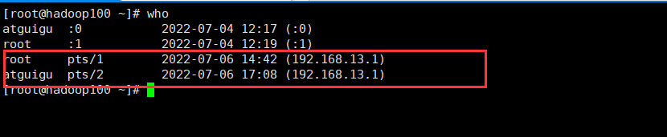
  
  * root用户查看其他登录用户是否开启 messag 服务
  
  ``` shell
  who -T
  # 控制台前的 + 代表开启了，- 代表关闭了
  ```
  
  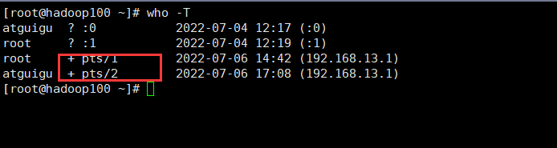
  
  * 显示当前用户名称
  
  ``` shell
  whoami
  ```
  
  
  
  * 显示登录用户的用户名
  
  ``` shell
  who am i
  ```
  
  


### 4.8 sudo 设置普通用户具有 root 权限

* **添加 atguigu 用户，并对其设置密码**

``` shell
useradd aguigu
```

``` shell
passwd atguigu
```

* **修改配置文件**

``` shell
vim /etc/sudoers
```

​		修改 /etc/sudoers 文件，找到下面一行（91行），在 root 下面添加一行，如下所示：

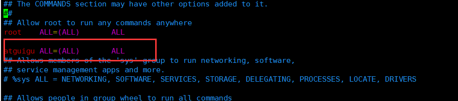

​		或者配置成采用 sudo 命令时，不需要输入密码

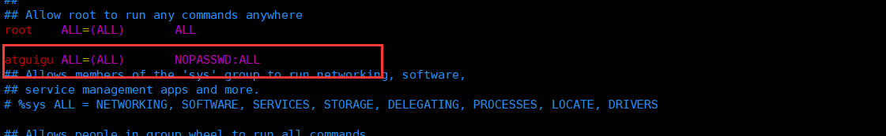

​		修改完毕，现在可以使用 atguigu 账号登录，然后用命令 sudo，即可获得 root 权限进行操作

* **案例实操**

  * 用普通用户 查看 root 用户的主目录

  ``` linux
  su atguigu  # 从 root 用户 切换到 普通用户
  sudo ls    # 使用sudo命令让普通用户暂时拥有root用户权限
  ```

  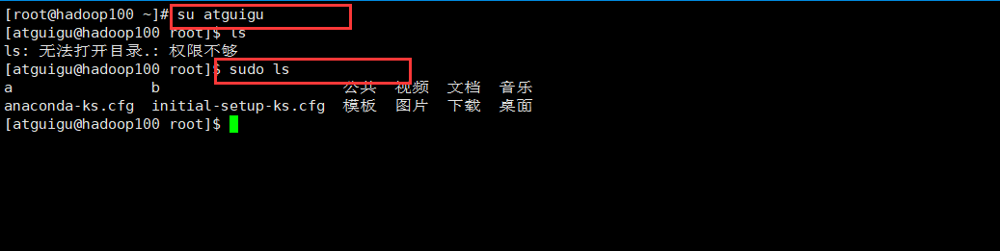


### 4.9 usermod 修改用户

* **基本语法**

``` linux
usermod -g  用户组 用户名
```

* **选项说明**

| 选项   | 功能                                                       |
| ------ | ---------------------------------------------------------- |
| **-g** | **修改用户的初始登录组，给定的组必须存在。默认组 id 是 1** |

* **案例实操**

  * 将用户加入到用户组

  ``` linux
  usermod -g hair tony
  ```

  

## 5. 用户组管理命令

​		每个用户都有一个用户组，系统可以对一个用户组中的所有用户进行集中管理。不同 Linux 系统对用户组的规定有所不同

​		 如Linux下的用户属于与它同名的用户组，这个用户组在创建用户时同时创建。

​		 用户组的管理涉及用户组的添加、删除和修改。组的增加、删除和修改实际上就是对 /etc/group文件的更新。


### 5.1 groupadd 新增组

* **基本语法**

``` linux
groupadd 组名
```

* **案例实操**

  * 添加一个 hair 组

  ``` linux
  groupadd hair
  ```

  

### 5.2 groupdel 删除组

* **基本语法**

``` linux
groupdel 组名
```

* **案例实操**

  - 删除 hair 组

  ``` linux
  groupdel hair
  ```


### 5.3 groupmod 修改组

* **基本语法**

``` linux
groupmod -n 新组名 老组名
```

* **选项说明**

| 选项           | 功能描述               |
| -------------- | ---------------------- |
| **-n<新组名>** | **指定工作组的新组名** |

* **案例实操**

  * 修改 hair 组 为 meifa

  ``` linux
  groupmod -n meifa hair
  ```

### 5.4 cat /etc/group  查看创建了哪些组

* **基本操作**

``` linux
cat   /etc/group
```


## 6. 文件权限类

### 6.1 文件属性

​		Linux系统是一种典型的多用户系统，不同的用户处于不同的地位，拥有不同的权限。 为了保护系统的安全性，Linux系统对不同的用户访问同一文件（包括目录文件）的权限做 了不同的规定。在Linux中我们可以使用 **ll** 或者 **ls -l** 命令来显示一个文件的属性以及文件所属 的用户和组。

* **从左到右的10个字符表示，如图所示：**


​	如果没有权限，就会出现减号 [**-**] 。从左到右用 0-9 这些数字来表示：

​	（1）0-首位 表示类型

​				在 Linux 中第一个字符代表这个文件是目录，文件或链接文件等等

​				``- 代表是文件``

​				``d 代表是目录``

​				``l 链接文档（link file）``

​				``c 字符类型设备文件(比如键盘)``

​				``d 块类型设备文件(比如硬盘)`` 

​	（2）第 1-3 位确定属主（该文件的所有者）拥有该文件的权限。 --- User

​	（3）第 4-6 位确定属组（所有者的同组用户）拥有该文件的权限。--- Group

​	（4）第 7-9 位确定其他用户拥有该文件的权限 --- Other


* **rwx 作用文件和目录的不同解释**

  * 作用到文件：

  > **[ r ]：代表可读(read)：可以读取，查看**
  >
  > **[ w ]：代表可写(write)：可以修改，看是不代表可以删除该文件，删除一个文件的前提条件是对该文件所在的目录有写权限，才能删除该文件**
  >
  > **[ x ]：代表可执行(execute)：可以被系统执行**

  * 作用到目录：

  > **[ r ]：代表可读(read)：可以读取，ls 查看目录内容**
  >
  > **[ w ]：代表可写(write)：可以修改，目录内容创建 + 删除 + 重命名目录**
  >
  > **[ x ]：代表可执行(execute)：可以进入该目录**

* **案例实操**

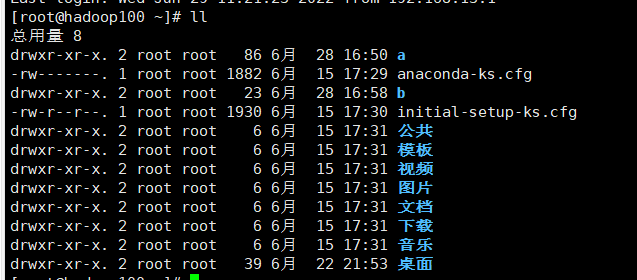


​		文件基本属性介绍，如图所示：

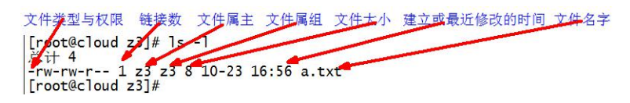


​	（1）如果查看到的是文件：链接数指的是硬链接个数

​	（2）如果查看的是文件夹：链接数指的是子文件夹个数


### 6.2 chmod 改变权限

* **基本语法**


​	第一种方式变更权限：

``` linux
chmod [{ugoa}{+-=}{rwx}] 文件或目录
```

​    第二种方式变更权限

``` linux
chmod [modc=421] [文件或目录]
```

* **经验技巧**

| 字符  | 含义                        |
| ----- | --------------------------- |
| **u** | **所属主**                  |
| **g** | **所属组**                  |
| **o** | **其他人**                  |
| **a** | **所有人（u、g、o的总和）** |


| **数字**             | **含义** |
| -------------------- | -------- |
| **1    ---> 001**    | **--x**  |
| **2    ---> 010**    | **-w-**  |
| **3    --->  011**   | **-wx**  |
| **4     --->  100**  | **r--**  |
| **5     --->  101**  | **r-x**  |
| **6     --->  110**  | **rw-**  |
| **7      --->  111** | **rwx**  |

* **案例实操**

  * 修改文件使其所属主用户具有执行权限

  ``` linux
  chmod u+x text
  ```

  修改前：

  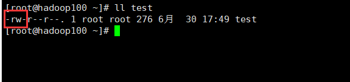

  修改后：

  ​										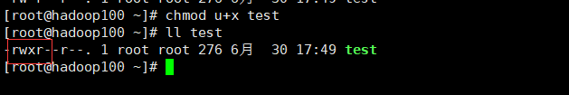

  

  * 修改文件使其所属组用户具有执行权限

  ``` linux
  chmod g+x test
  ```

  修改前：

  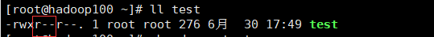

  修改后：

  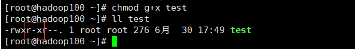

  - 修改文件所属主用户执行权限，并使其他用户具有执行权限

  ``` linux
  chmod u-x,o+x test
  ```

  修改前：

  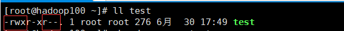

  修改后：

  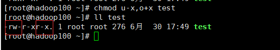

  * 采用数字的方式，设置文件所有者、所属组、其他用户都具有可读可写可执行权限

  ``` linux
  chmod 777 test
  ```

  修改前：

  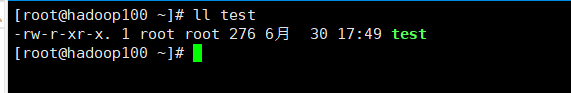

  修改后：

  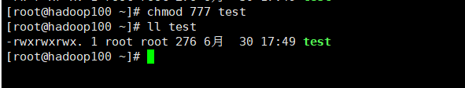

  * 修改整个文件夹里面的所有文件的所有者、所属组、其他用户都具有可读、可写、可执行权限

  ``` linux
  chmod -R 777 a
  ```

  修改前：

  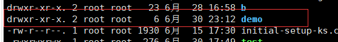

  修改后：

  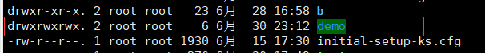


### 6.3 chown 改变所有者

* **基本语法**

``` linux
chown [选项][最终用户][文件或目录]  (功能描述：改变文件或者目录的所有者)
```

* **选项说明**

| 选项   | 功能         |
| ------ | ------------ |
| **-R** | **递归操作** |

* **案例实操**
  * 修改文件所有者
  
  ``` linux
  chown atguigu test
  ```
  
  修改前：
  
  
  
  修改后：
  
  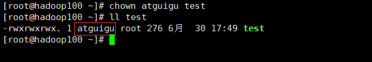
  
  * 递归改变文件所有者和所有组
  
  ``` linux'
  chown -R atguigu:atguigu demo/
  ```
  
  修改前：
  
  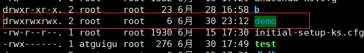
  
  修改后：
  
  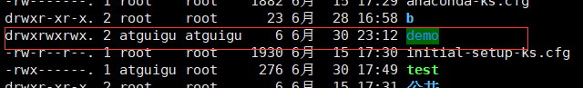


### 6.4 chgrp 改变所属组

* **基本语法**

``` linux
chgrp [最终用户组] [文件或目录]   （功能描述：改变文件或者目录的所属组）
```

* **案例实操**

  * 修改文件的所属组

  ``` linux
  chgrp atguigu test
  ```

  修改前：

  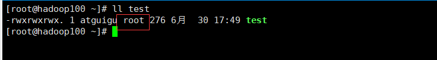

  修改后：

  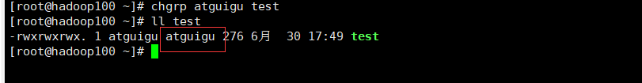


## 7. 搜索查找类

### 7.1 find 查找文件或者目录

​		find 指令将从指定目录向下递归遍历其各个子目录，将满足条件的文件显示在终端

* **基本语法**

``` linux
find [搜索范围] [选项]
```

* **选项说明**

| 选项                | 功能                                  |
| ------------------- | ------------------------------------- |
| **-name<查询方式>** | **按照指定的文件名查找模式查找文件**  |
| **-user<用户名>**   | **查找属于指定用户名所有文件**        |
| **-size<文件大小>** | **按照指定的文件大小查找文件,单位为** |
|                     | **b     ----->   块（512字节）**      |
|                     | **c     ----->    字节**              |
|                     | **w    ----->   字（2字节）**         |
|                     | **k     ----->     千字节**           |
|                     | **M    ----->     兆字节**            |
|                     | **G    ----->      G字节**            |

* **案例实操**

  * 按文件名：根据名称查找/目录下的filename.txt文件

  ``` linux
  find /home/atguigu -name test
  ```

  

  * 按拥有者：查找 /opt 目录下，用户名称为 -user 的文件

  ``` linux
  find /home/atguigu -user atguigu
  ```

  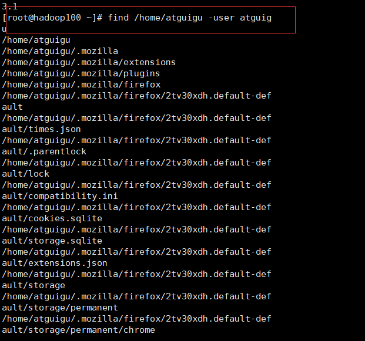

  * 按文件大小：在 /home 目录下查找大于 2M 的文件（+n 大于，-n 小于，n等于）

  ``` linux
  find /home -size +2M
  ```

  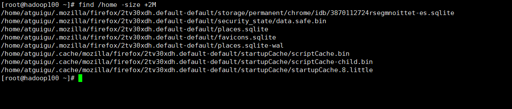


### 7.2 locate 快速定位文件路径

​		**locate 指令利用事先建立的系统中所有文件名称及路径的locate 数据库实现快速定位给定的文件。Locate 指令无需遍历整个文件系统，查询速度较快。为了保证查询结果的准确度，管理员必须定期更新 locate 时刻。** 

* **基本语法**

``` linux
locate 搜索文件
```

* **经验技巧**

​		由于 locate 指令基于数据库进行查询，所以第一次运行前，必须使用  ``updatedb`` 指令创建 locate 数据库

* **案例实操**

  * 查询文件夹

  ``` linux
  updatedb
  locate tmp
  ```

* **补充**

  * **which 查看命令位置**

  ``` linux
  which locate
  ```

  

  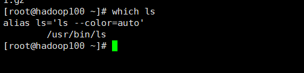

  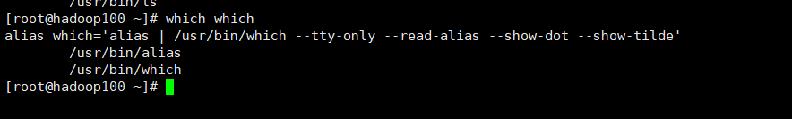

  * **whereis 查看命令位置**

  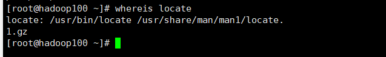


### 7.3 grep 过滤查找 和  "|" 管道符

​		管道符，"|"，表示将前一个命令的处理结果输出传递给后面的命令处理

* **基本语法**

``` linux
grep 选项 查找内容 源文件
```

* **选项说明**

| 选项        | 功能                 |
| ----------- | -------------------- |
| **-n**      | **显示匹配行及行号** |
| **-i**      | **忽略大小写**       |
| **-m 数字** | **过滤的最大行数**   |

* **案例实操**

  * 查找某文件在第几行

  ``` linux
  ls | grep -n test
  ```

  * 查找 以 ``.cfg`` 结尾的文件

  ``` linux
  ls | grep .cfg
  ```

  * 

  ``` linux
  grep -n boot initial-setup-ks.cfg  | wc
  ```

  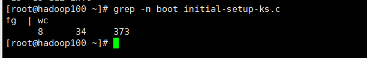


## 8. 压缩和解压类

### 8.1 gzip/gunzip 压缩

* **基本语法**

``` linux
gzip 文件   （功能描述：压缩文件，只能将文件压缩为*.gz文件）
```

``` linux
gunzip 文件.gz   （功能描述：解压缩文件命令）
```

* **经验技巧**

  * 只能压缩文件不能压缩目录
  * 不保留原来的文件
  * 同时多个文件会产生多个压缩包

* **案例实操**

  * gzip 压缩

  ``` linux
  gzip hello
  ```

  

  * gunzip 解压缩文件

  ``` linux
  gunzip hello.gz
  ```

  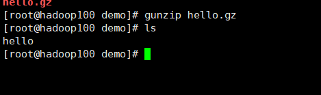


### 8.2 zip/unzip 压缩

* **基本语法**

``` linux
zip [选项] XXX.zip 将要压缩的内容  （功能描述：压缩文件和目录的命令）
```

``` linux
unzip [选项] XXX.zip
```

* **选项说明**

| zip 选项 | 功能         |
| -------- | ------------ |
| **-r**   | **压缩目录** |

| unzip 选项   | 功能                         |
| ------------ | ---------------------------- |
| **-d<目录>** | **指定解压后文件的存放目录** |

* **经验技巧**

​		zip 压缩命令在 windows/linux 都通用，可以压缩目录且保留源文件

* **案例实操**

  * 压缩 hello.txt 和 hello1.txt ，压缩后的名称为 mypackage.zip

  ``` linux
  zip mypackage.zip hello hello1
  ```

  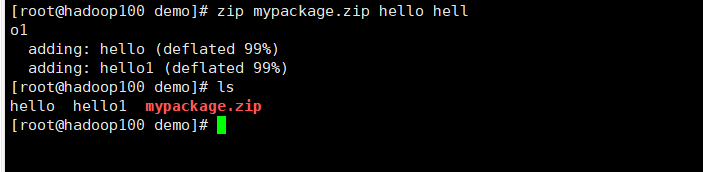

  * 解压 mypackage.zip

  ``` linux
  unzip mypackage.zip
  ```

  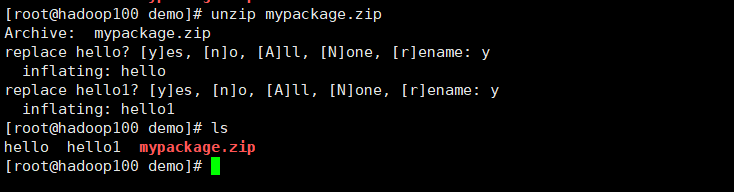

  * 解压 mypackage.zip 到指定目录d

  ``` linux
  unzip mypackage.zip -d /home/atguigu/demo1
  ```

  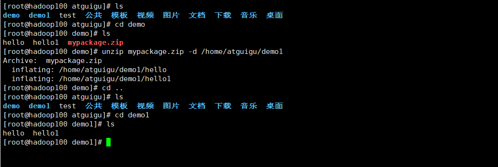


### 8.3 tar 打包

* **基本语法**

``` linux
tar [选项] XXX.tar.gz  将要打包进去的内容   （功能描述：打包目录，压缩后的文件格式 .tar.gz）
```

* **选项说明**

| 选项   | 功能                   |
| ------ | ---------------------- |
| **-c** | **产生 .tar 打包文件** |
| **-v** | **显示详细信息**       |
| **-f** | **指定压缩后的文件名** |
| **-z** | **打包同时压缩**       |
| **-x** | **解包.tar文件**       |
| **-C** | **解压到指定目录**     |

* **案例实操**

  * 压缩多个文件

  ``` linux
  tar -zcvf houma.tar hello hello1 hello2 
  ```

  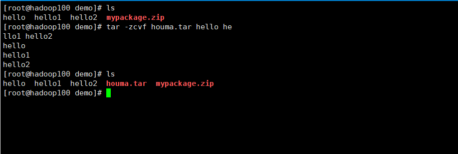

  * 压缩目录

  ``` linux
  tar -zcvf mydemo1.tar.gz demo1/ 
  ```

  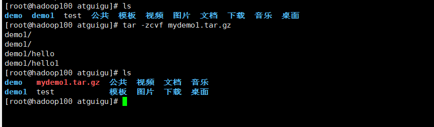

  * 解压当前目录

  ``` linux
  tar -zxvf mydemo1.tar.gz
  ```

  * 解压到指定目录

  ``` linux
  tar -zxvf mydemo1.tar.gz -C /home/atguigu
  ```

  

## 9. 磁盘查看和分区类

### 9.1 du 查看文件和目录占用的磁盘空间

​		**du：** disk usage 磁盘占用情况

* **基本语法**

``` linux
du 目录/文件   （功能描述：显示目录下每个子目录的磁盘使用情况）
```

* **选项说明**

| 选项          | 功能                                                    |
| ------------- | ------------------------------------------------------- |
| -h            | 以人们较容易阅读的 GBytes，MBytes，KBytes等格式自行显示 |
| -a            | 不仅查看子目录大小，还要包括文件                        |
| -c            | 显示所有的文件和子目录大小后，显示总和                  |
| -s            | 只显示总和                                              |
| --max-depth=n | 指定统计子目录的深度为第 n 层                           |

* **案例实操**

  * 查看当前用户主目录占用的磁盘空间大小

  ``` linux
  du -sh
  ```

  


### 9.2 df 查看磁盘空间使用情况

​		**df：** disk free 空余磁盘

* **基本语法**

``` linux
df 选项  （功能描述；列出文件系统的整体磁盘使用量，检查文件系统的磁盘空间占用情况）
```

* **选项说明**

| 选项   | 功能                                                         |
| ------ | ------------------------------------------------------------ |
| **-h** | **以人们较容易阅读的 GBytes，MBytes，KBytes 等格式自行显示** |

* **案例实操**

  * 查看磁盘使用情况

  ``` linux
  df -h
  ```

  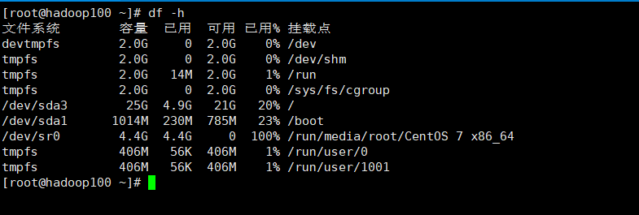

* **补充：使用 free 查看当前内存使用情况**

  * 查看当前内容使用情况

  ``` linux
  free -h
  ```

  


### 9.3 lsblk 查看设备挂载情况

* **基本语法**

``` linux
lsblk      (功能描述：查看设备挂载情况)
```

* **选项说明**

| 选项   | 功能                                         |
| ------ | -------------------------------------------- |
| **-f** | **查看详细的设备挂载情况，显示文件系统信息** |

### 9.4 mount/umount 挂载/卸载

​		对于Linux用户来讲，不论有几个分区，分别分给哪一个目录使用，它总归就是一个根 目录、一个独立且唯一的文件结构。

​		 Linux中每个分区都是用来组成整个文件系统的一部分，它在用一种叫做“挂载”的处理 方法，它整个文件系统中包含了一整套的文件和目录，并将一个分区和一个目录联系起来， 要载入的那个分区将使它的存储空间在这个目录下获得。

* **挂载前准备（必须要有光盘或者已经连接镜像文件），如图所示：**

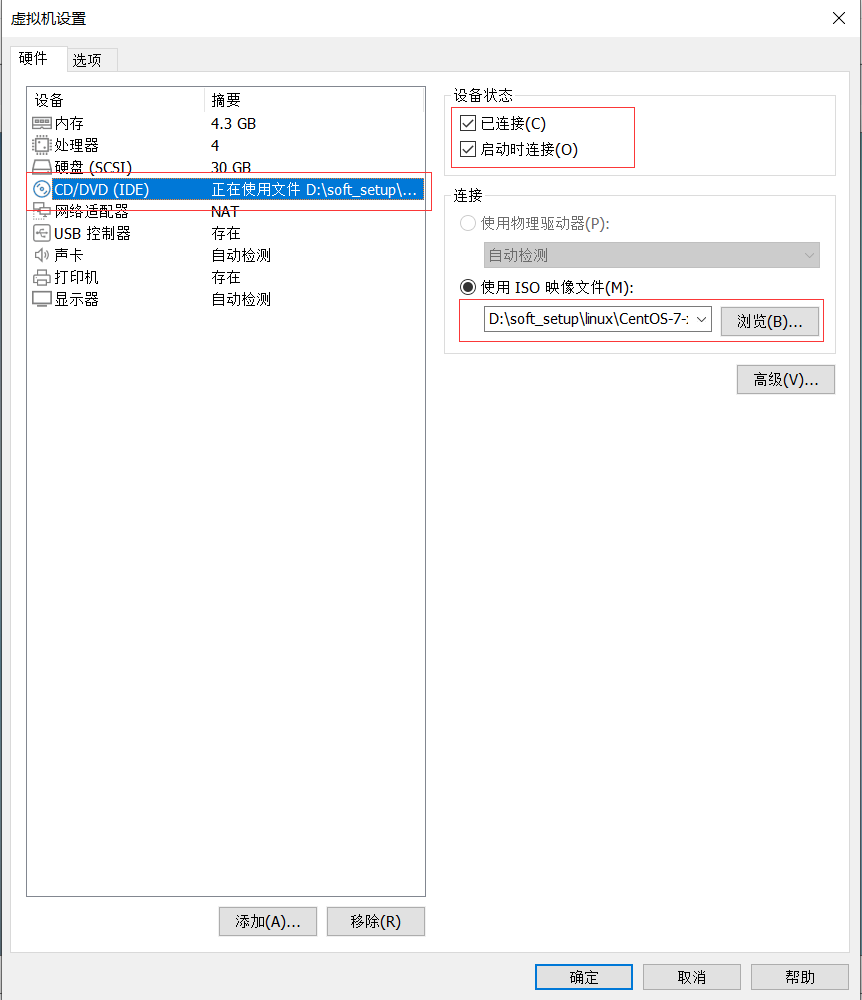


* **基本语法**

``` linux
mount [-t vfstype] [-o options] device dir (功能描述：挂载设备)

umount 设备文件名或挂载点   (功能描述：卸载设备)
```

* **参数说明**

| 参数           | 功能                                                         |
| -------------- | ------------------------------------------------------------ |
| **-t vfstype** | **指定文件系统的类型，通常不必指定。mount 会自动选择正确的类 型。常用类型有：           光盘或光盘镜像：iso9660                                     DOS fat16 文件系统：msdos                               Windows 9x fat32 文件系统：vfat               Windows NT ntfs 文件系统：ntfs                        Mount Windows 文件网络共享：smbfs UNIX(LINUX) 文件网络共享：nfs** |
| **-o options** | **主要用来描述设备或档案的挂接方式。常用的参数有：                                                                           loop：用来把一个文件当成硬盘分区挂接上系统                                                                                         ro：采用只读方式挂接设备                                   rw：采用读写方式挂接设备 iocharset：指定访问文件系统所用字符集** |
| **device**     | **要挂接(mount)的设备**                                      |
| **dir**        | **设备在系统上的挂接点(mount point)**                        |

* **案例实操**

  * 挂载光盘镜像文件

  ``` linux
  mkdir /mnt/cdrom/    # 建立挂载点
  mount -t iso9660 /dev/cdrom  /mnt/cdrom  (描述：设备 /dev/cdrom 挂载到 挂载点：/mnt/cdrom 中)
  ```

  * 卸载光盘镜像文件

  ``` linux
  umount /mnt/cdrom
  ```

* **设置开机自动挂载**

``` linux
vi /etc/fstab
```

添加红框中内容，保存并退出

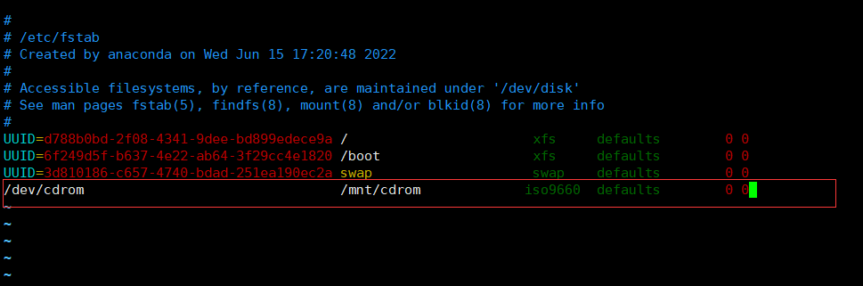


### 9.5 fdisk 硬盘分区

* **基本语法**

``` linux
fdisk -l     (功能描述：查看磁盘分区详情
)
```

``` linux
fdisk 硬盘设备名  (功能描述：对新增硬盘进行分区操作)
```

* **选项说明**

| 选项   | 功能                       |
| ------ | -------------------------- |
| **-l** | **显示所有硬盘的分区列表** |

* **经验技巧**

​		该命令必须在 root 用户下才能使用

* **功能说明**

  * Linux 分区

  > ``Device：分区序列``
  >
  > Boot：引导
  >
  > Start：从 X 磁柱开始
  >
  > End：到 Y 磁柱结束
  >
  > ``Blocks：容量``
  >
  > Id：分区类型ID
  >
  > System：分区类型

  * 分区操作按键说明

  > m：显示命令列表 
  >
  > p：显示当前磁盘分区 
  >
  > n：新增分区 
  >
  > w：写入分区信息并退出 
  >
  > q：不保存分区信息直接退

* **案例实操**

  * 查看系统分区情况

  ``` linux
  fdisk -l
  ```

  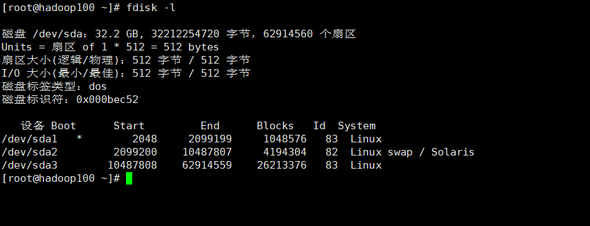

  * 硬盘分区

    * 在虚拟机上新增一块硬盘

    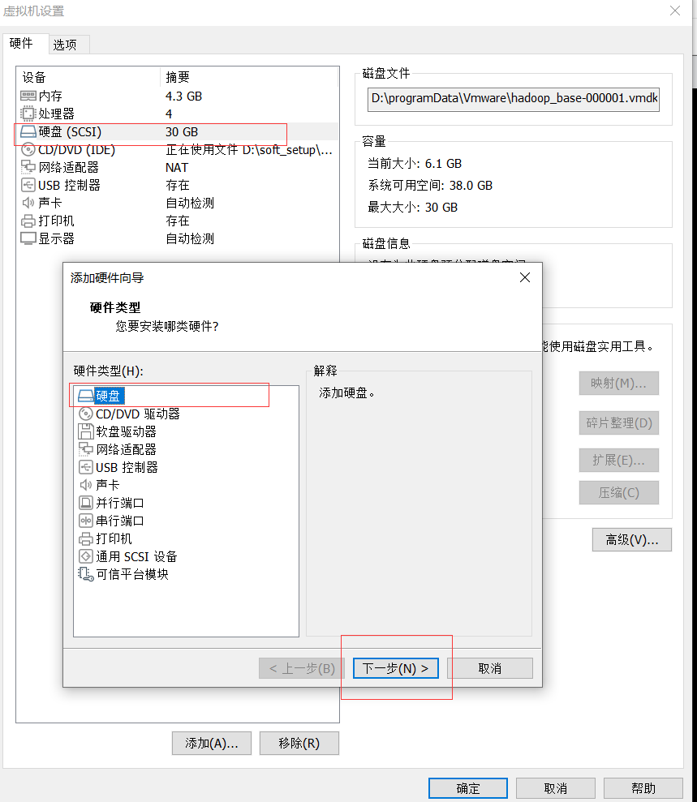

    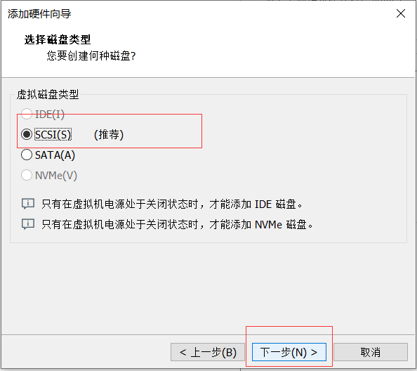

    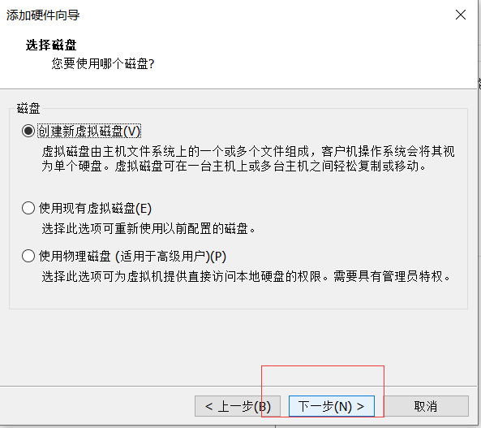

    

    查看设备挂载情况

    ``` linux
    lsblk -l
    ```

    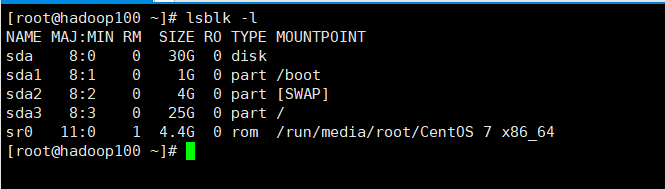

    当前我们新添加的硬盘没有显示，所以我们要重启虚拟机

    ``` linux
    reboot # 重启虚拟机
    ```

    重启后，可以看到新增硬盘信息

    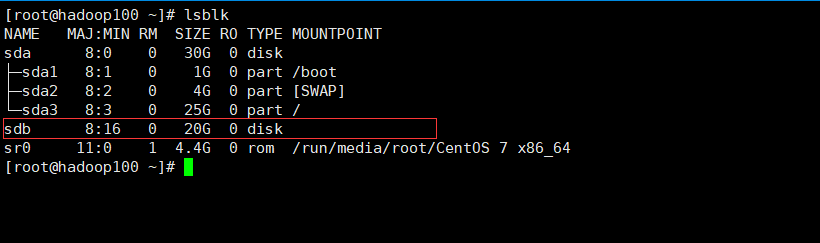

    ``` linux
    fdisk /dev/sdb # 开始硬盘分区
    ```

    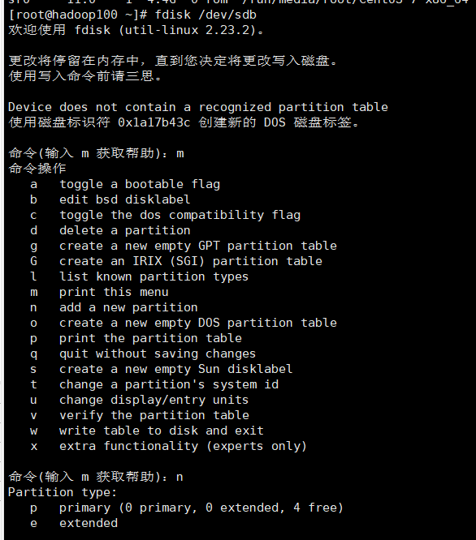

    ``` linux
    输入 n 开始分区，p 代表主分区，e 代表扩展分区,
    这里我们选择主分区，其他都选择默认值
    ```

    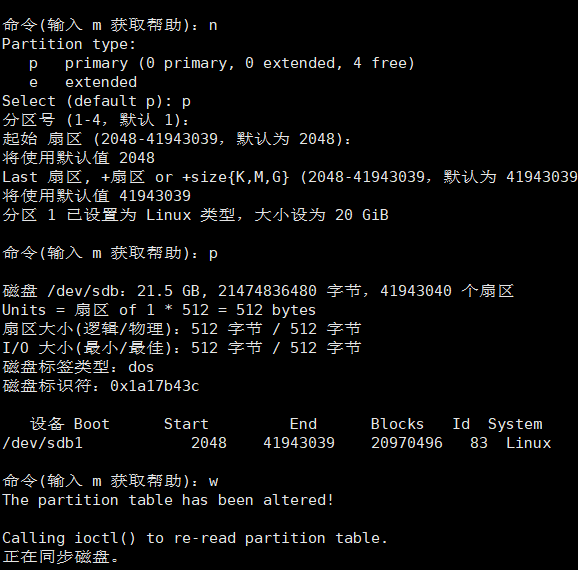

    ``` linux
    lsblk -f # 查看文件系统信息
    ```

    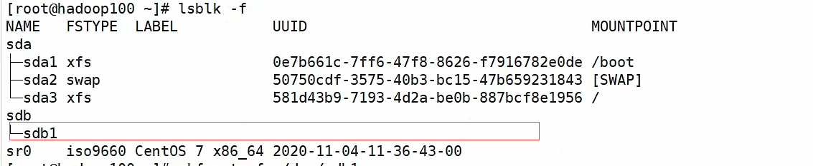

    

    这里分区后的硬盘，还没有 uuid ,还需要进行格式化处理

    ``` linux
    mkfs -t xfs /dev/sdb1
    ```

     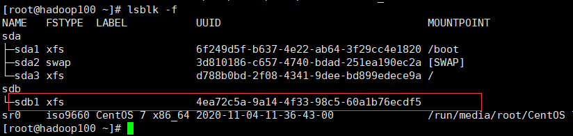

    最后就是进行挂载处理

    ``` linux
    mount /dev/sdb1 /home/atguigu
    ```

    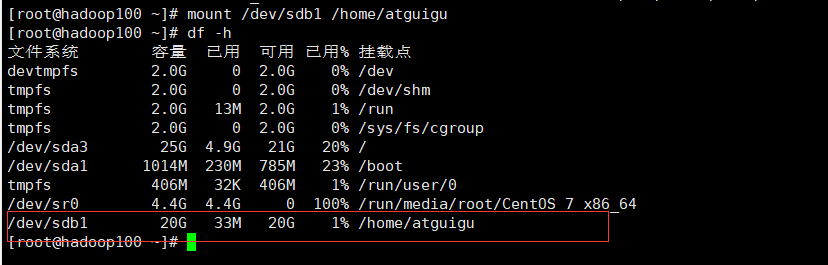

    

    卸载处理

    ``` linux
    umount /home/atguigu
    ```

## 10. 进程管理类

​		进程是正在执行的一个程序或命令，每一个进程都是一个运行的实体，都有自己的地 址空间，并占用一定的系统资源。

### 10.1 ps 查看当前系统进程状态

​		**ps：** process status 进程状态

* **基本语法**

``` linux
ps aux | grep xxx  (功能描述：查看系统中所有进程)
```

``` linux
ps -ef | grep xxx  (功能描述：可以查看子父进程之间的关系)
```

* **选项说明**

| 选项 | 功能                                       |
| ---- | ------------------------------------------ |
| a    | 列出带有终端的所有用户的进程               |
| x    | 列出当前用户的所有进程，包括没有终端的进程 |
| u    | 面向用户友好的显示风格                     |
| -e   | 列出所有进程                               |
| -u   | 列出某个用户关联的所有进程                 |
| -f   | 显示完整格式的进程列表                     |

* **功能说明**

  * ``px aux`` 显示信息说明

  > **USER：该进程是由哪个用户产生的**
  >
  > **PID：进程的ID号**
  >
  > **%CPU：该进程占用CPU资源的百分比，占用越高，进程越耗费资源;**
  >
  > **%MEM：该进程占用物理内存的百分比，占用越高，进程越耗费资源;**
  >
  > **VSZ：该进程占用虚拟内存的大小，单位KB;**
  >
  > **RSS：该进程占用实际物理内存的大小，单位KB;**
  >
  > **TTY：该进程是在哪个终端中运行的。对于CentOS来说，tty1是图形化终端，tty2-tty6是本地的字符界面终端，pts/0-255代表虚拟终端。**
  >
  > **STAT：进程状态。常见的状态有：R：运行状态、S：睡眠状态、T：暂停状态、Z：僵尸状态、s：包含子进程、l：多线程、+：前台显示**
  >
  > **START：该进程的启动时间**
  >
  > **TIME：该进程占用 CPU 的运算时间，注意不是系统时间**
  >
  > **COMMAND：产生此进程的命令名**

  * ps-ef显示信息说明

  > **UID：用户ID**
  >
  > **PID：进程ID**
  >
  > **PPID：父进程ID**
  >
  > **C：CPU 用于计算执行优先级的因子。数值越大，表明进程是 CPU 密集型运算， 执行优先级会降低；数值越小，表明进程是 I/O 密集型运算，执行优先级会提高**
  >
  > **STIME：进程启动的时间**
  >
  > **TTY：完整的终端名称**
  >
  > **TIME：CPU时间**
  >
  > **CMD：启动进程所用的命令和参数**

* **经验技巧**

> 如果想查看进程的 cpu 占用率和内存占用率，可以使用 aux
>
> 如果想查看进程的父进程 ID 可以使用 -ef

* **案例实操**

  * 查看进程的 cpu 占用率 和 内存占用率

  ``` linux
  ps aux
  ```

  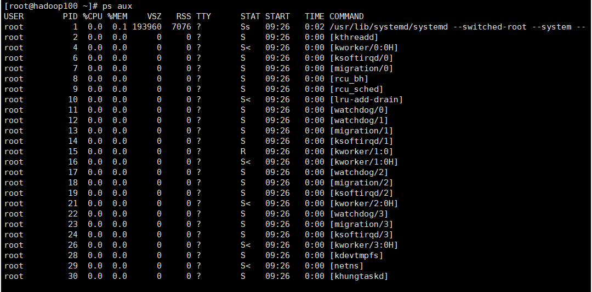

  * 查看进程的父进程 ID

  ``` linux
  ps -ef
  ```

  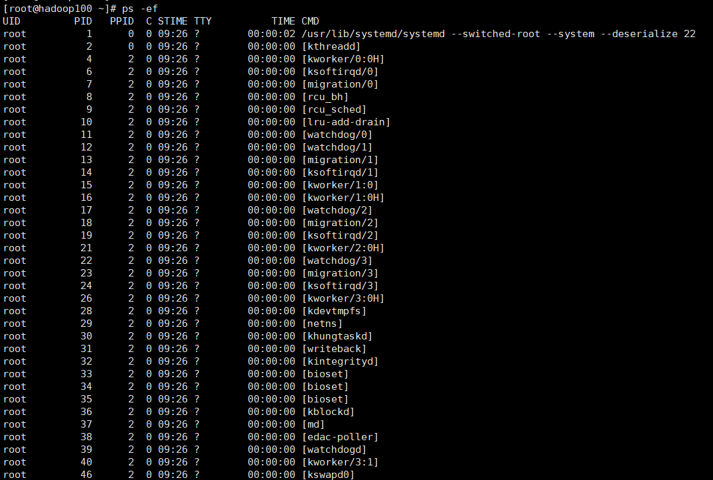


### 10.2 kill终止进程

* **基本语法**

​		kill [选项] 进程号      (功能描述：通过进程号杀死进程)

​		killall 进程名称         (功能描述：通过进程名称杀死进程，也支持通配符，这在系统因负载过大而变得很慢时很有用)

​		**注意：谨慎 kill 掉后台守护进程，比如：不小心杀掉了远程登录守护进程sshd，那么就只能在物理机上使用``systemctl start sshd`` 命令重新启动远程登录守护进程sshd**

* **选项说明**

| 选项   | 功能                     |
| ------ | ------------------------ |
| **-9** | **表示强迫进程立即停止** |

* **案例实操**

  * 杀死浏览器进程

  ``` shell
  kill -9 5102
  ```

  * 通过进程名杀死进程

  ``` shell
  killall firefox  # 谨慎使用
  ```


### 10.3 pstree 查看进程树

* **基本语法**

``` linux
pstree [选项]
```

* **选项说明**

| 选项   | 功能                   |
| ------ | ---------------------- |
| **-p** | **显示进程的 PID**     |
| **-u** | **显示进程的所属用户** |

* **案例实操**

  * 显示进程 pid

  ``` linux
  pstree -p
  ```

  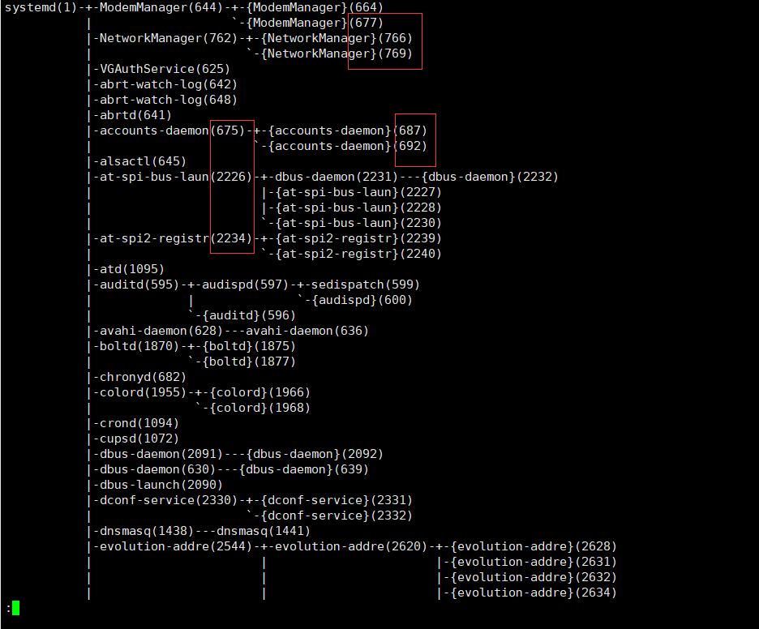

  * 显示进程所属用户

  ``` linux
  pstree -u
  ```

  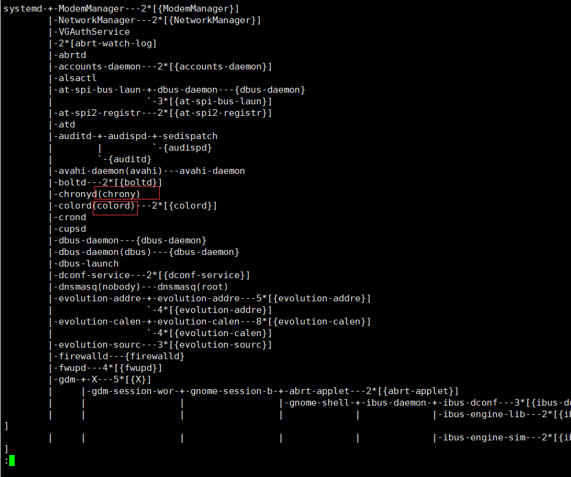


### 10.4 top 实时监控系统进程状态

* **基本命令**

``` linux
top [选项]
```

* **选项说明**

| 选项        | 功能                                                         |
| ----------- | ------------------------------------------------------------ |
| **-d 秒数** | **指定 top 命令每隔几秒更新。默认是 3 秒在 top 命令的交互模式中可以执行的命令** |
| **-i**      | **使 top 不显示任何闲置或者僵死进程**                        |
| **-p**      | **通过指定监控进程 ID 来仅仅监控某个进程的状态**             |

* **操作说明**

对查询出的进程结果进行排序：

| 操作  | 功能                                |
| ----- | ----------------------------------- |
| **p** | **以 CPU 使用率排序，默认就是此项** |
| **M** | **以内存的使用率排序**              |
| **N** | **以 PID 排序**                     |
| **q** | **退出 top**                        |

* **查询结果字段解释**

​	第一行信息为任务对列信息：

| 内容                             | 说明                                                         |
| -------------------------------- | ------------------------------------------------------------ |
| **12:26:46**                     | **系统当前时间**                                             |
| **up 1 day，13:32**              | **系统的运行时间，本机已经运行 1 天 13 小时 32 分钟**        |
| **2 users**                      | **当前登录了两个用户**                                       |
| **load average：0.00,0.00,0.00** | **系统在之前1分钟，5分钟，15分钟的平均负载。一般认为小于1时，负载较小。如果大于1，系统已经超出负荷** |

第二行为进程信息：

| 内容                | 说明                                          |
| ------------------- | --------------------------------------------- |
| **Tasks：95 total** | **系统中的进程总数**                          |
| **1 running**       | **正在运行的进程数**                          |
| **94 sleeping**     | **睡眠的进程**                                |
| **0 stopped**       | **正在停止的进程**                            |
| **0 zombie**        | **僵尸进程。如果不是0，需要手工检查僵尸进程** |

第三行为 CPU 信息：

| 内容               | 说明                                                         |
| ------------------ | ------------------------------------------------------------ |
| **Cpu(s)：0.1%us** | **用户模式占用的 CPU 百分比**                                |
| **0.1%sy**         | **系统模式占用的 CPU 百分比**                                |
| **0.0%ni**         | **改变过优先级的用户进程占用的 CPU 百分比**                  |
| **99.7%id**        | **空闲 CPU 的 CPU 百分比**                                   |
| **0.1%wa**         | **等待输入/输出的进程的占用 CPU 百分比**                     |
| **0.0%hi**         | **硬中断请求服务占用的 CPU 百分比**                          |
| **0.1%si**         | **软中断请求服务占用的 CPU 百分比**                          |
| **0.0%st**         | **st（Steal time）虚拟时间百分比。就是当有虚拟机时，虚拟 CPU 等待实际 CPU 的时间百分比** |

第四行为物理内存信息：

| 内容                   | 功能                                                         |
| ---------------------- | ------------------------------------------------------------ |
| **Mem：625344k total** | **物理内存的总量，单位 KB**                                  |
| **571504k used**       | **已经使用的物理内存数量**                                   |
| **53840k free**        | **空闲的物理内存数量，我们使用的是虚拟机，总共只分配了 628 M内存，所以只有 53 MB的空闲内存了** |
| **65800k buffers**     | **作为缓冲的内存数量**                                       |

第五行为交换分区（swap）信息

| 内容                    | 功能                             |
| ----------------------- | -------------------------------- |
| **Swap：524280k total** | **交换分区（虚拟内存）的总大小** |
| **Ok used**             | **已经使用的交互分区的大小**     |
| **524280k free**        | **空闲交换分区的大小**           |
| **409280k cached**      | **作为缓存的交互分区的大小**     |

* **案例实操**

  * 查询结果 1 s 更新一次

  ``` linux
  top -d 1
  ```

  * 使 top 不显示任何闲置或者僵死进程

  ``` linux
  top -i
  ```

  * 通过指定监控进程 ID 来仅仅监控某个进程的状态

  ``` linux
  top -p 2575
  ```

  > 执行上述命令后，可以按 P、M、N对查询出的进程结果进行排序


### 10.5 netstat 显示网络状态和端口占用信息

* **基本语法**

``` linux
netstat -anp | grep 进程号 (功能描述：查看该进程网络信息)
```

``` linux
netstat -nlp | grep 端口号 (功能描述：查看网络端口号占用情况)
```

* **选项说明**

| 选项   | 功能                                                   |
| ------ | ------------------------------------------------------ |
| **-a** | **显示所有正在监听(listen) 和 未监听的套接字(socket)** |
| **-n** | **拒绝显示别名，能显示数字的全部转化成数字**           |
| **-l** | **仅列出在监听的服务状态**                             |
| **-p** | **表示显示哪个进程在调用**                             |

* **案例实操**

  * 通过进程号查看 sshd 进程的网络信息

  ``` linux
  netstat -anp | grep sshd
  ```

  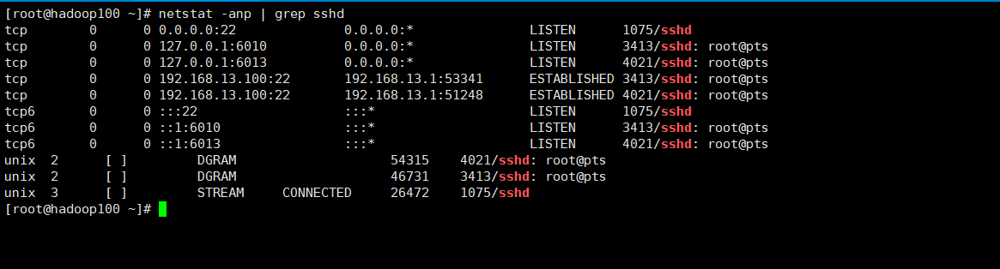

  * 查看某端口号是否被占用

  ``` linux
  netstart -nltp | grep 22 或者  netstat -tunlp | grep 22
  ```

  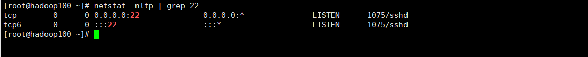

  * 查看某端口号是否被占用

  ``` linux
  netstat -nlp | grep 22
  ```

  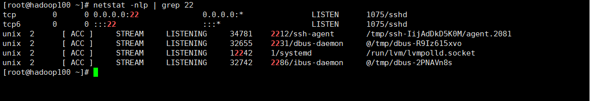


### 10.6 fg和bg进程挂起

Linux下的fg和bg命令是进程的前后台调度命令，即将作业号（jobs命令执行结果方括号中的数值，非进程号）的命令进程放到前台或后台运行。比如一个需要长时间运行的命令，我们就希望把它放入后台，这样就不会阻塞当前的操作。

进程前后台操作用到以下命令或按键：

* **终止并退出前台命令的执行，回到shell**

``` shell
Ctrl+C
```

* **暂停前台命令的执行，将该进程放入后台，回到shell**

``` shell
Ctrl+Z
```

* **查看当前在后台执行的命令，-l 参数可查看命令进程号**

``` shell
jobs
```

> 输入命令：jobs
> 终端显示：[1]+ Stopped vim /etc/network/interfaces > /home/leo/Desktop/ip.txt (wd: /)，方括号中的1是作业号

> 输入命令：jobs -l
> 终端显示：[1]+ 4664 停止 vim /etc/network/interfaces > /home/leo/Desktop/ip.txt (wd: /)，4664是进程号
> kill %1或者kill 4664都可以杀死这个进程。

* **运行命令时，在命令末尾加上&可让命令在后台执行**

``` shell
&
```

* **将命令作业号为N的命令进程放到前台执行，%N也能达到这个效果**

``` shell
fg N
```

* **将命令作业号为N的命令进程放到后台执行**

``` shell
bg N
```

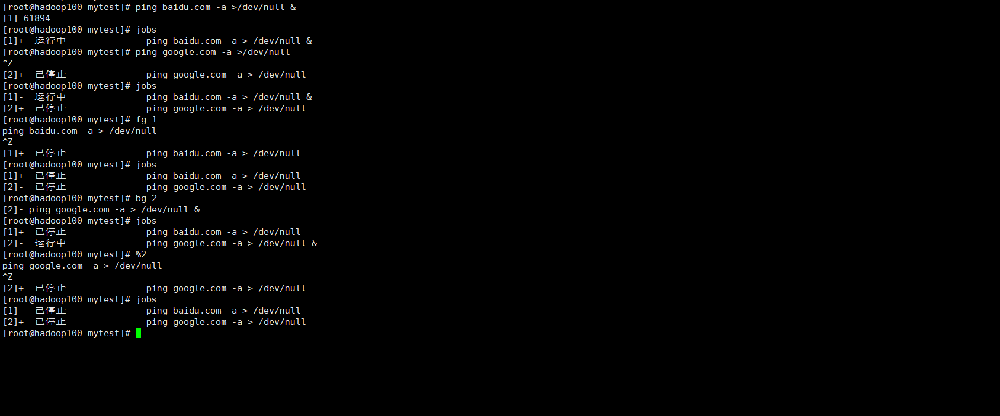

## 11. crontab 系统定时任务

### 11.1 crontab 服务管理

* **重新启动 crond 服务**

``` linux
systemctl restart crond
```

### 11.2 crontab 定时任务设置

* **基本语法**

``` linux
crontab [选项]
```

* **选项说明**

| 选项   | 功能                                |
| ------ | ----------------------------------- |
| **-e** | **编辑 crontab 定时任务**           |
| **-l** | **查询 crontab 任务**               |
| **-r** | **删除当前用户所有的 crontab 任务** |

* **参数说明**

``` linux
crontab -e
```

> * 进入 crontab 编辑界面。会打开 vim 编辑你的工作
>
> ``***** 执行的任务 `` 

| 项目           | 含义                     | 范围                        |
| -------------- | ------------------------ | --------------------------- |
| **第一个 "*"** | **一小时当中的第几分钟** | **0-59**                    |
| **第二个 "*"** | **一天当中的第几小时**   | **0-23**                    |
| **第三个 "*"** | **一个月当中的第几天**   | **1-31**                    |
| **第四个 "*"** | **一年当中的第几月**     | **1-12**                    |
| **第五个 "*"** | **一周当中的星期几**     | **0-7（0和7都代表星期日）** |

> * 特殊符号

| 特殊符号 | 含义                                                         |
| -------- | ------------------------------------------------------------ |
| *        | 代表任何时间。。比如第一个“*”就代表一小时中每分钟 都执行一次的意思。 |
| ，       | 代表不连续的时间。比如“ 0  8,12,16  *  *  * 命令”，就代表 在每天的 8 点 0 分，12 点 0 分，16 点 0 分都执行一次命令 |
| -        | 代表连续的时间范围。比如“0 5 * * 1-6 命令”，代表在 周一到周六的凌晨 5 点 0 分执行命令 |
| */n      | 代表每隔多久执行一次。比如“ */10  *  *  *  * 命令”，代 表每隔 10分钟就执行一遍命令 |

> * 特定时间执行命令

| 时间                   | 含义                                                         |
| ---------------------- | ------------------------------------------------------------ |
| 45  22  *  *  *  命令  | 每天 22点45分执行命令                                        |
| 0  17  *  *  1  命令   | 每周 1 的 17 点 0 分执行命令                                 |
| 0  5  1,15  *  *  命令 | 每月1 号 和 15 号的凌晨 5 点 0 分 执行                       |
| 40  4  *  *  1-5  命令 | 每周一到周五的凌晨 4点40分执行命令                           |
| */10  4  *  *  *  命令 | 每天的凌晨4点，每隔十分钟执行一次命令                        |
| 0  0  1,15  *  1  命令 | 每月 1 号 和 15号，每周 1 的 0点 0 分都会执行命令。注意：星期几何几号最好不要同时出现，因为它们定义的都是天。非常容易让管理员混乱 |

* **案例实操**

  * 每隔 1 分钟，向 /home/atguigu/crontabtest.txt 文件中添加一个 11 的数字

  ``` linux
  crontab -e
  */1 * * * *  echo 11 >> /home/atguigu/crontabtest.txt
  ```

  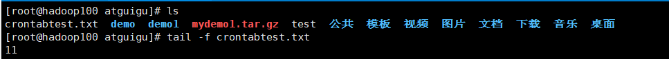


# 第八章：软件包管理

## 1. RPM

### 1.1 RPM 概述

​		RPM（RedHat Package Manager），RedHat软件包管理工具，类似windows里面的setup.exe 是Linux这系列操作系统里面的打包安装工具，它虽然是RedHat的标志，但理念是通用的。

​	   RPM包的名称格式 ： **Apache-1.3.23-11.i386.rpm** 

- “apache” 软件名称 
- “1.3.23-11”软件的版本号，主版本和此版本 
- “i386”是软件所运行的硬件平台，Intel 32位处理器的统称 
- “rpm”文件扩展名，代表RPM包

### 1.2 RPM 查询命令(rpm -qa)

* **基本语法**

``` linux
rpm -qa  (功能描述：查询所安装的所有rpm软件包)
```

* **经验技巧**

> 由于软件包比较多，一般都会采取过滤。 rpm -qa | grep rpm 软件包

* **案例实操**

  * 查询 firefox 软件安装情况

  ``` linux
  rpm -qa | grep firefox
  ```


### 1.3 RPM卸载命令(rpm -e)

* **基本语法**

``` linux
rpm -e RPM软件包
```

``` linux
rpm -e --nodeps 软件包
```

* **选项说明**

| 选项     | 功能                                                         |
| -------- | ------------------------------------------------------------ |
| -e       | 卸载软件包                                                   |
| --nodeps | 卸载软件时，不检查依赖。这样的话，那些使用该软件包的软件在此之后可能就不能正常工作了 |

* **案例实操**

  * 卸载 firefox 软件

  ``` linux
  rpm -e firefox
  ```

  

### 1.4 RPM安装命令(rpm-ivh)

* **基本语法**

``` linux
rpm -ivh RPM包全名
```

> 注意：安装时一定要提供 RPM包全名。
>
> 这里以 firefox 为例：
>
> ``` linux
> # 输入命令，进入到CentOS光盘下的软件包目录
> cd /run/media/root/CentOS\ 7\ x86_64/Packages
> # 搜索 firefox 包的全名
> ls | grep firefox
> # 搜索结果如下
> firefox-68.10.0-1.el7.centos.x86_64.rpm
> ```
>
> 

* **选项说明**

| 选项         | 功能                        |
| ------------ | --------------------------- |
| **-i**       | **install，安装**           |
| **-v**       | **--verbose，显示详细信息** |
| **-h**       | **--hash，进度条**          |
| **--nodeps** | **安装前不检查依赖**        |

* **案例实操**

  * 安装 firebox 软件

  ``` linux
  rpm -vih firefox-68.10.0-1.el7.centos.x86_64.rpm
  ```


## 2. YUM仓库配置(推荐使用)

​		YUM（全称为 Yellow dog Updater, Modified）是一个在 Fedora 和 RedHat 以及 CentOS 中的 Shell 前端软件包管理器。基于 RPM 包管理，能够从指定的服务器自动下载 RPM 包 并且安装，可以自动处理依赖性关系，并且一次安装所有依赖的软件包，无须繁琐地一次 次下载、安装，如图所示：

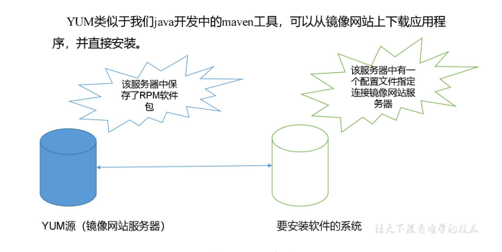

* **基本语法**

``` linux
yum [选项] [参数]
```

* **选项说明**

| 选项   | 功能                       |
| ------ | -------------------------- |
| **-y** | **对所有提问都回答 "yes"** |

* **参数说明**

| 参数             | 功能                                |
| ---------------- | ----------------------------------- |
| **install**      | **安装 rpm 软件包**                 |
| **update**       | **更新 rpm 软件包**                 |
| **check-update** | **检查是否有可用的更新 rpm 软件包** |
| **remove**       | **删除指定的 rpm 软件包**           |
| **list**         | **显示软件包信息**                  |
| **clean**        | **清理 yum 过期的缓存**             |
| **deplist**      | **显示 yum 软件包的所有依赖关系**   |

* **案例实操**

  * 采用 yum 方式安装 firefox

  ``` linux
  yum install firefox
  ```


## 3. 修改网络 YUM 源

​		默认的系统 YUM 源，需要连接国外 apache 网站，网速比较慢，可以修改关联的网络 YUM 源为国内镜像的网站，比如网易 163,aliyun 

* **安装 wget，wget用来从指定的URL下载文件**

``` linux
yum install wget
```

* **在 /etc/yum.repos.d/目录下，备份默认的 repos 文件**

``` linux
cp CentOS-Base.repo CentOS-Base.repo.backup
```

* **下载网易、163或者是 aliyun 的 repos 文件，任选其一，如图所示：**

``` linux
wget http://mirrors.aliyun.com/repo/Centos-7.repo //阿里云
或
wget http://mirrors.163.com/.help/CentOS7-Base-163.repo //网易 163
```

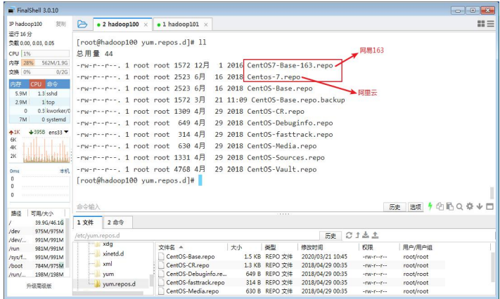

* **使用下载好的 repos 文件替换默认的 repos 文件**

例如：用 CentOS7-Base-163.repo 替换 CentOS-Base.repo

``` linux
mv CentOS7-Base-163.repo CentOS-Base.repo
```

* **清理旧缓存数据，缓存新数据**

``` linux
yum clean all
yum makecache
```

> yum makecache 就是把服务器的包信息下载到本地电脑缓存起来

* **测试**

``` linux
yum list | grep firefox
```

``` linux
yum -y install firefox
```

> 一般我们不需要配置镜像，因为 yum 源，会自动根据我们的地址来使用离我们最近的镜像源来进行下载


# 第九章：克隆虚拟机

## 1. 克隆

* 从现有虚拟机（``关机状态``）克隆出新虚拟机，右键选择管理 => 克隆，如图所示：

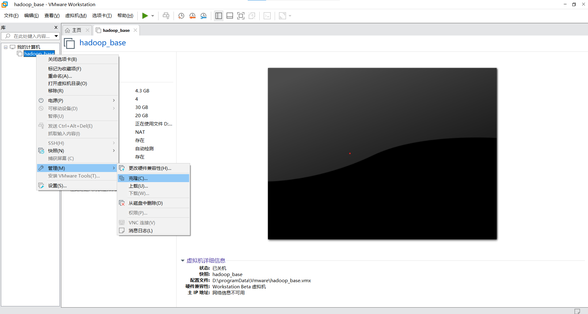

* 点击下一步，如图所示：

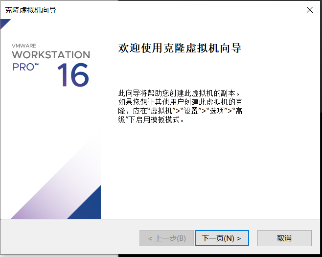

* 选择虚拟机中的当前状态,如下图所示：

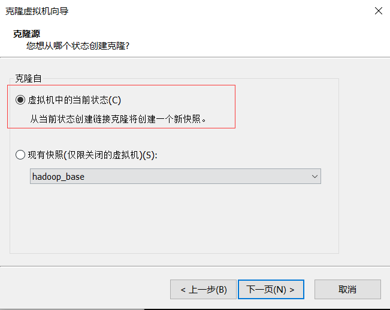

* 选择创建完整克隆，如下图所示：

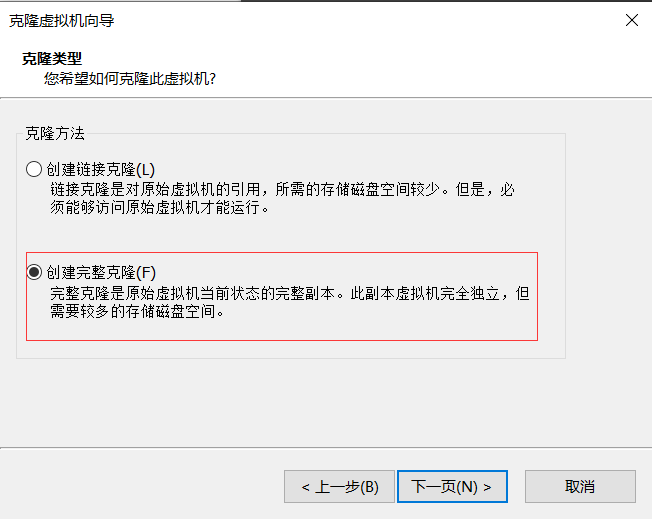

* 设置虚拟机名称及存储位置，如下图所示：

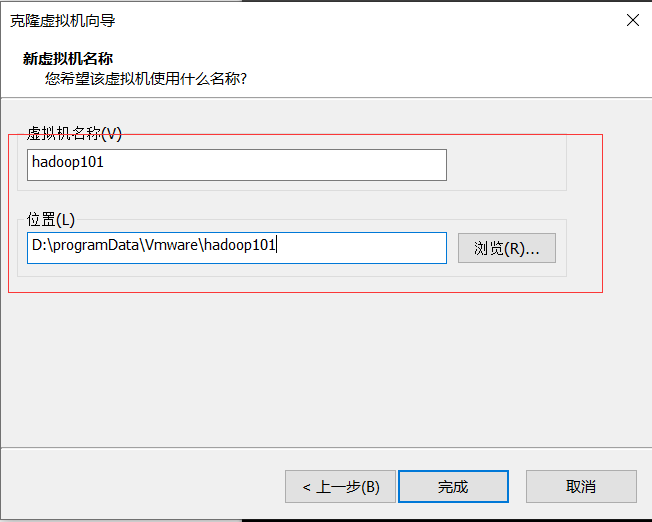

* 点击完成，进行完成虚拟机克隆：

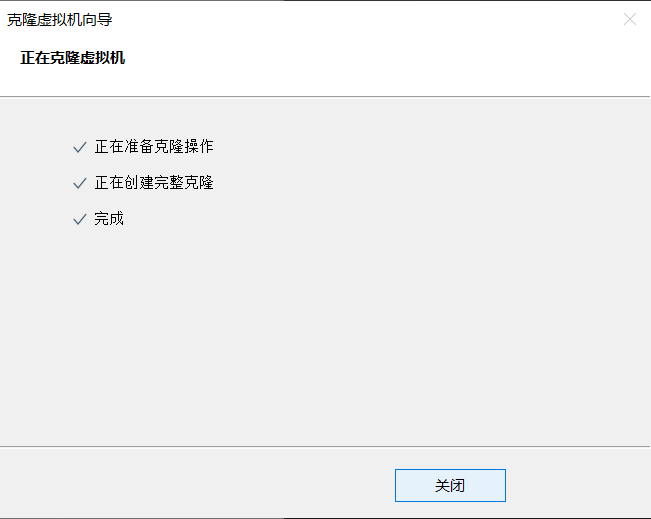


## 2. 开机修改相关配置

> 注意：使用 root 用户

* **修改 vim /etc/sysconfig/network-scripts/ifcfg-ens33 ,修改 IP 地址,如图 所示：**

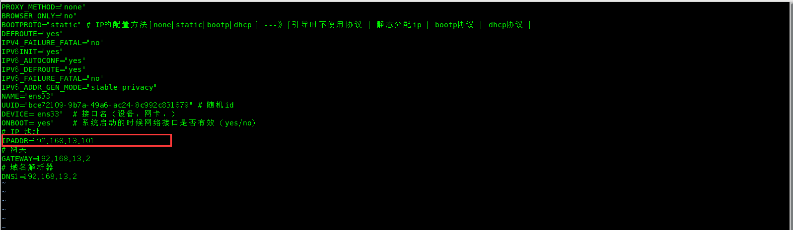

* **修改 /etc/hostname ,修改主机名，如图所示：**

``` shell
vim /etc/hostname
```


* **修改完成后，执行命令重启 NetworkManager**

``` shell
systemctl stop NetworkManager
```

``` shell
systemctl start NetworkManager
```

* **试着 ping 一下外网看能否成功**

``` shell
ping www.baidu.com
```

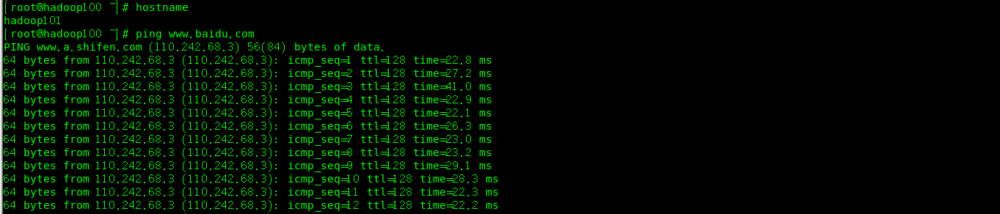


# 第十章：常见错误及解决方案

* **虚拟化支持异常情况如下几种情况：**

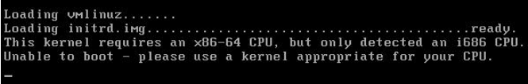


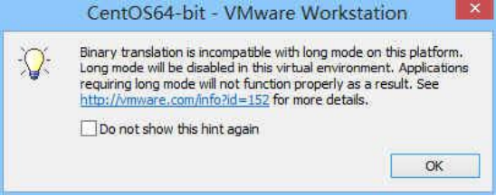

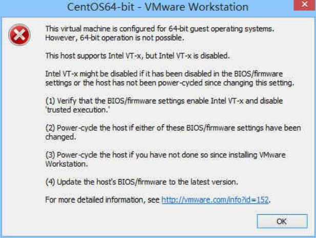


​	问题原因：宿主机 BIOS 设置中的硬件虚拟化被禁用了

​	解决办法：需要打开笔记本 BIOS 中的 IVT 对虚拟化的支持

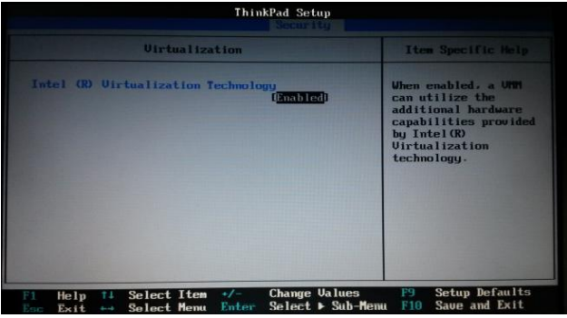


# 第十一章：企业真实面试题

## 1. 百度&&考满分

* **问题：Linux常用命令**

> 参考答案：find、df、tar、ps、top、netstat等（尽量说一些高级命令）


## 2. 瓜子二手车

* **问题：Linux查看内存、磁盘存储、io读写、端口占用、进程等命令**

> 1、查看内存：top
>
> 2、查看磁盘存储情况：df -h
>
> 3、查看磁盘 IO 读写情况：iotop（需要安装一下：yum install iotop），iotop -o （直接查看输出比较高的磁盘读写程序）
>
> 4、查看端口占用情况：netstat -tunlp | grep 端口号
>
> 5、查看进程：ps -aux


# 第十二章：Shell概述

Shell 是一个``命令行解释器``，它接收应用程序/用户命令，然后调用操作系统内核。

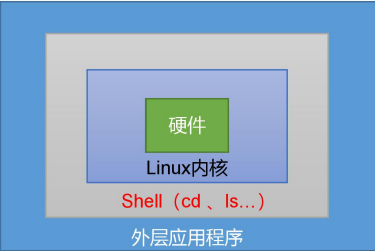

Shell 还是一个功能相当强大的编程语言，易编写，易调试，灵活性强

* **Linux 提供的 Shell 解析器有**

``` linux
cat /etc/shells
```

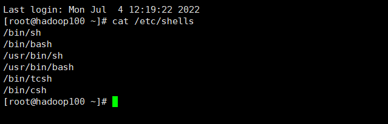

* **bash 和 sh 的关系**

``` linux
ll | grep bash
```

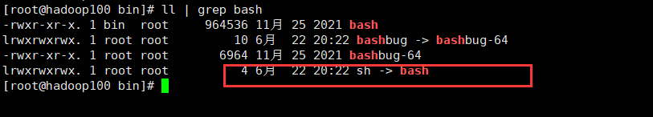

* **Centos默认的解析器是bash**

``` linux
echo $SHELL
```

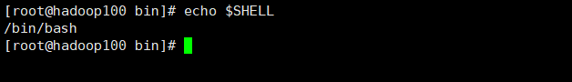


# 第十三章：Shell 脚本入门

* **脚本格式**

​		脚本以 ``#!/bin/bash`` 开头（指定解析器）

* **第一个Shell脚本：helloworld.sh**

  * 需求：创建一个 Shell 脚本，输出 helloworld
  * 案例实操：

  ``` Shell
  touch helloworld.sh
  vim helloworld.sh
  
  # 在 helloworld.sh 中输入如下内容:
  #!/bin/bash
  echo "helloworld"
  ```

* **脚本的常用执行方式**

  * 第一种：采用 ``bash 或 sh + 脚本的相对路径或绝对路径（不用赋予脚本 +x 权限）``

  > **sh + 脚本的相对路径**
  >
  > ``` shell
  > sh ./helloworld.sh
  > ```

  

  > **sh + 脚本的绝对路径**
  >
  > ``` shell
  > sh /root/myscripts/helloworld.sh
  > ```

  

  > **bash + 脚本的相对路径**
  >
  > ``` shell
  > bash ./helloworld.sh
  > ```

  

  > **bash + 脚本的绝对路径**
  >
  > ``` shell
  > bash /root/myscripts/helloworld.sh
  > ```

  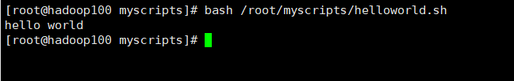

  * 第二种：采用输入脚本的绝对地址或相对路径执行脚本``（必须具有可执行权限 +x）``

  > 1.首先要赋予 helloworld.sh 脚本的 +x 权限
  >
  > ``` shell
  > chmod +x helloworld.sh
  > ```

  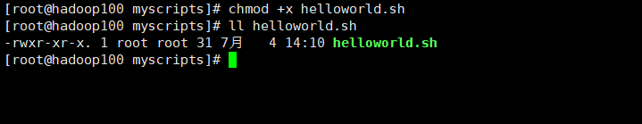

  > 2.执行脚本
  >
  > 相对路径
  >
  > ``` shell
  > ./helloworld.sh
  > ```
  >
  > 绝对路径
  >
  > ``` shell
  > /root/myscripts/helloworld.sh
  > ```
  >
  > 注意：
  >
  > 第一种执行方法，本质是 bash 解析器帮你执行脚本，所以脚本本身不需要执行 权限。
  >
  > 第二种执行方法，本质是脚本需要自己执行，所以需要执行权限

  

  

  * 第三种【了解】：在脚本的路径前加上 ``.`` 或者 ``source``

  > 分别使用 sh，bash，./ ，rouce 和 . 的方式来执行，结果如下：

  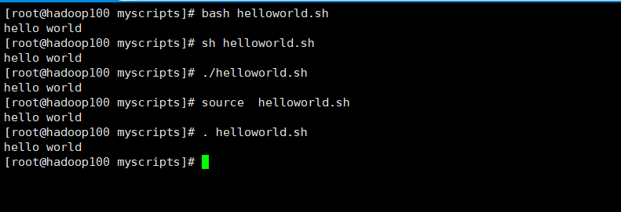

  > 原因：
  >
  > ​		前两种方式都是在当前 shell 中打开一个子 shell 来执行脚本内容，当脚本内容结束，则 子 shell 关闭，回到父 shell 中。
  >
  > ​		第三种，也就是使用在脚本路径前加 “.” 或者 source 的方式，可以使脚本内容在当前 shell 里执行，而无需打开子 shell！这也是为什么我们每次要修改完 /etc/profile  文件以后，需 要 source一下的原因。
  >
  > ​		开子 shell 与不开子 shell 的区别就在于，环境变量的继承关系，如在子 shell 中设置的 当前变量，父 shell 是不可见的


# 第十四章：变量

## 1. 系统预定义变量

* **常用系统变量**

``` shell
$HOME,$PWD,$SHELL,$USER 等
```

* **案例实操**

  * 查看系统变量的值

  ``` shell
  echo $HOME
  ```

  * 显示当前所有全局变量

  ``` shell
  env
  或
  env | less
  ```

  * 显示当前所有的全局变量

  ``` shell
  printenv
  或
  printenv | less
  ```

  * 显示某个全局变量

  ``` shell
  printenv USER
  ```

  * 显示当前 Shell 中所有变量：set

  ``` shell
  set
  或
  set | less
  ```


## 2. 自定义变量

* **基本语法**
  * 定义变量：变量名 = 变量值。``注意：= 号前后不能有空格``
  * 撤销变量名：unset 变量名
  * 声明静态变量：readonly变量。``注意：不能 unset``

* **变量定义规则**

  * 变量名称可以由字母、数字和下划线组成，但是不能以数字开头，``环境变量名建议大写``
  * 等号两侧不能有空格
  * 在 bash 中，变量默认类型都是字符串类型，无法直接进行数值运算
  * 变量的值如果有空格，需要使用双引号或单引号括起来

* **案例实操**

  * 定义变量 A

  ``` shell
  A=5
  ```

  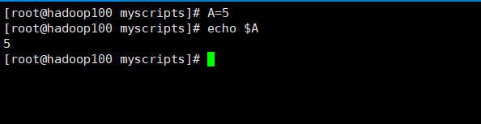

  * 给变量A重新赋值

  ``` shell
  A=8
  ```

  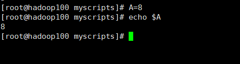

  * 撤销变量A

  ``` shell
  unset A
  ```

  

  * 声明静态的变量 B = 2，不能unset

  ``` shell
  readonly B=2
  ```

  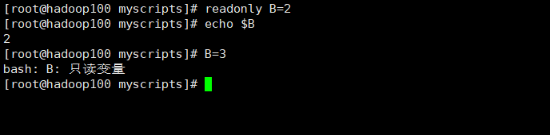

  * 在 bash 中，变量默认类型都是字符串类型，无法直接进行数值运算

  ``` shell
  C=1+2
  echo $C
  ```

  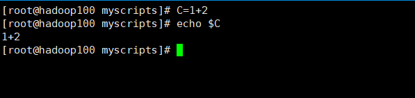

  * 变量的值如果有空格，需要使用双引号或单引号括起来

  ``` shell
  D=I love Banzhang  # 错误格式
  ```

  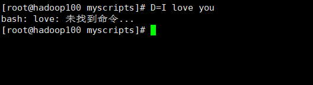

  ``` shell
  D='I love you' # 正确格式
  ```

  

  * 可把变量提升为全局环境变量，可供其他 Shell 程序使用

  ``` shell
  export 变量名
  vim helloworld.sh
  ```

  ​		在 helloworld.sh 文件中增加 ``echo $A``

  

  ​	   直接调用 helloworld.sh，发现 A 没有输出

  ``` shell
  ./helloworld.sh
  ```

  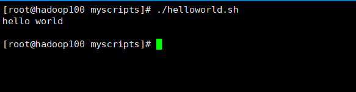

  ​		将 A 提升到全局变量

  ``` shell
  export A
  ./helloworld.sh
  ```

  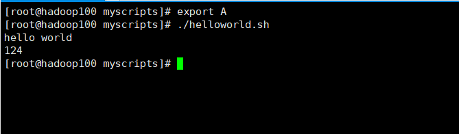


## 3. 特殊变量

### 3.1 $n

* **基本语法**

``` shell
$n  (功能描述：n为数字，$0 代表该脚本名称，$1-$9 代表第一到第九个参数，十以上的参数需要用大括号包含，如${10})
```

* **案例实操**

``` shell
#!/bin/bash
echo '=======$n======'
echo script name：$0
echo first paramter：$1
echo second paramter：$2
```

``` shell
./paramter.sh abc def
```

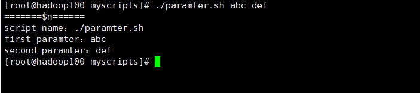


### 3.2 $#是否正确

* **基本语法**

``` shell
$# (功能描述：获取所有输入参数个数，常用于循环，判断参数的个数是否正确以及加强脚本的健壮性)
```

* **案例实操**

``` shell
#!/bin/bash
echo '=======$n======'
echo script name：$0
echo first paramter：$1
echo second paramter：$2
echo '=======$#======'
echo $#
```

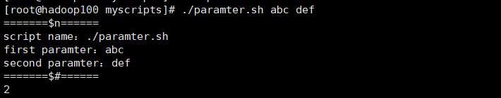


### 3.3 $*、$@

* **基本语法**

``` shell
$* #(功能描述：这个变量代表命令行中所有的参数，$* 把所有出的参数看成一个整体)

$@ #(功能描述：这个变量也代表命令行中所有的参数，不过 $@ 把每个参数区分对待)
```

* **案例实操**

``` shell
#!/bin/bash
echo '=======$n======'
echo script name：$0
echo first paramter：$1
echo second paramter：$2
echo '=======$#======'
echo $#
echo '======$*======'
echo $*
echo '======$@======'
echo $@
```

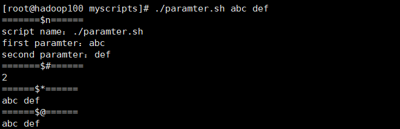

### 3.4 $?

* **基本语法**

``` shell
$?  #(功能描述：最后一次执行的命令的返回状态。如果这个变量的值为0，证明上一个命令正确执行：如果这个变量的值为非零（具体是哪个数，由命令自己来决定），则证明上一个命令执行不正确了)
```

* **案例实操**

  * 判断 paramter.sh 脚本是否正确执行

  ``` shell
  echo $?
  ```

  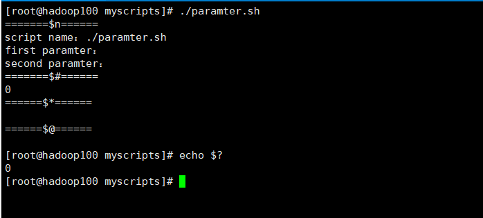


# 第十五章：运算符

* **基本语法**

``` shell
$((运算式))
或
$[运算式]
或
expr 运算式（不常用，麻烦）
```

* **案例实操**

  * 计算 (2 + 3)* 4 的值

  ``` shell
  $[(2 + 3) * 4]
  ```

  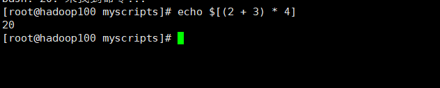


# 第十六章：条件判断

* **基本语法**

``` shell
test condition
[ condition ] (注意：condition 前后要有空格)
```

**注意：条件非空即为true，[ atguigu ] 返回true，[   ] 返回false**

* **常用判断条件**

  * 两个整数之间的比较

  | 条件    | 含义                        |
  | ------- | --------------------------- |
  | **-eq** | **等于(equal)**             |
  | **-ne** | **不等于(not equal)**       |
  | **-lt** | **小于(less than)**         |
  | **-le** | **小于等于(less equal)**    |
  | **-gt** | **大于(greater than)**      |
  | **-ge** | **大于等于(greater equal)** |
  | **-z**  | **是否为空**                |

  > 注：如果是字符串之间比较，用 等号 "=" 判断相等，用 "!=" 判断不相等

  * 按照文件权限进行判断

  | 条件   | 含义                        |
  | ------ | --------------------------- |
  | **-r** | **有读的权限（read）**      |
  | **-w** | **有写的权限（write）**     |
  | **-x** | **有执行的权限（execute）** |

  * 按照文件类型进行判断

  | 条件   | 含义                                     |
  | ------ | ---------------------------------------- |
  | **-e** | **文件存在（existence）**                |
  | **-f** | **文件存在并且是一个常规的文件（file）** |
  | **-d** | **文件存在并且是一个目录（directory）**  |

* **案例实操**

  * 23 是否大于等于 22

  ``` shell
  [ 23 ge 22 ]
  ```

  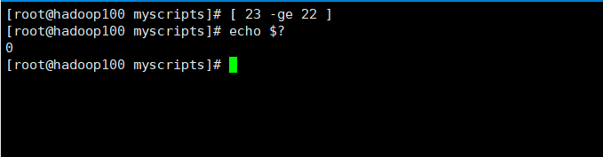

  * paramter.sh 是否具有写权限

  ``` shell
  [ -w paramter.sh ]
  ```

  

  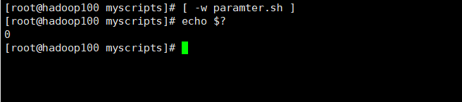

  * /home/atguigu/cls.txt 目录中的文件是否存在

  ``` shell
  [ -e /home/atguigu/cls.txt ]
  ```

  

  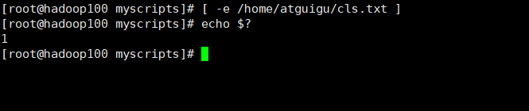

  * 多条件判断（&& 表示前一条命令执行成功时，才执行后一条命令，|| 表示上一 条命令执行失败后，才执行下一条命令）

  ``` shell
  [ hello ] && echo ok || echo notok
  ```

  

  ``` shell
  [  ] && echo ok || echo notok
  ```

  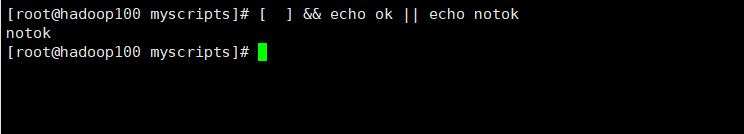


# 第十七章：流程控制

## 1. if 判断

* **基本语法**

  * 单分支

  ``` shell
  if [ 条件判断式 ];then
  	程序
  fi
  ```

  或者

  ``` shell
  if [ 条件判断式 ]
  then
  	程序
  fi
  ```

  * 多分支

  ``` shell
  if [ 条件判断式 ]
  then
  	程序
  else
  	程序
  fi
  ```

  > 注意事项：
  >
  > 1、[ 条件判断式 ]，中括号和条件判断式之间必须有空格
  >
  > 2、if 后要有空格

* **案例实操**

  * 输入一个数字，如果是 1，则输出 OK，如果是2，则输出 notOk，如果是其他，什么也不输出

  ``` shell
  touch if.sh
  chmod +x if.sh
  vim if.sh
  ```

  

  ``` shell
  #!/bin/bash
  if [ $A -eq 1]
  then
  	echo OK
  elif [ $A -eq 2]
  then
  	echo notOK
  fi
  ```

  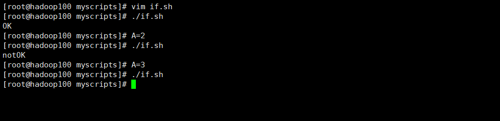


## 2. case 语句

* **基本语法**

``` shell
case $变量名 in
值1)
	如果变量的值等于值1，则执行程序1
;;
值2)
	如果变量的值等于值2，则执行程序2
;;
值3)
	如果变量的值等于值3，则执行程序3
;;
*)
	如果变量的值都不是以上的值，则执行此程序
;;
esac
```

> 注意事项：
>
> 1. case 行尾必须为单词 "in"，每一个模式匹配必须以右括号 ")" 结束。 
>
> 2. 双分号 "";;" 表示命令序列结束，相当于 java 中的 break。 
> 3. 最后的 "*)" 表示默认模式，相当于 java 中的 default

* **案例实操**

  * 输入一个数字，如果是 1 ，则输出 one，如果是 2 ，则输出 two，如果是3 ，则输出three，如果不是以上数字，则输出 more

  ``` shell
  touch case.sh
  chmod +x case.sh
  vim case.sh
  ```

  ``` shell
  #!/bin/bash
  case $1 in
  1)
          echo "one"
  ;;
  2)
          echo "tow"
  ;;
  3)
          echo "three"
  ;;
  *)
          echo "more"
  ;;
  esac
  ```

  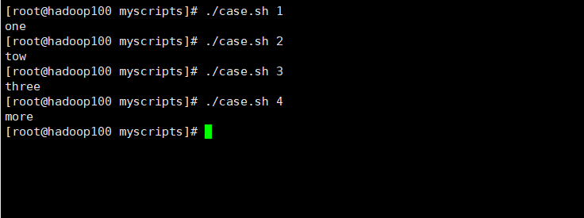


## 3. 循环

* **基本语法1**

``` shell
for (( 初始值; 循环控制条件; 变量变化))
do
	程序
done
```

* **案例实操**

  - 从 1 加到 100

  ``` shell
  for (( i=1; i<=$1 ; i++)))
  do
  	sum=$[$sum + $i]
  done
  echo $sum
  # 输出结果 5050
  ```

  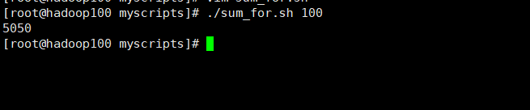

* **基本语法2**

``` shell
for 变量 in 值1 值2 值3 ...
do 
	程序
done
```

- **案例实操**

  * 打印所有输入参数

  ``` shell
  #!/bin/bash
  for var in $1 $2 $3
  do
          echo $var
  done
  ```

  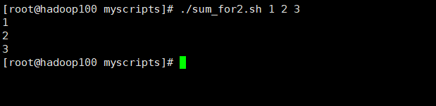

  * 从 1 加到 100

  ``` shell
  for i in {1..100} # 1-100的一个序列
  do
          sum=$[$sum + $i]
  done
  echo $sum
  ```

  

- 比较 ``$*`` 和 ``$@`` 的区别

> $* 和 $@ 都表示传递给函数或脚本的所有参数，不被双引号 "" 包含时，都以 $1 $2 …$n 的形式输出所有参数

``` shell
echo '======$*======'
for i in $*
do
        echo "I love $i"
done

echo '======$@======'
for i in $@
do
        echo "I love $i"
done
```

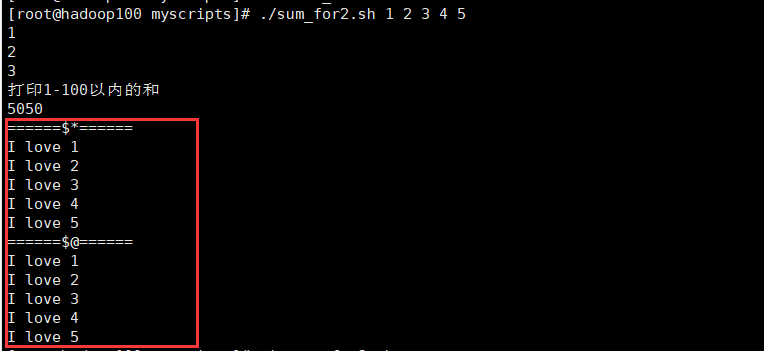

> 当它们被双引号  “”  包含时，$* 会将所有的参数作为一个整体，以  “$1 $2 …$n”  的形式输 出所有参数；$@ 会将各个参数分开，以  “$1”   “$2” …  “$n”  的形式输出所有参数。

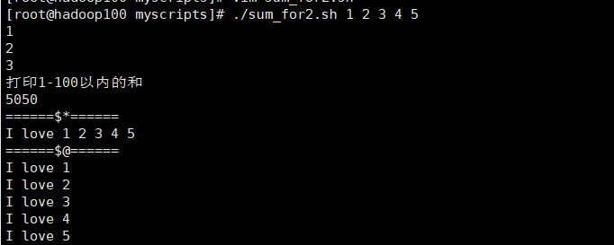

## 4. while 循环

* **基本语法**

``` shell
while [ 条件判断式 ]
do
	程序
done
```

* **案例实操**

  * 从 1 加到 100

  ``` shell
  #!/bin/bash
  a=1
  while [ $a -le $1 ] 
  do
          sum=$[ $sum + $a] # (新语法)： let sum+=a
          a=$[$a + 1]      #  (新语法)：let a+=1
  done
  echo $sum
  ```

  


# 第十八章：read 读取控制台输入

* **基本语法**

``` shell
read (选项) (参数)
	1. 选项：
		-p：执行读取值时的提示符
		-t：指定读取值时等待的时间（秒）如果 -t 不加表示一直等待
	2. 参数：
		变量：指定读取值的变量名
```

* **案例实操**

  * 提示 10 秒内，读取控制台输入的名称

  ``` shell
  #!/bin/bash
  read -t 10 -p "请输入你的芳名：" name
  echo "welome $name"
  ```

  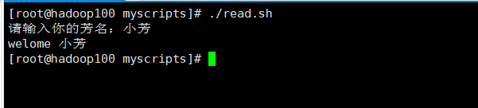


# 第十九章：函数

## 1. 系统函数

### 1.1 basename

* **基本语法**

``` shell
basename [string/pathname] [suffix] 
(功能描述：basename 命令会删掉所有的前缀包括最后一个('/')字符，然后将字符串显示出来)

basename 可以理解为取路径里的文件名称
选项：
suffix 为后缀，如果 suffix 被指定了，basename 会将pathname 或 string 中的 suffix 去掉
```

* **案例实操**

  * 截取该 /home/atguigu/colneTest.txt  路径的文件名称

  ``` shell
  basename /home/atguigu/colneTest.txt
  ```

  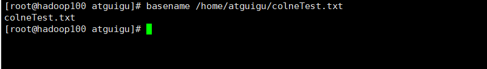

  * 获取当前脚本的绝对路径和脚本名称

  ``` shell
  #!/bin/bash
  echo script name：$(basename $0 .sh)
  echo script path：$(cd $(dirname $0);pwd)
  ```

  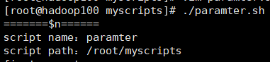


### 1.2 dirname

* **基本语法**

``` shell
dirname 文件绝对路径  (功能描述：从给定的包含绝对路径的文件名中去除文件名（非目录的部分），然后返回剩下的路径（目录的部分）)
```

> **dirname 可以理解为取文件路径的绝对路径名称**

* **案例实操**

  * 获取  colneTest.txt  文件的绝对路径

  ``` shell
  dirname /home/atguigu/colneTest.txt
  ```

  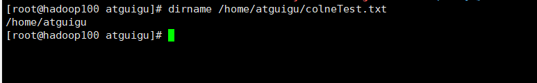

  

## 2. 自定义函数

* **基本语法**

``` shell
function funName()
{
	代码;
	return int;
}
```

* **经验技巧**

  * 必须在调用函数地方之前，先声明函数，shell脚本是逐行运行。不会象其它语言一样先编译
  * 函数返回值，只能通过 ``$?`` 系统变量获得，可以显示的加上return 返回，如果不加，将以最后一条命令运行结果，作为返回值。return 后跟数值 n (0-255)，即返回值的范围为（0-255）

* **案例实操**

  * 计算两个输入参数的和

  ``` shell
  #!/bin/bash
  
  function add(){
          s=$[$1+$2];
          echo "和："$s;
          return $s;
  }
  
  read -p "请输入一个整数：" a
  read -p "请输入一个整数：" b
  
  add $a $b  # 调用 add 函数
  echo "返回值为："$?  # 能够输出的范围是（0-255）
  ```

  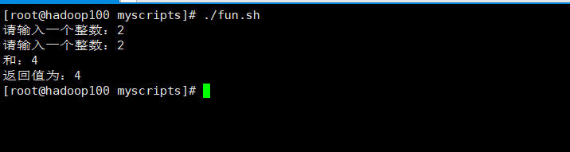


# 第十九章：正则表达式入门

​		**正则表达式使用单个字符串来描述、匹配一系列符合某个语法规则的字符串。在很多文 本编辑器里，正则表达式通常被用来检索、替换那些符合某个模式的文本。在 Linux 中，grep， sed，awk 等文本处理工具都支持通过正则表达式进行模式匹配**

## 1. 常规匹配

一串不包含特殊字符的正则表达式匹配它自己，例如：

``` shell
cat /etc/passwd | grep atguigu
```

就会匹配所有包含 atguigu 的行


## 2. 常用特殊字符

* **特殊字符：**``^``

​		``^`` 匹配一行的开头，例如：

``` shell
cat /etc/passwd | grep ^a
```

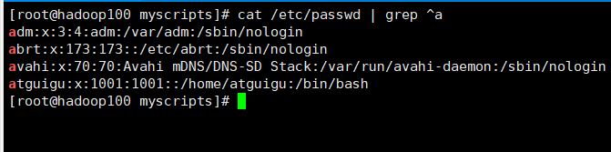

> 会匹配出所有以 a 开头的行

* **特殊字符：** ``$``

​		``$`` 匹配一行的阶数，例如：

``` shell
cat /etc/passwd | grep t$
```

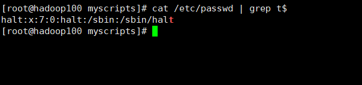

> 会匹配出所有以 t 结尾的行

* **特殊字符：** ``.``

​		``.`` 匹配一个任意的字符，例如：

``` shell
cat /etc/passwd | grep r..t
```

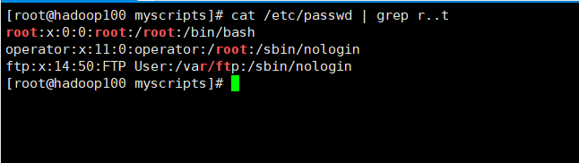

> 会匹配所有 r 和 t 之间包含两个字符的行

* **特殊字符：** ``*``

​		``*`` 不单独使用，他和上一个字符连用，表示匹配上一个字符 0 次 或 多次，例如：

``` shell
cat /etc/passwd | grep ro*t
```

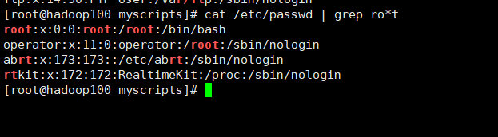

> 会匹配所有 r 和 t 之间包含 0个 或多个 o 的行

``.*`` **会匹配一个任意的字符串**

* **字符区间（中括号）：** ``[]``

``[]`` 表示匹配某个范围内的一个字符，例如：

| 正则           | 含义                               |
| -------------- | ---------------------------------- |
| **[6,8]**      | **匹配 6 或者 8**                  |
| **[0-9]**      | **匹配一个 0-9 的数字**            |
| **[0-9]***     | **匹配任意长度的数字字符串**       |
| **[a-z]**      | **匹配一个 a-z 之间的字符**        |
| **[a-z]***     | **匹配任意长度的字母字符串**       |
| **[a-c, e-f]** | **匹配 a-c 或者 e-f 之间的任意字** |

``` shell
cat /etc/passwd | grep r[a,b,c]*t
```

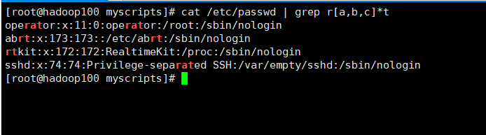

> 会匹配所有的 r 后面跟着任意多个 a 或 b 或 c 的行

* **特殊字符：** ``\``

``\`` 表示转义，并不会单独使用。由于所有特殊字符都有其特定匹配模式，当我们想匹配 某一特殊字符本身时（例如，我想找出所有包含 '$' 的行），就会碰到困难。此时我们就要 将转义字符和特殊字符连用，来表示特殊字符本身，例如：

``` shell
cat /etc/passwd | grep 'a\$b'
```

> 就会匹配所有包含 a$b 的行。注意需要使用单引号将表达式引起来


# 第二十章：文本处理工具

## 1. cut

​		cut 的工作就是“剪”，具体的说就是在文件中负责剪切数据用的。cut 命令从文件的每 一行剪切字节、字符和字段并将这些字节、字符和字段输出。

* **基本用法**

``` shell
cut [选项参数] filename
说明：默认分隔符是制表符
```

* **选项参数说明**

| 选项参数 | 功能                                               |
| -------- | -------------------------------------------------- |
| **-f**   | **列号，提取第几列**                               |
| **-d**   | **分隔符，按照指定分隔符分割列，默认是制表符"\t"** |
| **-c**   | **按字符进行切割，后加 n 表示取第几列，比如 -c 1** |

* **案例实操**

  * 数据准备

  ``` shell
  touch cut.txt
  vim cut.txt
  dong shen
  guan zhen
  wo wo
  lai lai
  le le
  ```

* **切割 cut.txt 第一列**

``` shell
cut -d " " -f 1 cut.txt
```

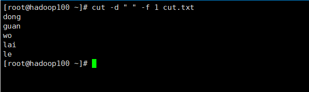

* **切割 cut.txt 第二、三列**

``` shell
cut -d " " -f 2,3 cut.txt

或

cut -d " " -f 2-3 cut.txt
```

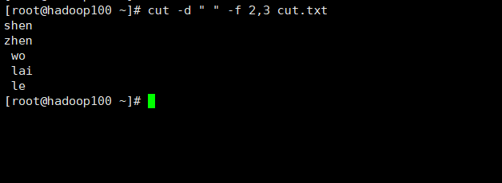

* **在 cut.txt 文件中切割出 guan**

``` shell
cat cut.txt | grep guan | cut -d " " -f 1
```

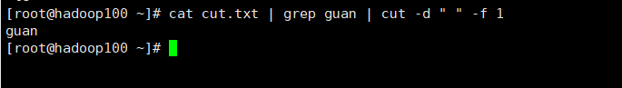

* **选取系统PATH变量值，第 2 个 ":" 开始后的所有路径：**

``` shell
echo $PATH
echo $PATH | cut -d ":" -f 3-  # '-' 表示所有，3- 表示第三列开始后的所有
```


* **切割 ifconfig 后打印的 IP 地址**

``` shell
ifconfig
ifconfig ens33 | grep netmask | cut -d " " -f 10
```

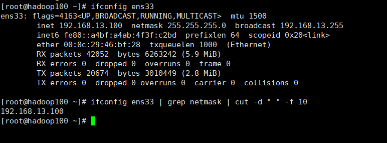

## 2. awk

​		一个强大的文本分析工具，把文件逐行的读入，以空格为默认分隔符将每行切片，切开 的部分再进行分析处理。

* **基本用法**

``` shell
awk [选项参数] '/pattern1/{action1}  /pattern2/{action2}...' filename

pattern：表示 awk 在数据中查找的内容，就是匹配模式
action：在找到匹配内容时所执行的一系列命令
```

* **选项参数说明**

| 选项参数 | 功能                     |
| -------- | ------------------------ |
| **-F**   | **指定输入文件分隔符**   |
| **-v**   | **赋值一个用户定义变量** |

* **案例实操**

  * 数据准备

  ``` shell
  passwd 数据的含义
  用户名:密码(加密过后的):用户 id:组 id:注释:用户家目录:shell
  ```

  * 搜索  passwd 文件中以 root 关键字开头的所有行，并输出该行的第七列

  ``` shell
  awk -F : '/^root/ {print $7}' /etc/passwd
  ```

  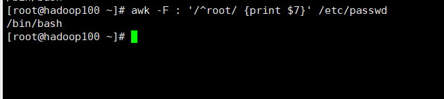

  * 搜索 passwd 文件以 root 关键字开头的所有行，并输出该行的第 1 列和第 7 列， 中间以  ","  号分割

  ``` shell
  awk -F : '/^root/ {print $1","$7}' /etc/passwd
  ```

  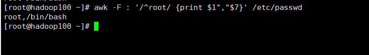

  > 注意：只有匹配了 pattern 的行才会执行 action

  * 只显示 ``/etc/passwd`` 中以 root 关键字开头的第一列和第七列，以逗号分割，且在所有行前面添加列名 ``user,shell`` 在最后一行添加 ``dahaige,/bin/zuishuai``

  ``` shell
  awk -F : 'BEGIN{print "user,shell"} /^root/ {print $1","$7} END{print "dahaige,/bin/zuishuai"}' /etc/passwd
  ```

  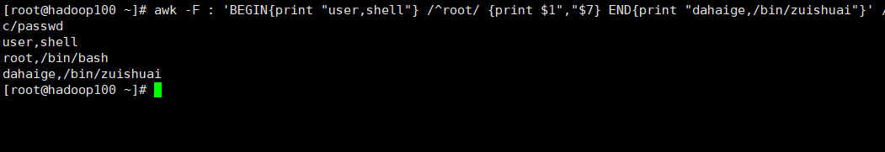

  > 注意：BEGIN 在所有数据读取行之前执行，END 在所有数据执行之后执行

  * 将 passwd 文件中的用户 id 增加数值 1 并输出

  ``` shell
  awk -v i=1 -F : '{print $3+i}' /etc/passwd
  ```

* **awk 的内置变量**

| 变量         | 说明                                               |
| ------------ | -------------------------------------------------- |
| **FILENAME** | **文件名**                                         |
| **NR**       | **已读的记录数（行号）**                           |
| **NF**       | **浏览记录的域的个数（切割后，每一行中列的个数）** |

* **案例实操**

  * 统计 passwd 文件名，每行的行号，每行的列数

  ``` shell
  awk -F : '{print "文件名：" FILENAME,"行号：" NR,"列数：" NF'} /etc/passwd
  ```

  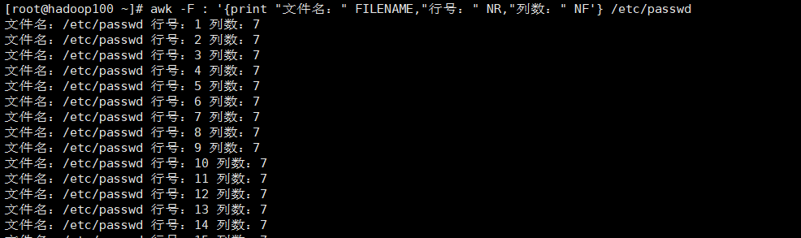

  * 查询 ifconfig 命令输出结果中的空行所在的行号

  ``` shell
  ifconfig | awk '/^$/ {print NR}'
  ```

  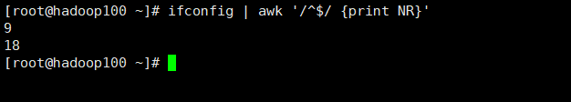

  * 切割 IP

  ``` shell
  ifconfig ens33 | awk '/netmask/ {print $2}' 
  ```

  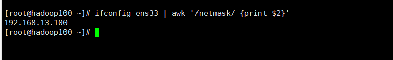

# 最后：综合应用案例

## 1. 归档文件

实际生产应用中，往往需要对重要数据进行归档备份

需求：实现一个每天对指定目录归档备份的脚本，输入一个目录名称（末尾不带/）， 将目录下所有文件按天归档保存，并将归档日期附加在归档文件名上，放在 /root/archive 下。

这里用到了归档命令：`tar`

后面可以加上` -c ` 选项表示归档，加上` -z ` 选项表示同时进行压缩，得到的文件后缀名为 `.tar.gz`

* **脚本实现代码如下**

``` shell
#!/bin/bash

# 首先判断输入参数个数是否为1
if [ $# -ne 1 ]
then
        echo "参数个数错误，应该输入一个参数，作为归档目录名"
        exit
fi

# 从输入参数中获取目录名称
if [ -d $1 ]
then
        echo
else
        echo
        echo "目录不存在！"
        exit
fi

# 获取文件名称和绝对路径
DIR_NAME=$(basename $1)
DIR_PATH=$(cd $(dirname $1); pwd)


# 获取当前日期
DATE=$(date +%y%m%d)

# 定义生成的归档文件名称
FILE=archive_${DIR_NAME}_$DATE.tar.gz
DEST=/root/archive/$FILE

# 判断 归档文件存放目录是否存在，如果不存在则自动创建目录
if [ ! -d /root/archive ]
then
        mkdir /root/archive
fi


# 开始归档目录文件
echo "开始归档目录文件..."
echo

tar -czf $DEST $DIR_PATH/$DIR_NAME

# 判断程序是否执行成功
if [ $? -eq 0 ]
then
        echo 
        echo "归档成功!"
        echo "归档文件为：$DEST"
else
        echo "归档出现问题"
        echo
fi
exit
```

## 2. 发送消息

我们可以利用 Linux 自带的 mesg 和 write 工具，向其它用户发送消息。 

需求：实现一个向某个用户快速发送消息的脚本，输入用户名作为第一个参数，后面直 接跟要发送的消息。脚本需要检测用户是否登录在系统中、是否打开消息功能，以及当前发 送消息是否为空。 		

脚本实现如下：

``` shell
#!/bin/bash

# 查看用户是否登录
login_user=$(who | grep -i -m 1 $1 | awk '{print $1}')

if [ -z $login_user ]
then
        echo "$1 不在线"
        echo "脚本退出..."
        exit
fi

# 查看用户是否开启了 message 功能
is_allowed=$(who -T | grep -i -m 1 $1 | awk '{print $2}')

if [ -z $login_user ]
then
        echo "$1 没有开启消息功能"
        echo "脚本退出..."
        exit
fi


# 确认是否有消息发送
if [ -z $2 ]
then
        echo "没有消息发送"
        echo "脚本退出..."
        exit
fi

# 从参数中获取要发送的消息
whole_message=$(echo $* | cut -d " " -f 2-)

# 获取用户登录的终端

user_terminal=$(who | grep -i -m 1 $1 | awk '/pts/ {print $2}')


# 写入要发送的消息
echo $login_user
echo $user_terminal
echo $whole_message | write $login_user $user_terminal

if [ $? != 0 ]
then
        echo "发送失败"
else
        echo "发送成功"
fi
exit
```

