# 第一章、Nginx 简介

**Nginx** (读作 "engine x") 是一个高性能、轻量级的开源 Web 服务器和反向代理服务器。它由俄罗斯程序员伊戈尔·赛索耶夫（Igor Sysoev）使用C语言开发，并于2004年10月4日发布了第一个公开版本。

Nginx以其**高并发、低内存消耗**和高稳定性而闻名，被广泛应用于全球众多大型网站，如百度、京东、新浪、腾讯、阿里等。根据Netcraft的调查数据，Nginx是**全球最流行的Web服务器**。

## 1.1 核心功能

Nginx不仅仅是一个Web服务器，它还是一个功能强大的全能型工具，主要功能包括：

1.  **HTTP Web服务器**：这是其最基本的功能，可以高效地托管和分发静态网页、图片、CSS、JavaScript等文件。

2.  **反向代理服务器**：这是Nginx最核心、最常用的功能之一。作为反向代理，Nginx接收客户端的请求，然后将请求转发给后端的应用服务器（如Tomcat、Node.js、Python应用等），并将服务器的响应返回给客户端。
    *   **优点**：在这个过程中，Nginx可以隐藏真实服务器的信息，起到保护和隔离的作用。对客户端而言，Nginx就是目标服务器。

3.  **负载均衡器**：当后端有多台服务器时，Nginx可以根据配置的算法（如轮询、IP哈希、最少连接数等），将客户端的请求**均匀地分发**到不同的服务器上。
    *   **优点**：这有效避免了单一服务器压力过大，从而**提升系统的整体处理能力、稳定性和可用性**。

4.  **内容缓存服务器**：Nginx可以将后端服务器生成的动态内容缓存起来。当相同的请求再次到来时，Nginx可以直接返回缓存内容，而无需重复请求后端。
    *   **优点**：这极大地**减轻了后端服务器的负担**，并显著**加快了客户端的响应速度**。

5.  **邮件代理服务器**：它还支持作为IMAP、POP3和SMTP协议的邮件代理服务器。

## 1.2 为什么Nginx如此高性能？

Nginx高性能的秘密在于其独特的架构设计：

*   **事件驱动与异步非阻塞**：与Apache等传统服务器为每个连接创建一个进程或线程不同，Nginx采用事件驱动模型。它使用一个**少量的、固定数量的工作进程**来处理成千上万的并发连接。
*   **高效处理**：当某个连接没有数据发送或接收时，工作进程不会阻塞等待，而是去处理其他活跃的连接。这种机制使其能轻松应对**高达50,000个并发连接数**，且内存占用极低。

## 1.3 Nginx vs. Apache

Nginx经常被拿来与另一个主流的Web服务器Apache比较，它们的主要区别如下：

| 特性         | Nginx                                   | Apache                           |
| :----------- | :-------------------------------------- | :------------------------------- |
| **架构**     | **事件驱动**，异步非阻塞                | **进程/线程驱动**，同步阻塞      |
| **并发处理** | **极高**，单进程可处理数万连接          | 高并发下性能下降明显，资源消耗大 |
| **资源占用** | **极低**，每个连接内存开销在KB级别      | 较高，每个连接内存开销在MB级别   |
| **静态文件** | **性能极佳**，吞吐量通常是Apache的2-5倍 | 性能一般                         |
| **动态内容** | 处理能力相对较弱，通常与后端服务器配合  | 处理能力强，内置多种动态语言模块 |

简单来说，Nginx更擅长处理**高并发**的**静态内容**和作为**反向代理/负载均衡器**，而Apache在处理复杂的**动态内容**方面有其传统优势。

## 1.4 总结

Nginx是一个集Web服务器、反向代理、负载均衡和内容缓存于一体的高性能软件。它凭借其出色的架构，能够在资源消耗极低的情况下处理海量并发请求，是现代互联网架构中不可或缺的核心组件。

# 第二章、Nginx 安装

## 2.1、安装 pcre

``这里把 pcre 安装到了 /usr/local 目录下面了``

* **执行命令进行远程下载**

``` shell
wget http://downloads.sourceforge.net/project/pcre/pcre/8.37/pcre-8.37.tar.gz
```

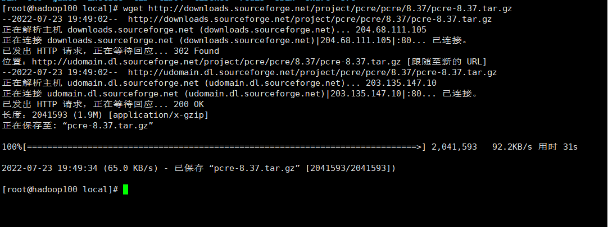

* **解压至当前目录**

``` shell
tar -xvf pcre-8.37.tar.gz
```

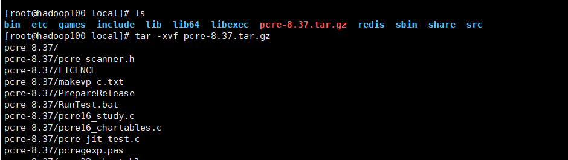


* **进入 pcre-8.37 目录下，执行 ./configure 命令**

``` shell
cd pcre-8.37
```

``` shell
./configure
```


``有一个错误，说我们缺少 C++ 编译环境，执行以下命令，进行安装：``

``` shell
yum -y install gcc-c++
```

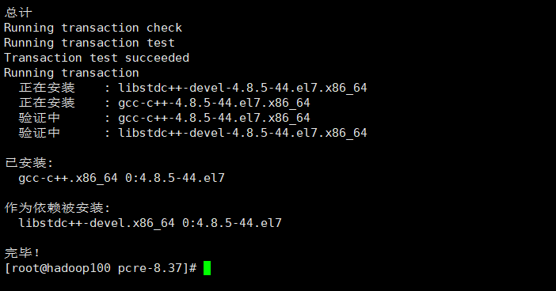

``gcc 安装完成后，要再重新执行一次 ./configure 命令``

* **在 pcre-8.37 目录下 执行以下命令进行编译和安装**

``` shell
make && make install
```

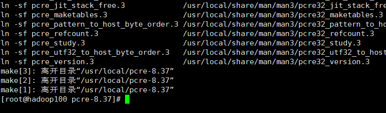

**输入以下命令可以查看版本号：**

``` shell
pcre-config --version
```

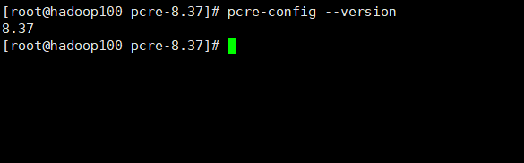

**至此 pcre 安装完成**

## 2.2、安装 openssl 和 zlib

``` shell
yum -y install make zlib zlib-devel gcc-c++ libtool openssl openssl-devel
```

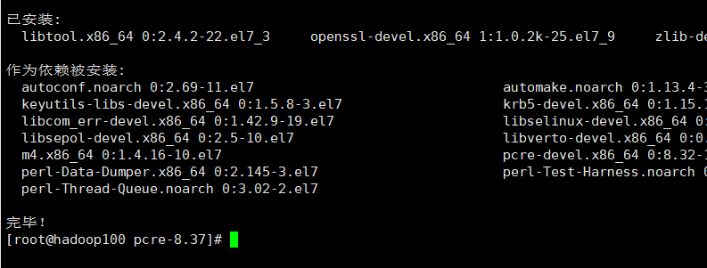


## 2.3、安装 Nginx

``这里把 Ngnix 安装到了 /usr/local 目录下面了``

* **通过远程工具（Xftp）将 Ngnix 安装包放到这个目录下**


* **进入 nginx-1.12.2 目录下，执行 ./configure 命令**

``` shell
cd cd nginx-1.12.2
```

``` shell
./configure
```

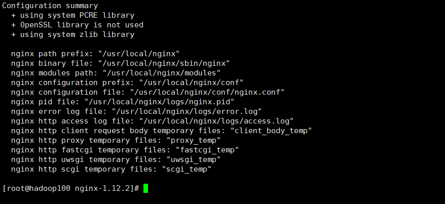

* **在 nginx-1.12.2 目录下 执行以下命令进行编译和安装**

``` shell
make && make install
```

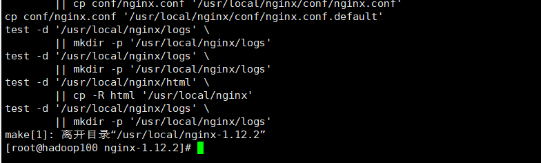


**在 /usr/local 目录下可以看到一个 ngnix 目录**

``` shell
ls
```


**至此 Ngnix 安装完成**


## 2.4、启动 Nginx

* **进入 nginx 目录下的 sbin 目录**

``` shell
cd nginx/sbin/
```

* **使用 ls 命令可以看到 有一个 nginx 文件**

``` shell
ls
```


* **使用 ./nginx 命令来启动nginx**

``` shell
./nginx
```


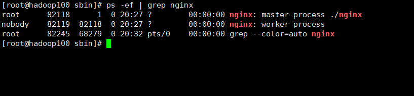


## 2.5、查看 nginx 默认访问端口号

`` 进入 nginx/conf/ 目录下，查看 nginx.conf 配置文件就能看到默认访问端口号``

``` shell
less nginx.conf # 查看命令
```


## 2.6、查看 防火墙 开放的端口号

``` shell
firewall-cmd --list-all
```

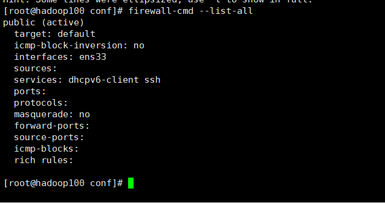

**当前还没有任何开放，现在开放一个端口号**

``` shell
sudo firewall-cmd --add-port=8001/tcp --permanent
```


**开放完成后重启防火墙**

``` shell
firewall-cmd --reload
```

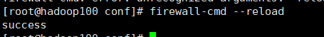

**重新查看一下防火墙开放的端口号**

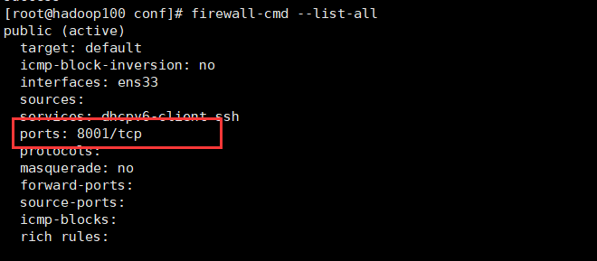

**至此，开放防火墙端口号开放成功**


# 第三章、Nginx 常用命令

> **使用 nginx 操作命令的前提条件：必须进入 nginx 的目录**
>
> **/usr/local/nginx/sbin**

## 3.1、查看 nginx 版本号

``` shell
./nginx -v
```


## 3.2、启动 nginx

``` shell
./nginx
```

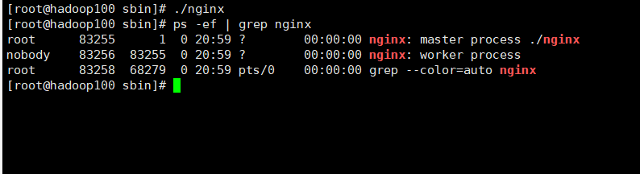

## 3.3、关闭 nginx

``` shell
./nginx -s stop
```

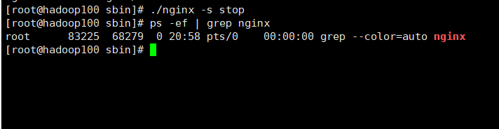

## 3.4、重新加载 nginx

``` shell
./nginx -s reload # 重新加载配置文件
```


# 第四章、Nginx 配置文件

> **Nginx 配置文件的位置：/usr/local/nginx/conf**

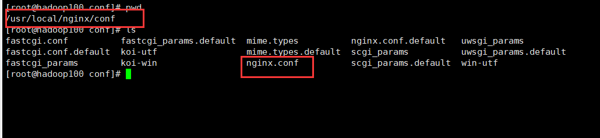

> **nginx 安装目录下，其默认的配置文件都放在这个目录的 conf 目录下，而主配置文件 nginx.conf 也在其中，后续对 nginx 的使用基本上都是对此配置文件进行相应的修改**

## 4.1、nginx 配置的组成

* **第一部分：全局块**

**从配置文件开始到 events 块之间的内容，主要会设置一些影响 nginx 服务器整体运行的配置指令，主要包括配 置运行 Nginx 服务器的用户（组）、允许生成的 worker process 数，进程 PID 存放路径、日志存放路径和类型以 及配置文件的引入等。**

**比如上面第一行配置的：**


**这是 Nginx 服务器并发处理服务的关键配置，worker_processes 值越大，可以支持的并发量也越多，但是会受到硬件、软件等设备的制约**


* **第二部分：events 块**

**比如上面的配置：** 


s 块涉及的指令主要影响 Nginx 服务器与用户的网络连接，常用的设置包括是否开启对多 work process  下的网络连接进行序列化，是否允许同时接收多个网络连接，选取哪种事件驱动模型来处理连接请求，每个 word  process 可以同时支持的最大连接数等。**

**上述例子就表示每个 work process 支持的最大连接数为 1024. **

**这部分的配置对 Nginx 的性能影响较大，在实际中应该灵活配置。**


* **第三部分：http块**

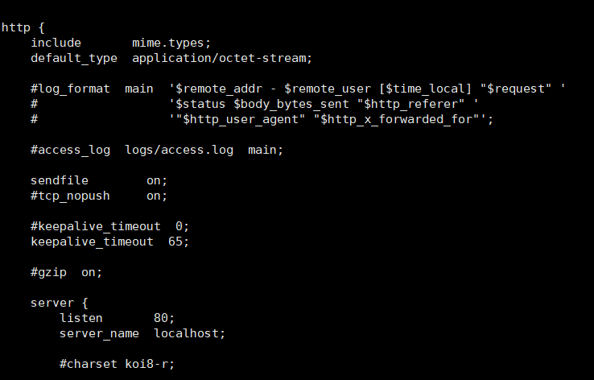

**这算是 Nginx 服务器配置中最频繁的部分，代理、缓存和日志定义等绝大多数功能和第三方模块的配置都在这里。 需要注意的是：http 块也可以包括 http 全局块、server 块。**

* **http 全局块**

 **http 全局块配置的指令包括文件引入、MIME-TYPE 定义、日志自定义、连接超时时间、单链接请求数上限等**

* **server块**

**这块和虚拟主机有密切关系，虚拟主机从用户角度看，和一台独立的硬件主机是完全一样的，该技术的产生是为了 节省互联网服务器硬件成本。**

**每个 http 块可以包括多个 server 块，而每个 server 块就相当于一个虚拟主机。 而每个 server 块也分为全局 server 块，以及可以同时包含多个 locaton 块**

1、**全局 server 块**

**最常见的配置是本虚拟机主机的监听配置和本虚拟主机的名称或 IP 配置**

2、**location 块**

**一个 server 块可以配置多个 location 块。 **

**这块的主要作用是基于 Nginx 服务器接收到的请求字符串（例如 server_name/uri-string），对虚拟主机名称 （也可以是 IP 别名）之外的字符串（例如 前面的 /uri-string）进行匹配，对特定的请求进行处理。地址定向、数据缓 存和应答控制等功能，还有许多第三方模块的配置也在这里进行。**


# 第五章、Ngnix 配置实例-反向代理实例

## 1、反向代理实例一


> **打开浏览器，在浏览器地址栏输入 www.123.com ，跳转到 linux 系统 tomcat 主页面**

### 1.1、准备工作

#### 1、在linux中安装tomcat

* **默认linux就带有jdk，如果tomcat和jdk版本不适用，那么可以重新下载jdk**

``` shell
java -v # 查看 jdk 版本
```


* **先去tomcat官网下载tomcat，这里下载的是tomcat8.5.81 版本**

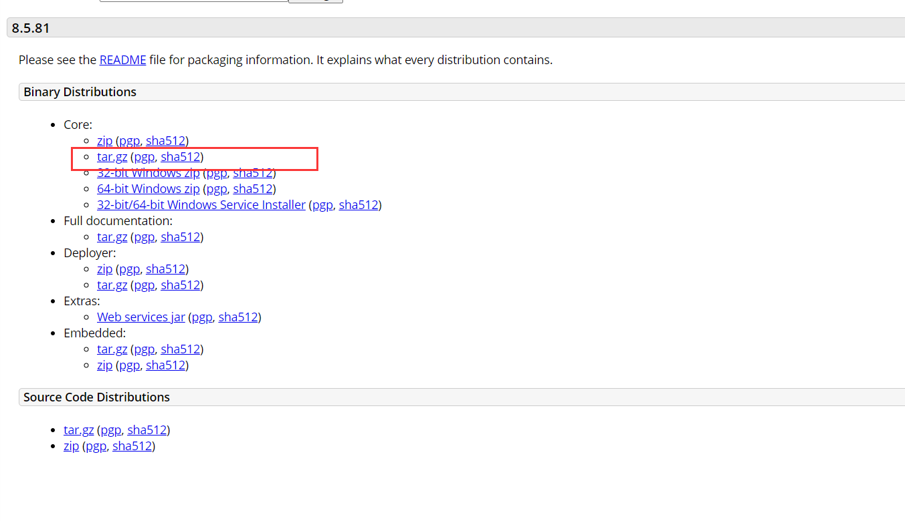

* **通过 Xfp 将压缩包上传到 linux 的 /usr/local 目录下，并解压**

``` shell
tar -xvf apache-tomcat-8.5.81.tar.gz
```

* **进入 tomcat的bin 目录使用以下命令启动 tomcat**

``` shell
./startup.sh
```

#### 2、对外开放访问的端口

* **输入以下命令进行访问**

``` shell
firewall-cmd --add-port=8080/tcp --permanent
```

``` shell
firewall-cmd --freload
```

* **查看已经开放的端口号**

``` shell
firewall-cmd --list-all
```

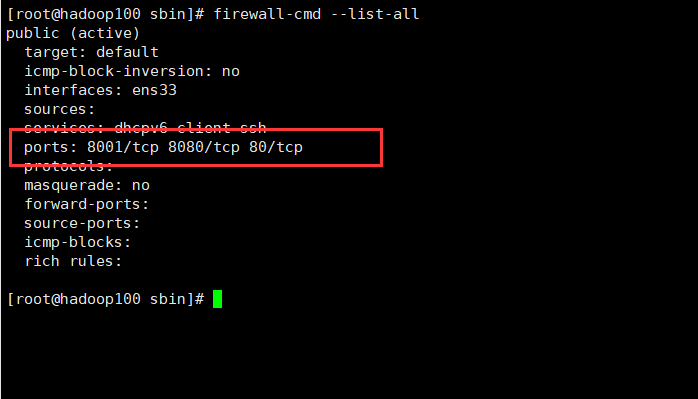


#### 3、在 windows 系统中通过输入 Linux主机IP地址+8080 看能否打开tomcat默认界面

```shell
ifconfig # 查看 linux 主机的IP地址
```

**我这里输入的是：http://192.168.13.100:8080/**

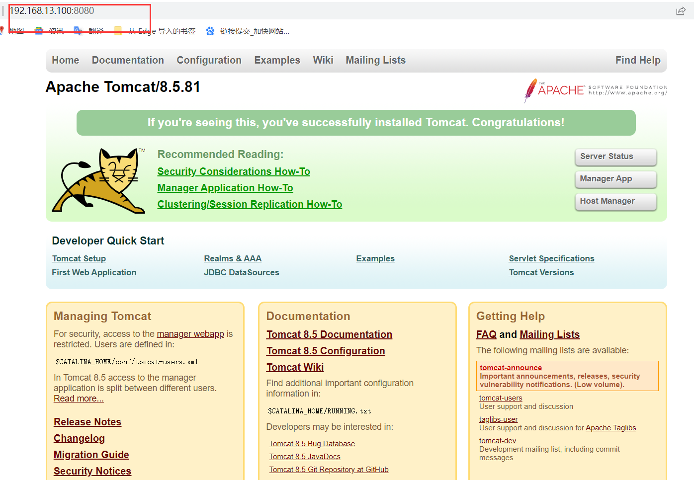


### 1.2、访问过程分析

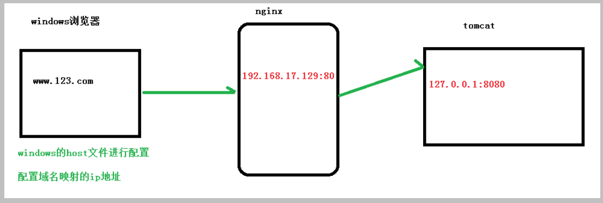


### 1.3、具体配置

#### 1、在 windows 系统的 host 文件进行域名和 ip对应关系的配置

``添加内容在 host 文件中：``

> **192.168.13.100     www.123.com** 

此时在浏览器输入 www.123.com:8080 就能访问 linux 中的 tomcat了


#### 2、在 nginx 中进行请求转发的配置(反向代理配置)

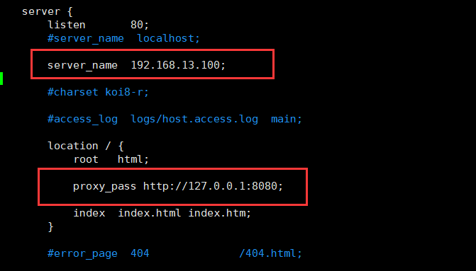

**修改完配置文件记得重启 nginx**

#### 3、最终测试

**在浏览器输入：www.123.com 即可访问 linux 中的 tomcat，这一次就不用加端口号了**


## 2、反向代理实例二

> 实现效果：使用 nginx 反向代理，根据访问的路径跳转到不同端口的服务中 
>
> nginx 监听端口为 9001
>
> 访问 http://127.0.0.1:9001/edu/ 直接跳转到 127.0.0.1:8081 
>
> 访问 http://127.0.0.1:9001/vod/ 直接跳转到 127.0.0.1:8080

### 2.1、实验代码

* **第一步，准备两个 tomcat，一个 8080 端口，一个 8081 端口，并在tomcat下的webapps目录下准备好测试的页面**

> **测试页面：a.html **
>
> **http://192.168.13.100:8080/vod/a.html  ---> 输出结果：8080**
>
> **http://192.168.13.100:8081/edu/a.html  ---> 输出结果：8081**

* **第二步，分别启动8080和8081端口的Tomcat**

``在 tomcat 的bin目录下执行以下命令来启动tomcat``

``` shell
./startup.sh
```

* **第三步，修改 nginx 的配置文件**

> 在 http 块中添加 server {}

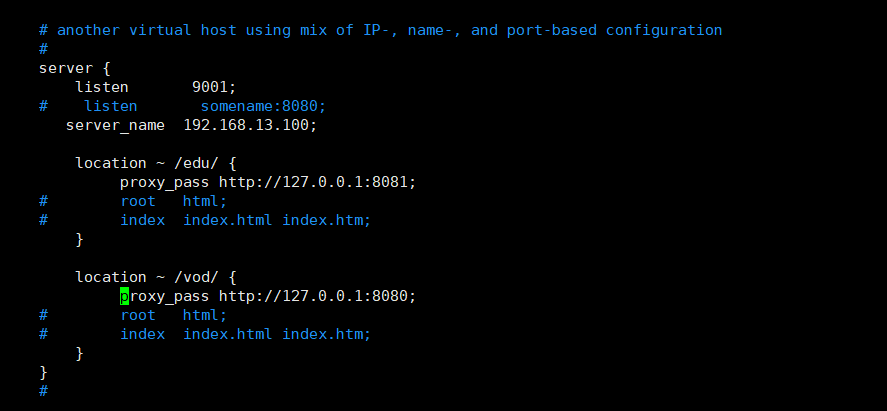

> **注意：不要忘记结尾添加 ``;``**

* **开发对外访问的端口号**

> 9001 8080 8081

``` shell
firewall-cmd --list-all # 查看防火墙开放的端口号
```

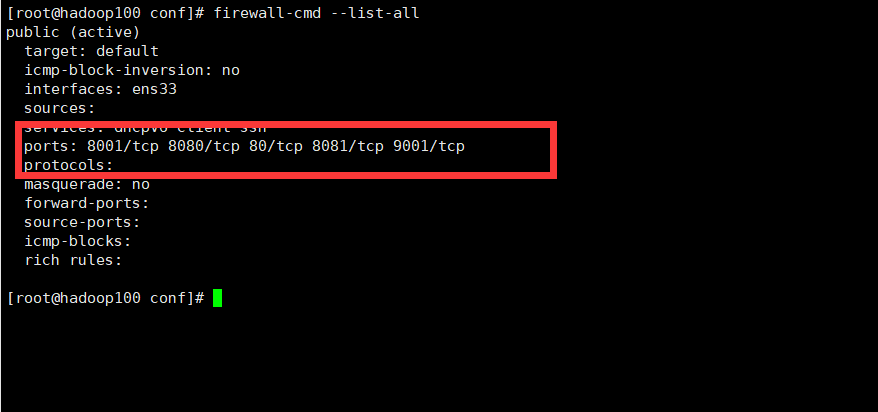

* **浏览器输入地址进行测试**

> http://192.168.13.100:9001/edu/a.html
>
> http://192.168.13.100:9001/vod/a.html

### 2.2、location指令说明

**该指令用于匹配URL**

**语法如下：**

``` shell
location [ = | ~ | ~* | ^~ ] uri {

}
```

 **1、= ：用于不含正则表达式的 uri 前，要求请求字符串与 uri 严格匹配，如果匹配 成功，就停止继续向下搜索并立即处理该请求。** 

**2、~：用于表示 uri 包含正则表达式，并且区分大小写。**

> **例如：**
>
> **~ /edu/ ：这个表示的就是匹配路径中包含 /edu/ 的地址**

 **3、~*：用于表示 uri 包含正则表达式，并且不区分大小写。**

 **4、^~：用于不含正则表达式的 uri 前，要求 Nginx 服务器找到标识 uri 和请求字 符串匹配度最高的 location 后，立即使用此 location 处理请求，而不再使用 location  块中的正则 uri 和请求字符串做匹配。**

**注意：如果URI 包含正则表达式，则必须要有 ~ 或者 ~* 标识**


# 第六章、Nginx配置实例-负载均衡

## 1、实现效果

> **浏览器地址栏输入地址 http://192.168.13.100/edu/a.html，负载均衡效果，平均 8080 和 8081 端口中**

## 2、准备工作

* **准备两台 tomcat 服务器，一台 8080，一台 8081**

* **在两台 tomcat 里面 webapps 目录中，创建名称是 edu 文件夹，在 edu 文件夹中创建 页面 a.html，用于测试**
* **在 Nginx 的配置文件中进行负载均衡的配置**

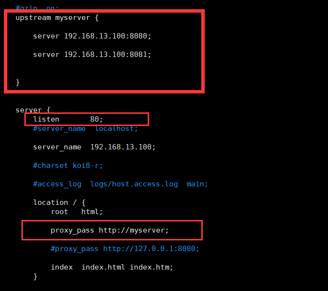

* **浏览器中输入地址进行测试**

> http://192.168.13.100/edu/a.html
>
> 效果：刷新浏览器时，浏览器切换输出8081 和 8080 ，表明将我们的请求均衡的分发给了 8081 和 8080 服务器了

## 3、Nginx 分配服务器策略

* **轮询(默认)**

> **每个请求按时间顺序逐一分配到不同的后端服务器，如果后端服务器 down 掉，能自动剔除**

* **weight（分配权重）**

> **weight 代表权重默认为 1,权重越高被分配的客户端越多**

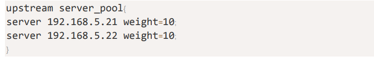

* **ip_hash**

> **每个请求按访问 ip 的 hash 结果分配，这样每个访客固定访问一个后端服务器**

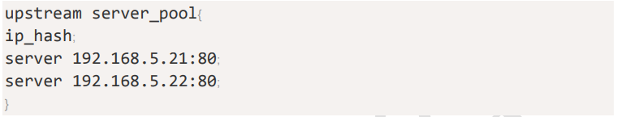

* **fair(第三方)**

> **按后端服务器的响应时间来分配请求，响应时间短的优先分配**

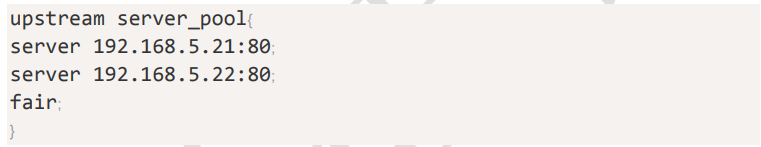


# 第七章、Nginx配置实例-动静分离

## 1、什么是动静分离

Nginx 动静分离简单来说就是把动态跟静态请求分开，不能理解成只是单纯的把动态页面和 静态页面物理分离。严格意义上说应该是动态请求跟静态请求分开，可以理解成使用 Nginx  处理静态页面，Tomcat 处理动态页面。

动静分离从目前实现角度来讲大致分为两种， 一种是纯粹把静态文件独立成单独的域名，放在独立的服务器上，也是目前主流推崇的方案； 另外一种方法就是动态跟静态文件混合在一起发布，通过 nginx 来分开。 通过 location 指定不同的后缀名实现不同的请求转发。通过 expires 参数设置，可以使 浏览器缓存过期时间，减少与服务器之前的请求和流量。具体 Expires 定义：是给一个资 源设定一个过期时间，也就是说无需去服务端验证，直接通过浏览器自身确认是否过期即可， 所以不会产生额外的流量。此种方法非常适合不经常变动的资源。（如果经常更新的文件， 不建议使用 Expires 来缓存），我这里设置 3d，表示在这 3 天之内访问这个 URL，发送 一个请求，比对服务器该文件最后更新时间没有变化，则不会从服务器抓取，返回状态码 304，如果有修改，则直接从服务器重新下载，返回状态码 200

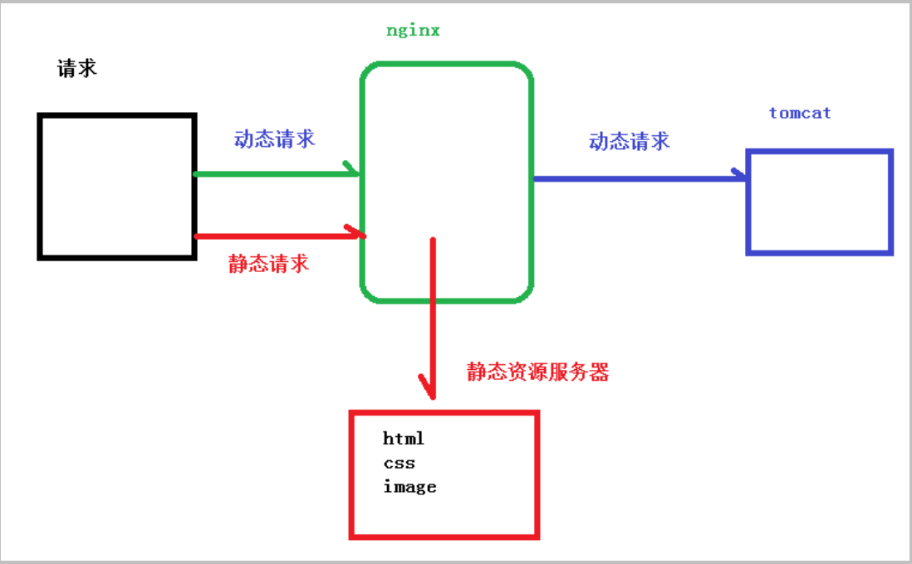


## 2、准备工作

### 2.1、在 linux 系统中准备静态资源，用于进行访问

> **在 /usr/local 目录下新建data目录，然后在 data 目录下新建 img 目录和 www 目录，其中 img 目录下存放一张图片，www 目录下存放一个网页**
>
> **图片：1.jpg**
>
> **网页：a.jpg**


### 2.2、在 nginx 的配置文件中进行配置

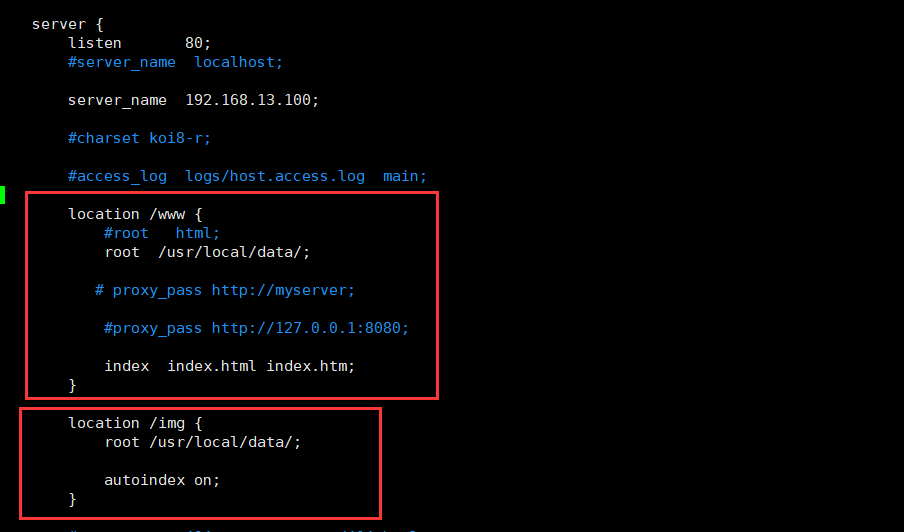


### 2.3、最终测试

* **在浏览器中输入以下地址**

> [192.168.13.100/img/1.jpg](http://192.168.13.100/img/1.jpg)


> 因为在配置文件中配置了 autoindex on; 所以当访问到 /img/ 时，会出现一个文件夹页面，如下所示：

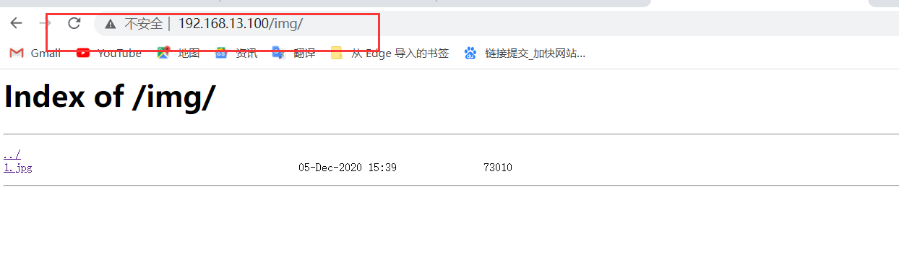

* **在浏览器中输入以下地址**

> http://192.168.13.100/www/a.html

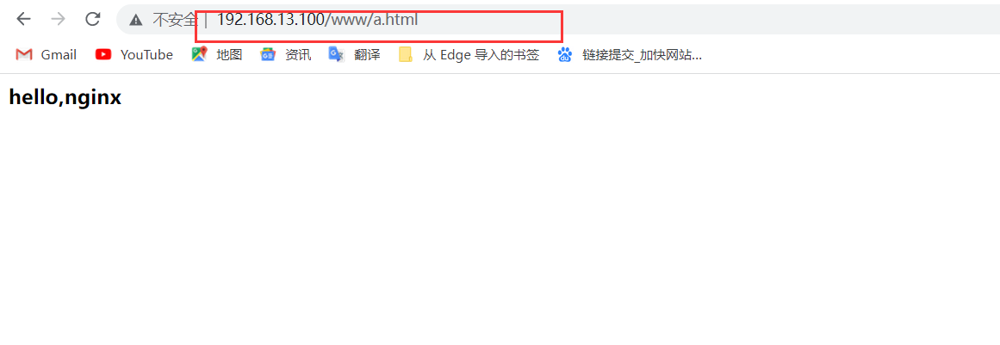


# 第七章、Nginx配置实例-高可用性

**高可用集群（主从模式集群架构图）**

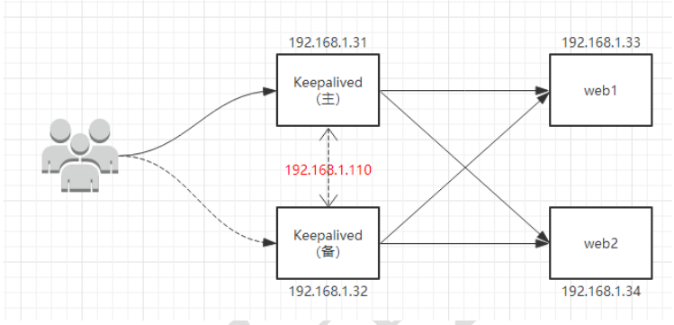

## 1、什么是 Nginx 高可用集群

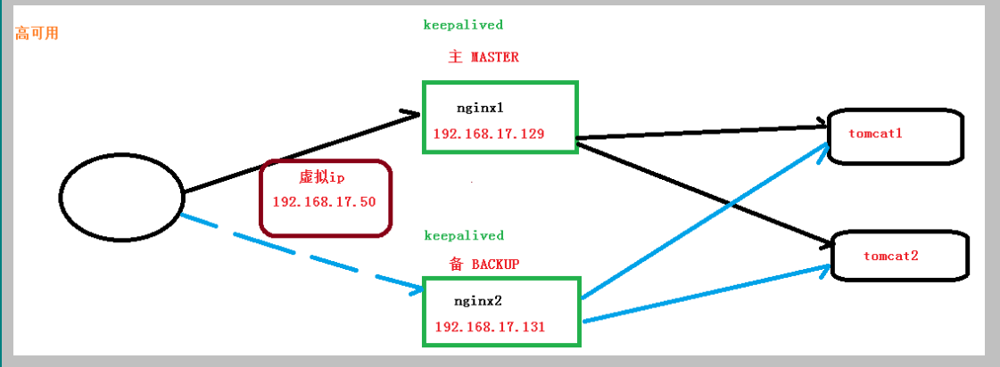


- **需要两台 nginx 服务器**
- **需要 keepalived**
- **需要虚拟 ip**


## 2、准备工作

* **需要准备两台服务器**

* **在两台服务器上安装 nginx**

* **在两台服务器上安装 keepalived**


## 3、安装 keepalived

* **使用 yum 命令进行安装**

``` shell
yum install keepalived -y
```

* **安装之后，在 etc 里面生成目录 keepalived,有文件 keepalived.conf**


## 4、完成高可用配置（主从配置）

* **修改 /etc/keepalived/keepalived.conf 配置文件**

``` shell
```

* **在 /usr/local/src 添加监测脚本**

``` shell
#!/bin/bash
A=`ps -C nginx –no-header |wc -l`
if [ $A -eq 0 ];then
 /usr/local/nginx/sbin/nginx
 sleep 2
 if [ `ps -C nginx --no-header |wc -l` -eq 0 ];then
 killall keepalived
 fi
fi
```

* **把两台服务器上 nginx 和 keepalived 启动**

> **启动 ngindx：./nginx**
>
> **启动 keepalived：systemctl start Keepalived.service**


## 5、最终测试

* **在浏览器地址栏输入 虚拟 ip 地址 192.168.17.50**
* **把主服务器（192.168.17.129）nginx 和 keepalived 停止，再输入 192.168.17.50**


# 第八章、Nginx 的原理

## 1、master 和 worker

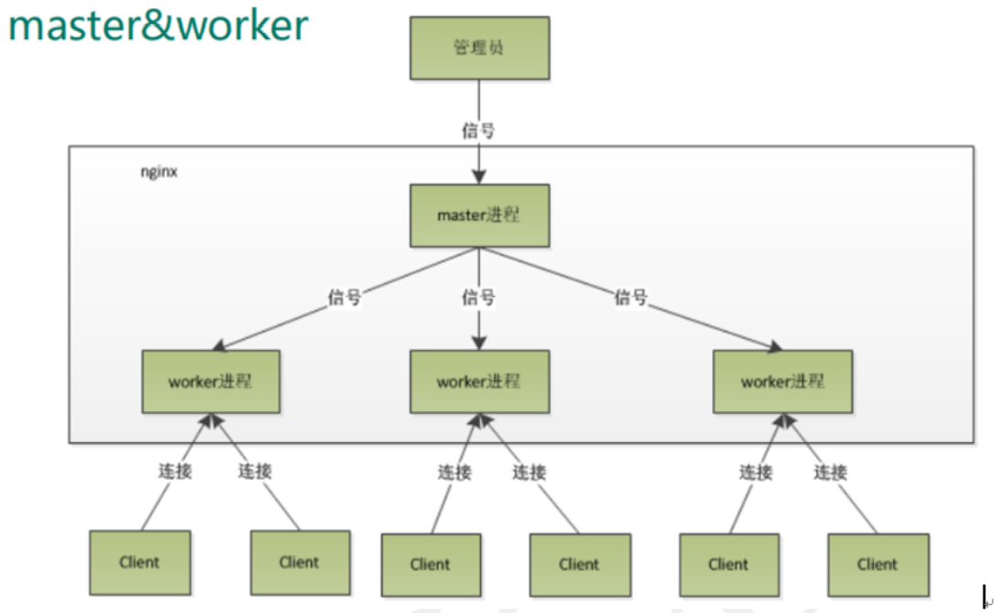

**Nginx 中会有一个 master 进程 和 多个 worker 进程**


## 2、worker 如何进行工作的

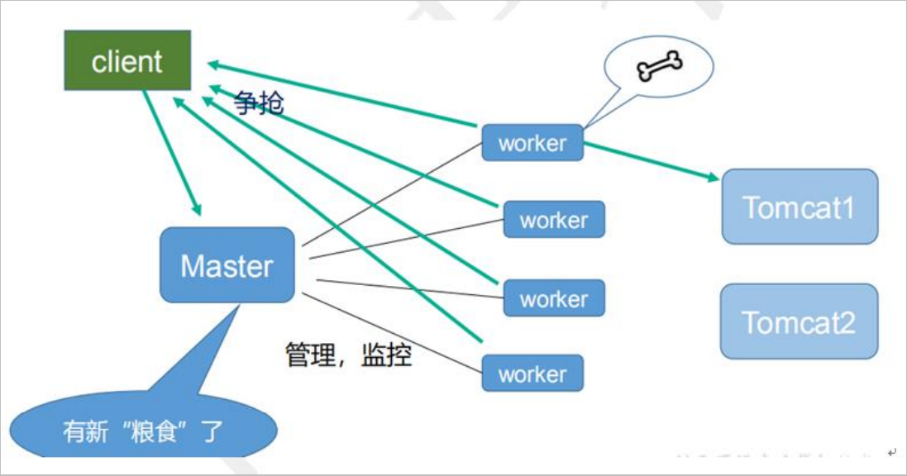


## 3、一个master 和 多个 worker 的好处

* **可以使用 nginx –s reload 热部署，利用 nginx 进行热部署操作**

* **每个 woker 是独立的进程，如果有其中的一个 woker 出现问题，其他 woker 独立的， 继续进行争抢，实现请求过程，不会造成服务中断**


## 4、设置多少个 worker 合适

* **worker 数和服务器的 cpu 数相等是最为适宜的**


## 5、连接数 worker_connection

* **发送请求，占用了 worker 的几个连接数**

> **2 个 或 4 个**
>
> **当请求的是静态资源时，占用了 worker 的两个连接数 **
>
> **当请求通过tomcat访问数据库等操作时，会占用 worker 的四个连接数**

* **Nginx 有一个master，有四个worker，每个worker支持最大连接数 1024，则支持的最大并发数是多少**

> * **普通的静态访问最大并发数是：worker_connections * worker_processes / 2**
>
> * **而如果是 HTTP 作 为反向代理来说，最大并发数量应该是 worker_connections *  worker_processes/4**
>
> * **worker_connections：worker连接数**
>
> * **worker_processes：worker进程数**
