# 第一章、Git概述

Git 是一个免费的、开源的分布式版本控制系统，可以快速高效地处理从小型到大型的各种 项目。 

Git 易于学习，占地面积小，性能极快。 它具有廉价的本地库，方便的暂存区域和多个工作 流分支等特性。其性能优于 Subversion、CVS、Perforce 和 ClearCase 等版本控制工具。

## 1. 何为版本控制

版本控制是一种记录文件内容变化，以便将来查阅特定版本修订情况的系统。

 ==版本控制其实最重要的是可以记录文件修改历史记录==，从而让用户能够查看历史版本， 方便版本切换。


## 2. 为什么需要版本控制

个人开发过渡到团队协作。

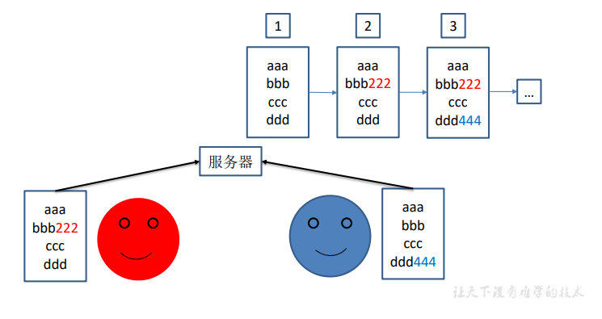


## 3、版本控制工具

### 3.1、 集中式版本控制工具

集中化的版本控制系统诸如 CVS、SVN 等，都有一个单一的集中管理的服务器，保存 所有文件的修订版本，而协同工作的人们都通过客户端连到这台服务器，取出最新的文件或 者提交更新。多年以来，这已成为版本控制系统的标准做法。

这种做法带来了许多好处，每个人都可以在一定程度上看到项目中的其他人正在做些什 么。而管理员也可以轻松掌控每个开发者的权限，并且管理一个集中化的版本控制系统，要 远比在各个客户端上维护本地数据库来得轻松容易。

事分两面，有好有坏。这么做显而易见的缺点是中央服务器的单点故障。如果服务器宕 机一小时，那么在这一小时内，谁都无法提交更新，也就无法协同工作。

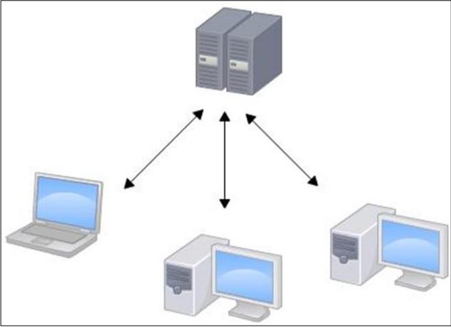


### 3.2、 分布式版本控制工具

Git、Mercurial、Bazaar、Darcs……

像 Git 这种分布式版本控制工具，客户端提取的不是最新版本的文件快照，而是把代码 仓库完整地镜像下来（本地库）。这样任何一处协同工作用的文件发生故障，事后都可以用 其他客户端的本地仓库进行恢复。因为每个客户端的每一次文件提取操作，实际上都是一次 对整个文件仓库的完整备份。

分布式的版本控制系统出现之后,解决了集中式版本控制系统的缺陷: 

1. 服务器断网的情况下也可以进行开发（因为版本控制是在本地进行的） 

2. 每个客户端保存的也都是整个完整的项目（包含历史记录，更加安全）


## 4、Git简史

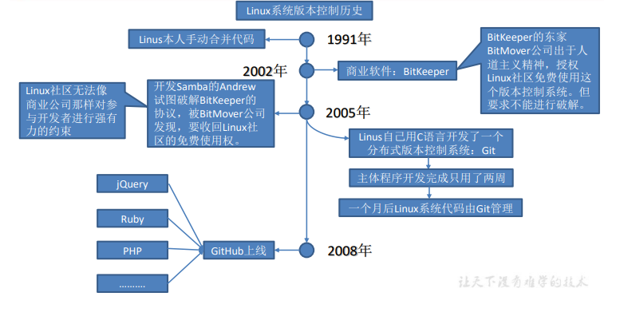


## 5、Git工作机制

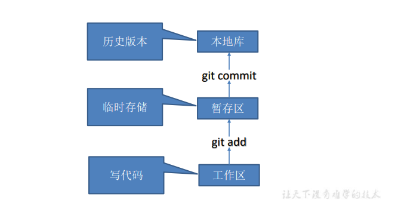


## 6、Git和代码托管中心

代码托管中心是基于网络服务器的远程代码仓库，一般我们简单称为==远程库==

### 6.1、局域网

GitLab

### 6.2、互联网

GitHub（外网）

Gitee 码云（国内网站）


# 第二章、Git安装

官网地址： https://git-scm.com

一路点击 next

# 第三章、Git常用命令

| 命令名称                             | 作用           |
| ------------------------------------ | -------------- |
| git config --global user.name 用户名 | 设置用户签名   |
| git config --global user.email 邮箱  | 设置用户签名   |
| git init                             | 初始化本地库   |
| git status                           | 查看本地库状态 |
| git add 文件名                       | 添加到暂存区   |
| git commit -m "日志信息" 文件名      | 提交到本地库   |
| git reflog                           | 查看历史记录   |
| git reset --hard 版本号              | 版本穿梭       |
| git remote -v                        | 查看远程地址   |

## 1、设置用户签名

### 1.1、 基本语法

``` shell
git config --global user.name 用户名 

git config --global user.email 邮箱
```

### 1.2、 案例实操

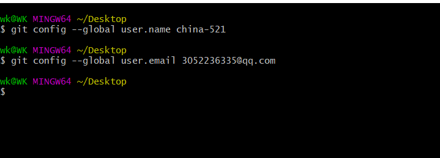


在c盘的wk目录下有一个.gitconfig配置文件，里面有我们的签名信息

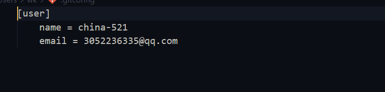


> 说明： 签名的作用是区分不同操作者身份。用户的签名信息在每一个版本的提交信息中能够看到，以此确认本次提交是谁做的。
>
> Git 首次安装必须设置一下用户签名，否则无法提交代码。
>
> ※注意：这里设置用户签名和将来登录 GitHub（或其他代码托管中心）的账号没有任何关系。

## 2、初始化本地仓库

### 2.1、 基本语法

``` shell
git init
```

### 2.2、 案例实操

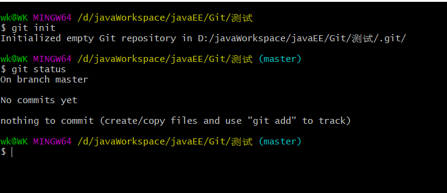

### 2.3、 结果查看

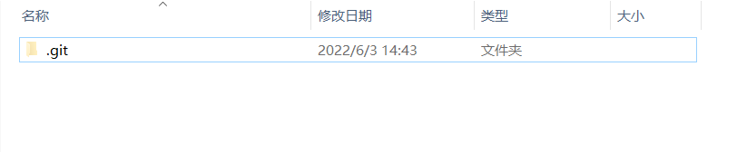


## 3、查看本地库状态

### 3.1、 基本语法

``` shell
git status
```

### 3.2、 实例操作

#### 1、首次查看（工作区没有任何文件）

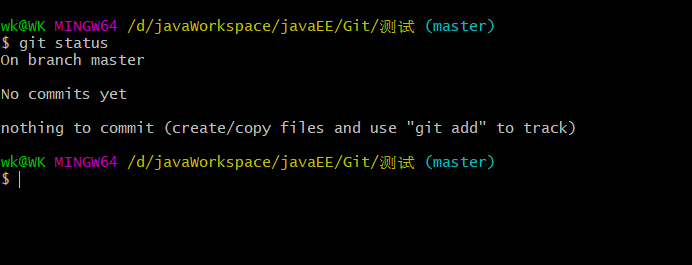

#### 2、新增文件（hello.text）

``` shell
vim hello.txt
```

> 扩展：
>
> 1、进入编辑模式
>
> ``` git
> i
> ```
>
> 2、退出编辑模式
>
> ``` git
> ESC
> ```
>
> 3、保存并退出命令
>
> ``` git
> :wq
> ```
>
> 4、查看当前文件夹下的文件
>
> ``` git
> ll
> ```
>
> 5、查看具体文件内容
>
> ``` git
> cat 文件名
> ```
>
> 

####  3、再次查看（检测到未追踪的文件）

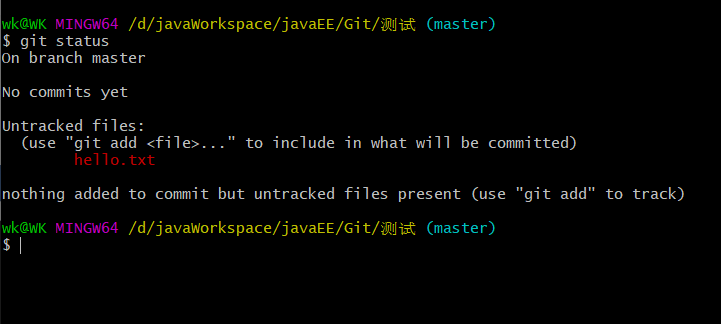

## 4、添加暂存区

### 4.1、 将工作区的文件添加到暂存区

#### 1、 基本语法

``` git
git add 文件名
```

#### 2、 案例实操

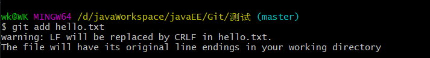

### 4.2、 查看状态（检测到暂存区有新文件）

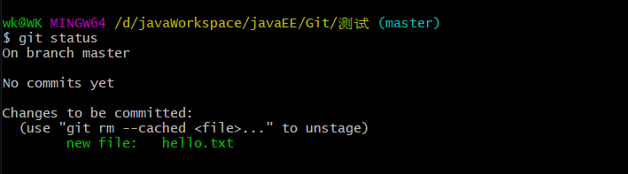

``` shell
# 删除暂存区文件命令：
git rm --cached hello.txt
```

## 5、提交本地库(形成历史版本)

### 5.1、将暂存区的文件提交到本地库

#### 1、 基本语法

``` shell
git commit -m '日志信息' 文件名
```

#### 2、 案例实操

> 提交本地库后，生成了精简版的版本号： fccf975

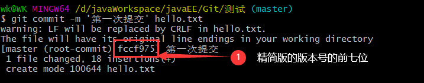

### 5.2、 查看状态（没有文件需要提交,工作树是干净的）

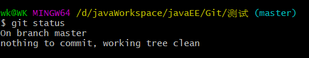

### 5.3、查看版本信息

1、精简版

``` shell
git reflog
```

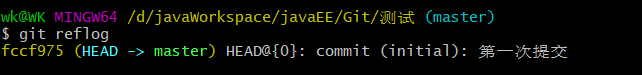

> 通过这个命令可以看到我们刚才生成的那个简易的历史版本

2、详细版

``` shell
git log
```

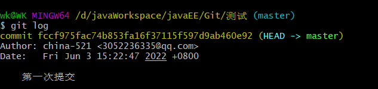

> 里面包含详细的信息，以及完整版的版本号

## 6、修改文件（hello.txt）

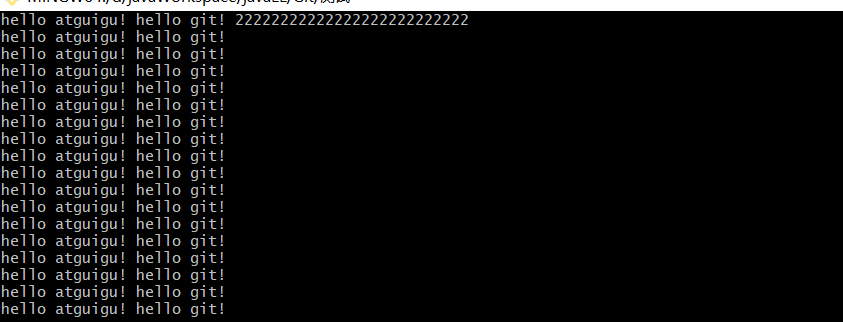


### 6.1、查看状态（检测到工作区有文件被修改）

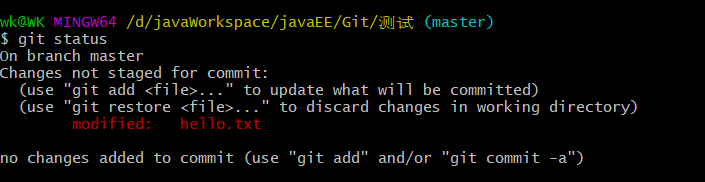


### 6.2、 将修改的文件再次添加到缓存区

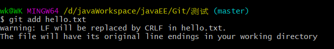

### 6.3、 查看状态（工作区的修改添加到了缓存区）

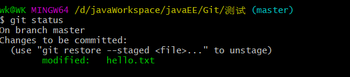

## 7、历史版本

### 7.1、查看历史版本

#### 1、基本语法

``` shell
 # 查看版本信息
git reflog

# 查看版本详细信息
git log
```

#### 2、案例实操

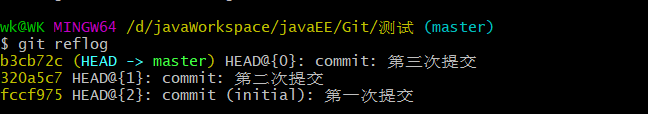

> 当前有三个版本

### 7.2、版本穿梭

#### 1、基本语法

``` git
git reset --hard 版本号
```

#### 2、案例实操

* 首先查看当前的历史记录，可以看到当前是在 b3cb72c 这个版本

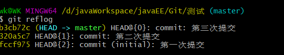

* 切换到  320a5c7 的版本，也就是我们第二次提交的版本

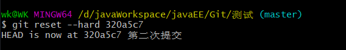

* 切换完毕之后再查看历史记录，当前成功切换到了 320a5c7  版本

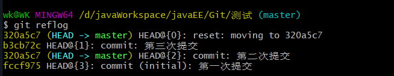

* 然后查看文件 hello.txt ，发现文件内容已经变化

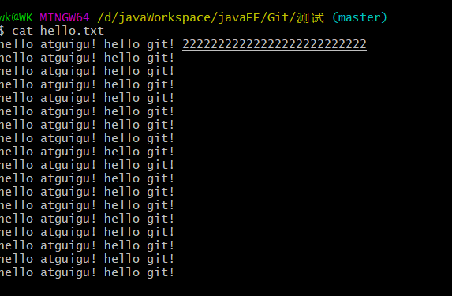


> Git 切换版本，底层其实是移动的 HEAD 指针，具体原理如下图所示。

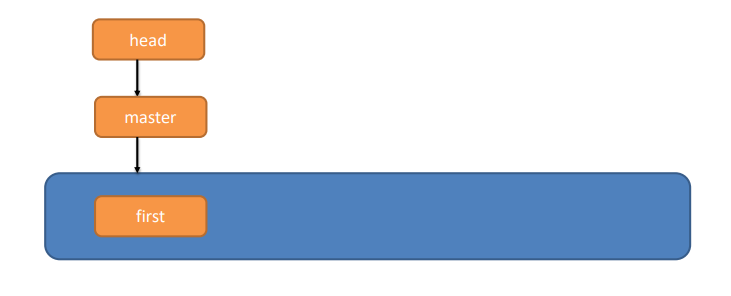

### 7.3、版本还原

#### 1、基本语法

``` shell
git revert 版本号
```


## 8、远程地址

### 8.1、查看远程地址

``` shell
git remote -v
```

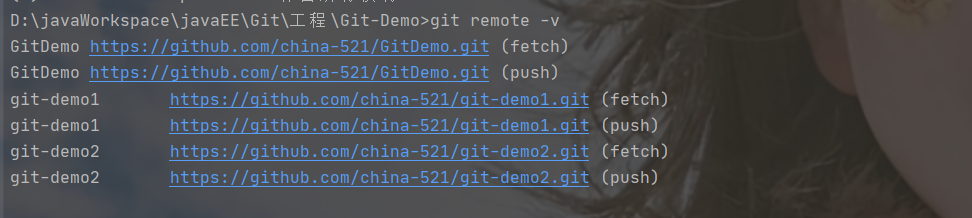


### 8.2、新增远程地址

``` shell
git remote add origin 远程地址
```

### 8.3、删除远程地址

``` shell
git remote remove 远程地址
```

## 9、将本地代码推送到远程仓库

``` shell
git push 别名/远程仓库地址 分支
```

## 10、为版本号设置标签

### 10.1、新增标签

``` shell
git tag 标签名 版本号
```

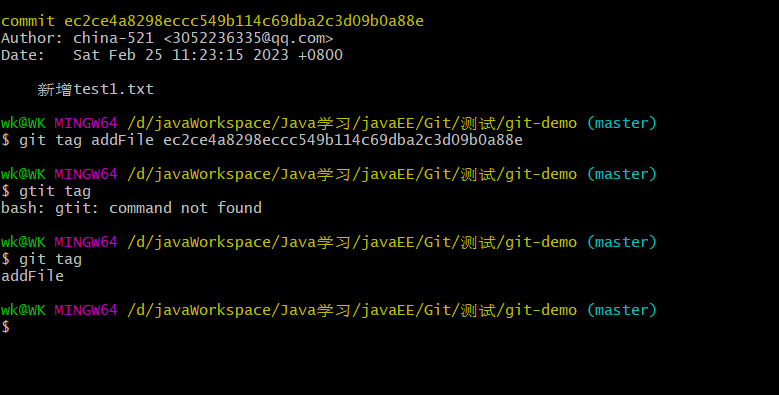

### 10.2、删除标签

``` shell
git tag -d 标签名
```

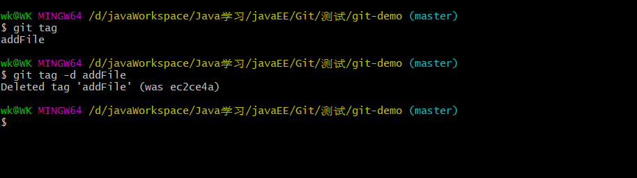


## 11、暂存代码

拉取代码有冲突时，需要先把改动暂存，再拉下代码，处理冲突。然后add、commit、push

如下是一个常用的，当拉取代码有冲突时的操作场景：

```text
git stash save 备注信息  // 暂存修改 
git pull  // 拉取代码 
git stash pop // 恢复暂存的修改 这个指令将缓存堆栈中的第一个stash删除，并将对应修改应用到当前的工作目录下。
```

如下是暂存常用到命令：

``` shell
git stash push -- 文件路径：暂存指定的文件

git stash save "message"：暂存所有文件并添加一个描述性文字。
git stash pop：将最近的存储应用到当前分支并从列表中删除它。
git stash list：列出当前所有已保存但未恢复的存储。
git stash apply：将最近的存储应用到当前分支。
git stash apply 'stash@{2}'：应用特定编号的存储到当前分支。
git stash drop 'stash@{0}'：从列表中永久删除一个存储。
git stash clear：删除所有存储。
```

## 12、补充

> 远程仓库中不小心提交了配置文件，需要删除已经传到远程仓库中的错误文件
>
> （1）git pull origin master
>
> （2）git rm --cache 文件名（只在缓存中删除对应的文件）
>
> （3）提交：git commit -m"本地删除远程文件filename"
>
> （4）git push


# 第四章、分支操作

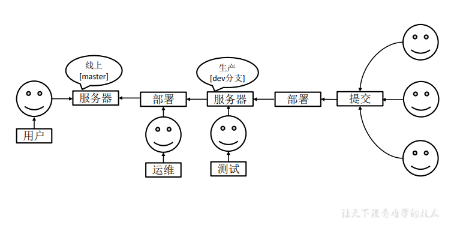


## 1、什么是分支

在版本控制过程中，同时推进多个任务，为每个任务，我们就可以创建每个任务的单独 分支。使用分支意味着程序员可以把自己的工作从开发主线上分离开来，开发自己分支的时候，不会影响主线分支的运行。对于初学者而言，分支可以简单理解为副本，一个分支就是 一个单独的副本。（分支底层其实也是指针的引用）

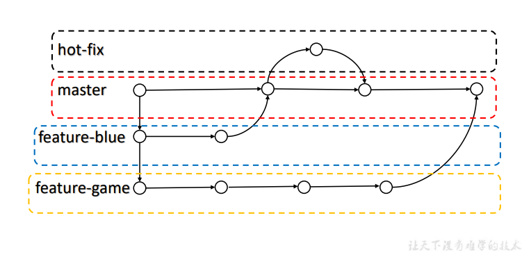

## 2、分支的好处

同时并行推进多个功能开发，提高开发效率。 

各个分支在开发过程中，如果某一个分支开发失败，不会对其他分支有任何影响。失败 的分支删除重新开始即可。


## 3、分支的操作

| 命令名称            | 作用                         |
| ------------------- | ---------------------------- |
| git branch 分支名   | 创建分支                     |
| git branch -v       | 查看分支                     |
| git checkout 分支名 | 切换分支                     |
| git merge 分支名    | 把指定的分支合并到当前分支上 |

### 3.1、查看分支

#### 1、 基本语法

``` git
git branch -v
```

#### 2、 案例实操

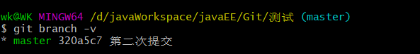

> *代表当前所在的分区

### 3.2、创建分支

#### 1、 基本语法

``` shell
git branch 分支名 # 创建分支

git checkout -b 分支名 # 创建并切换分支
```

#### 2、 案例实操

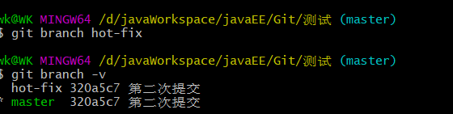

>  hot-fix 320a5c7 第二次提交 ：这个是刚创建的新的分支，并将主分支master的内容复制了一份

### 3.3、删除分支

``` shell
git branch -d 分支名
```


### 3.3、修改分支

* 在master分支上做修改

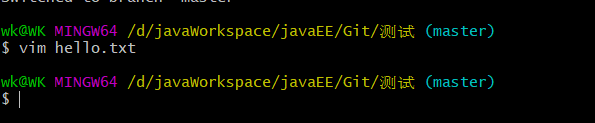

* 将修改后的文件添加到暂存区

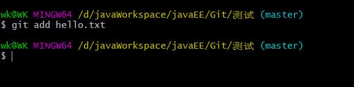

* 提交到本地仓库

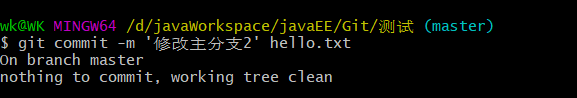

* 查看分支

  * > hot-fix 分支并未做任何改变
    >
    > 当前 master 分支已经更新为最新一次提交的版本

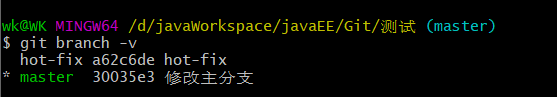

* 查看master分支上的内容

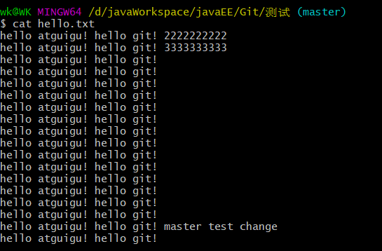

### 3.4、切换分支

#### 1、基本语法

``` git
git checkout 分支名
```

#### 2、案例实操

``` git
git checkout hot-fix
```

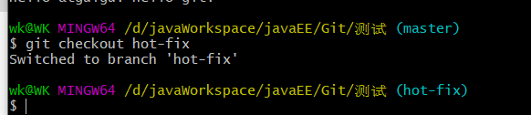

> 发现当前分支已经从 master 切换到了 hot-fix 分支。
>
> 查看 hot-fix 分支上的文件内容发现与master分支上的内容不同

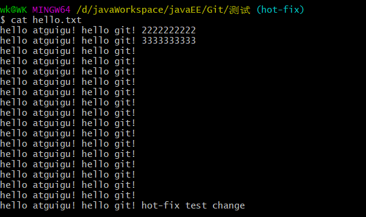


### 3.5、合并分支

#### 1、基本语法

``` git
git merge 分支名
```

#### 2、案例实操 在 master 分支上合并 hot-fix 分支

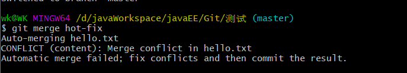

### 3.6、产生冲突

> 产生冲突的表现：后面状态为 ==MERGING==

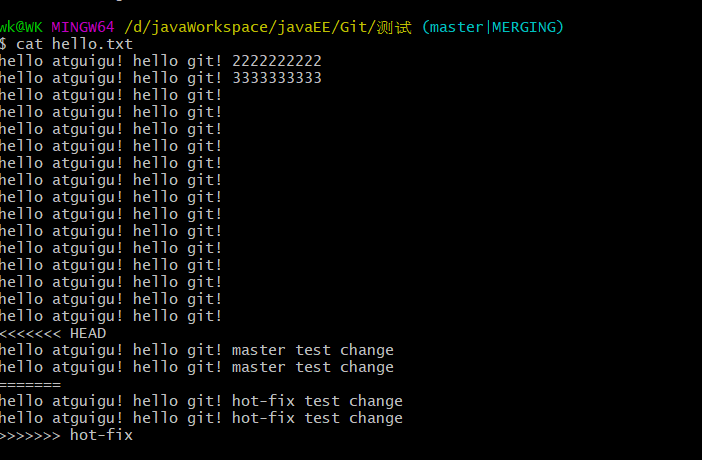

> 产生冲突的原因：
>
> 合并分支时，两个分支在==同一个文件的同一个位置==有两套完全不同的修改。Git 无法替 我们决定使用哪一个。必须==人为决定==新代码内容。

查看状态（检测到有文件两处修改）

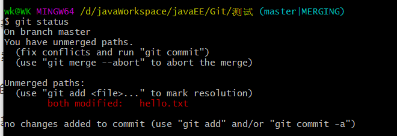

### 3.7、解决冲突

#### 1、编辑有冲突的文件，删除特殊符号，决定要使用的内容

特殊符号：``<<<<<<< HEAD`` 当前分支的代码 ``=======`` 合并过来的代码 ``>>>>>>> hot-fix``

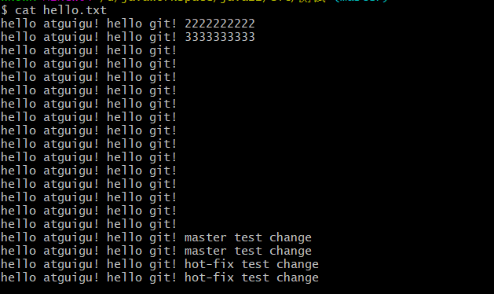

#### 2、添加到暂存区

``` git
git add hello.txt
```

#### 3、执行提交（注意：此时使用git commit 命令时不能带文件名）

``` git
git commit -m '提交冲突合并'
```

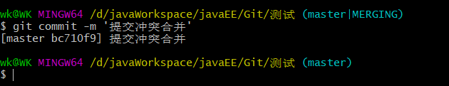

> 发现后面 MERGING消失，变为正常

## 4、创建分支和切换分支图解

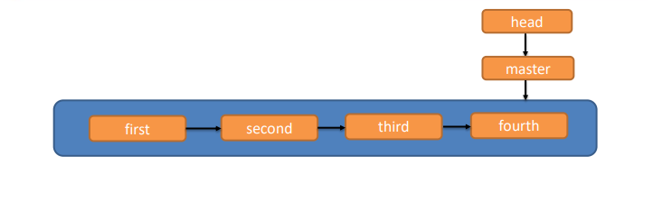

> master、hot-fix 其实都是指向具体版本记录的指针。当前所在的分支，其实是由 HEAD 决定的。所以创建分支的本质就是多创建一个指针。
>
> HEAD 如果指向 master，那么我们现在就在 master 分支上。
>
> HEAD 如果执行 hotfix，那么我们现在就在 hotfix 分支上。
>
> 所以切换分支的本质就是移动 HEAD 指针


# 第五章、Git团队协作机制

## 1、团队内协作

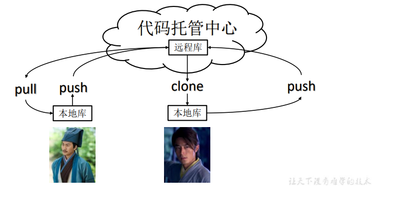

## 2、跨团队协作

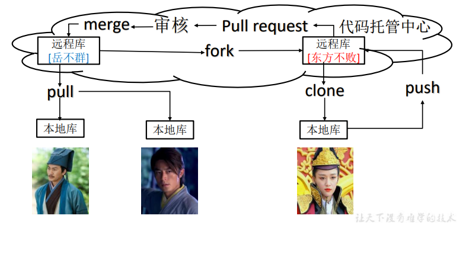

# 第六章、GitHub操作

GitHub 网址：https://github.com/

## 1、创建远程仓库


## 2、远程仓库操作

| 命令名称                           | 作用                                                      |
| ---------------------------------- | --------------------------------------------------------- |
| git remote -v                      | 查看当前所有远程地址别名                                  |
| git remote add 别名 远程地址       | 起别名                                                    |
| git push 别名 分支                 | 推送本地分支上的内容到远程仓库                            |
| git clone 远程地址                 | 将远程仓库的内容克隆到本地                                |
| git pull 远程库地址别名 远程分支名 | 将远程仓库对于分支最新内容拉下来后与 当前本地分支直接合并 |

### 2.1、创建远程仓库别名

#### 1、基本语法

``` git
git remote -v 查看当前所有远程地址别名
```

``` git
git remote add 别名 远程地址
```

#### 2、案例实操

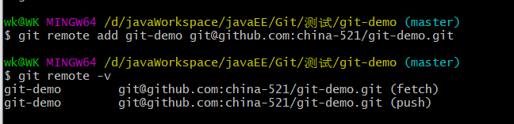


### 2.2、推送本地分支到远程仓库

#### 1、 基本语法

``` git
git push 别名 分支
```

#### 2、 案例实操

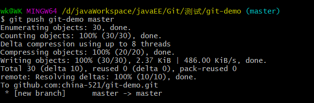


此时发现我们的 master 分支上的内容推送到了 Github 创建的远程仓库


### 2.3、拉取远程库代码到本地仓库

#### 1、 基本语法

``` git
git pull 别名 分支
```

#### 2、案例实操


#### 3、查看本地仓库状态


> 发现本地仓库是干净的，即拉取到本地仓库后的代码会被自动提交到本地仓库
>
> 查看版本，发现拉取后的代码版本已经存在在本地仓库


### 2.4、克隆远程仓库到本地

> 克隆代码是不需要登录账号的

#### 1、 基本语法

``` git 
git clone 远程地址
```

#### 2、 案例实操


> 克隆的仓库地址(SSH形式) ：git@github.com:china-521/git-demo.git
>
> 这个地址为远程仓库地址，克隆结果：初始化本地仓库


> 克隆操作成功以后，会自动创建远程仓库别名
>
> 默认生成的别名是： origin


> 小结：clone 会做如下操作
>
> 1、拉取代码。2、初始化本地仓库。3、创建别名

### 2.5、 邀请加入团队

#### 2.5.1 选择邀请合作者


#### 2.5.2 搜索并添加要合作的人


#### 2.5.3 复 制 地 址 并 通 过 微 信 钉 钉 等 方 式 发 送 给 该 用 户 ， 复 制 内 容 如 下 ：

> https://github.com/china-521/git-demo/invitations


#### 2.5.4 在 atguigulinghuchong 这个账号中的地址栏复制收到邀请的链接，点击接收邀请


#### 2.5.5 成功之后可以在 atguigulinghuchong 这个账号上看到 git-Demo 的远程仓库


#### 2.5.6 mao888 可以修改内容并 push 到远程仓库


#### 2.5.7 回到 china-521 的 Github 仓库可以看到，最后一次是 atguigulinghuchong 提交的


### 2.6、拉取远程库内容

#### 2.6.1 基本语法

``` git
git pull 远程库地址别名 远程分支名
```

#### 2.6.2 案例实操

> 将远程库对于分支最新内容拉取下来后后与当前本地分支直接合并


## 3、跨团队协作

### 3.1、将远程仓库的地址复制发给邀请跨团队协作的人，比如China-521。


### 3.2、在 China-521 的Github 账号里的地址栏复制收到的链接，然后点击 Fork 将项目叉到自己的本地仓库


>叉成功以后就可以在自己的仓库看到叉入的仓库信息


### 3.3、china-521就可以在线编辑叉取过来的文件了


### 3.4、编辑完毕，填写描述信息并点击左下角绿色按钮提交


### 3.5、接下来点击上方的 Pull 请求，并创建一个新的请求


### 3.6、被叉取的Github账号可以看到有一个Pullrequest 请求


**进入聊天室，可以讨论代码相关内容**


### 3.7、如果代码没有问题，被叉取的Github账号可以点击 Merge pull reque 合并代码


## 4、免密登录（SSH）

我们可以看到远程仓库中还有一个 SSH 的地址，因此我们也可以使用 SSH 进行访问。


具体操作如下：

* 在 ``C:\Users\wk`` 目录下使用 Git Bash Here 打开，输入下面命令生成.ssh密钥.

> 注意这里的 -C 是大写
>
> -C 后面是一段描述

``` git
 ssh-keygen -t rsa -C china-521
```


* 进入 ``.ssh`` 文件查看公共密钥

``` git
cd .ssh

cat id_rsa.pub
```


* 复制 id_rsa.pub 文件内容（公共密钥），登录 GitHub，点击用户头像→ Settings → SSH and GPG  keys


> 点击 New SSH Key 后，会弹出设置页面
>
> 其中，Title中随意去个名字
>
> Key中填入刚才获取到的公共密钥
>
> 接下来再往远程仓库 push 东西的时候使用 SSH 连接就不需要登录了。


# 第七章、IDEA集成 Git

## 1、配置Git忽略文件

### 1.1、Eclipse 特定文件


### 1.2、IDEA特定文件


### 1.3、Maven工程的target目录


> 问题1：为什么要忽略他们？
>
> 答：与项目的实际功能无关，不参与服务器上部署运行。把它们忽略掉能够屏蔽 IDE 工具之间的差异
>
> 问题2：怎么忽略？
>
> * 创建忽略规则文件 xxxx.ignore（前缀名随便起，建议是 git.ignore）
> * 这个文件的存放位置原则上在哪里都可以，为了便于让 ~/.gitconfig 文件引用，建议放在用户家目录下
> * git.ignore 文件模板内容如下：
>
> ``` text
> # Compiled class file
> *.class
> 
> # Log file
> *.log
> 
> # BlueJ files
> *.ctxt
> 
> # Mobile Tools for Java (J2ME)
> .mtj.tmp/
> 
> # Package Files #
> *.jar
> *.war
> *.nar
> *.ear
> *.zip
> *.tar.gz
> *.rar
> 
> # virtual machine crash logs, see 
> http://www.java.com/en/download/help/error_hotspot.xml
> hs_err_pid*
> .classpath
> .project
> .settings
> target
> .idea
> *.iml
> ```
>
> * 在 .gitconfig 文件中引用忽略配置文件（此文件在Windows 的家目录中）
>
> ``` text
> [user]
> 	name = china-521
> 	email = 3052236335@qq.com
> [core]
> 	excludesfile = C:/Users/wk/git.ignore
> # 注意：这里要使用“正斜线（/）”，不要使用“反斜线（\）”
> ```


## 2、定位 Git 程序


## 3、初始化本地仓库


选择要创建 Git 本地仓库的工程（选择当前工程即可）


## 4、添加到暂存区

右键点击项目选择 Git -> Add 将项目添加到暂存区


## 5、提交到本地库


## 6、切换版本

在 IEDA 的左下角，点击 Git ，然后点击 Log 查看版本


右键选择要切换的版本，然后在菜单里点击 Checkout 


## 7、创建分支

选择 Git，在 Repository 里面，点击Branches 按钮


在弹出的Git Branches框里，点击 New Branch 按钮


填写分支名称，创建 hot-fix1分支


然后在 IDEA 的右下角看到 hot-fix，说明分支创建成功，并且当前已经切换成 hot-fix 分支


> :seedling: 补充：点击 IDEA 右下角中的分支，也可以进行分支的创建等一系列操作

## 8、切换分支

在 IDEA 窗口的右下角，切换到 master 分支


然后在 IDEA 窗口的右下角看到了master，说明 master 分支切换成功。


## 9、分支合并

在 IDEA 窗口的右下角，将 hot-fix 分支合并到当前 master 分支


如果代码没有冲突，分支直接合并成功，分支合并成功以后，代码自动提交无需手动提交本地库

## 10、解决合并冲突

如图所示，如果 master 分支和 hot-fix 分支都修改了代码，在合并分支的时候就会发生冲突

* **master分支代码修改**


* **hot-fix 分支代码修改**


我们现在站在 master 分支上合并hot-fix分支，就会发生代码冲突


点击 Conficts 框里的 Merge 按钮，进行手动合并代码


手动合并完代码后，点击右下角的 Apply 蛋妞


代码冲突解决，自动提交本地库


# 第八章、IDEA集成Github

## 1、设置Github账号


> 如果出现 401 等情况连接不上的，是因为网络原因，可以使用以下方式连接：
>
> 通过 token 进行连接


> Github 账户设置 token 方式:
>
> 依次点击：settings ---》Developer settings ---》  Personal access tokens


点击生成 token


复制红框中的字符串到idea中


点击登录


## 2、分享工程到 Github


来到github发现已经帮我们创建好了远程仓库


> 解决分享项目到 Github 或 Gitee 报错问题：==Successfully created project 'Git-Demo' on Gitee, but initial push failed: bad boolean config value '“false”' for 'http.sslverify'== 
>
> 在执行此操作之前确保，github或gitee已经设置了ssh免密登录

* **解决Github报错**


* **解决码云报错**


## 3、push 推送本地库到远程库

右键点击项目，可以将当前分支的内容push到 Github 的远程仓库中。


> 记得 push之前 要将修改后的代码提交的本地仓库
>
> 出现下面的提示表示 push 成功


> 注意：push是将本地库代码推送到远程库，**如果本地库代码跟远程库代码版本不一致， push 的操作是会被拒绝的**。**也就是说，要想 push 成功，一定要保证本地库的版本要比远程 库的版本高！**因此一个成熟的程序员在动手改本地代码之前，一定会先检查下远程库跟本地 代码的区别！如果本地的代码版本已经落后，切记要先 pull 拉取一下远程库的代码，将本地 代码更新到最新以后，然后再修改，提交，推送！


## 4、pull 拉取远程库到本地库

右键点击项目，可以将远程仓库的内容pull到本地仓库。


> 注意：pull 是拉取远端仓库代码到本地，如果远程库代码和本地库代码不一致，会自动 合并，如果自动合并失败，还会涉及到手动解决冲突的问题


## 5、clone克隆远程库到本地

### 5.1、情况一：在idea起始菜单克隆项目

从idea 开始菜单，通过 github/码云 将项目克隆下来


### 5.3、情况二：在 ieda 工程中进行克隆


# 第九章、国内代码托管中心-码云

## 1、简介

> 众所周知，GitHub 服务器在国外，使用 GitHub 作为项目托管网站，如果网速不好的话， 严重影响使用体验，甚至会出现登录不上的情况。针对这个情况，大家也可以使用国内的项 目托管网站-码云。
>
> 码云是开源中国推出的基于 Git 的代码托管服务中心，网址是 https://gitee.com/ ，使用 方式跟 GitHub 一样，而且它还是一个中文网站，如果你英文不是很好它是最好的选择。

## 2、码云账号注册与登录

官网地址：https://gitee.com/

## 3、码云创建远程仓库

点击首页右上角的加号，选择下面的新建仓库


填写仓库名称，路径，仓库介绍，根据需求选择分支模型，最后，然后点击创建按钮


远程库创建好以后，就可以看到 HTTPS 和 SSH 的链接


## 4、IDEA集成码云

### 4.1、 IDEA安装码云插件

* **IDEA 默认不带码云插件，我们第一步要安装 Gitee 插件**

* **Idea 重启以后在 Version Control 设置里面看到 Gitee，说明码云插件安装成功**

  


然后在码云插件里面添加码云账号，我们就可以用 Idea 连接码云了


### 4.2、IDEA连接码云

> Idea 连接码云和连接 GitHub 几乎一样，首先在 Idea 里面创建一个工程，初始化 git 工 程，然后将代码添加到暂存区，提交到本地库，这些步骤上面已经讲过，此处不再赘述。

* 将本地代码 push 到码云远程库


* 自定义远程库连接


* 给远程库连接定义个name，然后再在 URL 里面填入码云远程库的 HTTPS 链接或 SSH 连接。


* 选择定义好的远程连接，点击 **Push** 即可


* 看到 提示就说明 Push 远程库成功


> 只要码云远程库连接定义好以后，对码云远程库进行 pull 和 clone 的操作和 Github 操作一致


## 5、码云复制 Github 项目

码云提供了直接复制 Github 项目的功能，方便我们做项目的迁移和下载。

具体操作如下：


将 Github 的远程库 HTTPS 链接复制过来，点击创建按钮即可


如果 Github 项目更新了以后，在码云项目端可以手动重新同步，进行更新！


# 第十章、自建代码托管平台-GitLab

## 1、GitLab 简介

> ​		GitLab 是由 GitLabInc.开发，使用 MIT 许可证的基于网络的 Git 仓库管理工具，且具有 wiki 和 issue 跟踪功能。使用 Git 作为代码管理工具，并在此基础上搭建起来的 web 服务。 
>
> ​		GitLab 由乌克兰程序员 DmitriyZaporozhets 和 ValerySizov 开发，它使用 Ruby 语言写 成。后来，一些部分用 Go 语言重写。截止 2018 年 5 月，该公司约有 290 名团队成员，以 及 2000 多名开源贡献者。
>
> ​		GitLab 被 IBM，Sony，JülichResearchCenter，NASA，Alibaba， Invincea，O’ReillyMedia，Leibniz-Rechenzentrum(LRZ)，CERN，SpaceX 等组织使用。

## 2、GitLab官网地址

官网地址：https://about.gitlab.com/

安装说明：https://about.gitlab.com/installation/

## 3、GitLab 安装

### 3.1、服务器准备

准备一个系统为 CentOS7 以上版本的服务器，要求内存 4G，磁盘 50G。 

关闭防火墙，并且配置好主机名和 IP，保证服务器可以上网。 

此教程使用虚拟机：主机名：gitlab-server IP 地址：192.168.6.200

### 3.2、安装包准备

Yum 在线安装 gitlab- ce 时，需要下载几百 M 的安装文件，非常耗时，所以最好提前把 所需 RPM 包下载到本地，然后使用离线 rpm 的方式安装。

下载地址：

https://packages.gitlab.com/gitlab/gitlab-ce/el/7/x86_64/Packages/g/gitlab-ce-13.10.2-ce.0.el7.x86_64.rpm

注：资料里提供了此 rpm 包，直接将此包上传到服务器 `/opt/module` 目录下即可。

### 3.3、编写安装脚本

安装 gitlab 步骤比较繁琐，因此我们可以参考官网编写 gitlab 的安装脚本

给脚本增加执行权限

然后执行该脚本，开始安装 gitlab-ce ,注意一定要保证服务器可以上网

### 3.4、初始化 GitLab 服务

执行以下命令初始化 GitLab 服务，过程大概需要几分钟，耐心等待...


### 3.5、启动GitLab服务

执行以下命令启动 Gitlab 服务，如需停止，执行 gitlab-ctl stop


### 3.6、使用浏览器访问 GitLab

使用 主机名 或者 IP 地址即可访问GitLab 服务。需要提前配置一下 windows的 hosts 文件。


> 首次登陆之前，需要修改下 GitLab 提供的 root 账户的密码，要求 8 位以上，包含大小 写子母和特殊符号。因此我们修改密码为 Atguigu.123456 然后使用修改后的密码登录 GitLab。


Gtilab 登录成功


### 3.7、GitLab 创建远程库


### 3.8、IDEA集成 GitLab

#### 3.8.1 安装 GitLab 插件


#### 3.8.2 设置GitLab 插件


#### 3.8.3 push 本地代码到 GitLab 远程库

> 注意：
>
> gitlab 网页上复制过来的连接是：http://gitlab.example.com/root/git-test.git.
>
>  需要手动修改为：http://gitlab-server/root/git-test.git 
>
> 选择 gitlab 远程连接，进行 push.

> 首次连接 gitlab，需要登录帐号和密码，用 root 帐号和我们修改的密码登录即可。

> 只要 GitLab 的远程库连接定义好以后，对 GitLab 远程库进行 pull 和 clone 的操作和 Github 和码云一致，此处不再赘述
